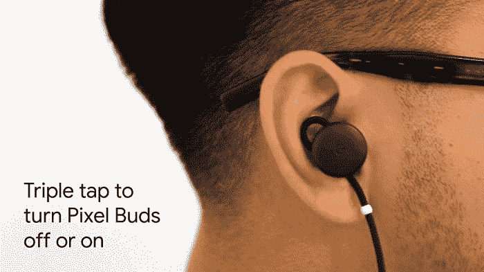

# 谷歌的 Pixel Buds 学习一些新技巧

> 原文：<https://web.archive.org/web/https://techcrunch.com/2018/05/15/googles-pixel-buds-learn-some-new-tricks/>

# 谷歌的 Pixel Buds 学会了一些新招

I/O 可能已经结束，但谷歌仍在以稳定的速度传播新闻。最新的更新来自 Googleverse 的一个更意想不到的角落。Pixel Buds，该公司备受期待的和 [lukewarmly 收到的](https://web.archive.org/web/20230325084823/https://techcrunch.com/2017/11/15/a-disappointing-debut-for-googles-pixel-buds/)蓝牙耳机得到了一个很好的软件更新。

在今天的一篇博客文章中，该公司强调了一些新功能，这些功能应该有助于使耳塞更加全面。

排在首位的是改进的蓝牙配对。这不是硬件升级，所以用户可能仍然会遇到产品早期出现的一些问题，但在同步硬件之间切换要容易得多。在已连接的计算机上从下拉菜单中选择 Pixel Buds 会将连接从当前设备切换到新设备。

耳机也有了一些新的触摸手势。轻按右耳塞三次将打开和关闭耳机，而轻按两次将歌曲跳到下一首曲目。 虽然第二个手势需要进入谷歌助手应用内的 Pixel Buds 设置才能启用。

所有这些更新都将从今天开始向用户推出。确切地说，没有一个是惊天动地的，但它们应该会让那些已经花了 160 美元购买谷歌无线耳机的人体验更好一些。