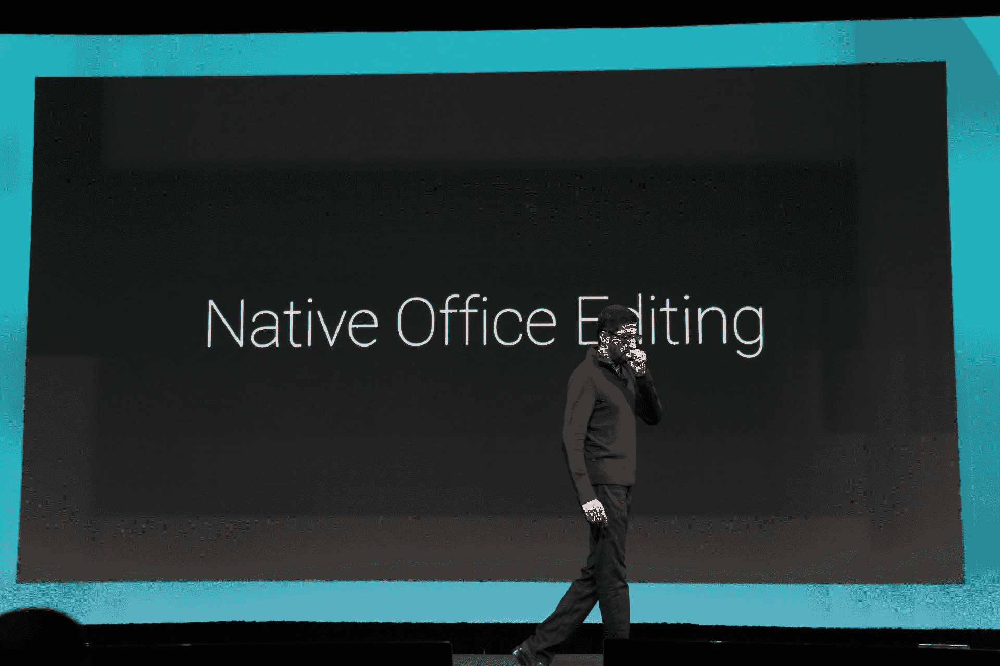
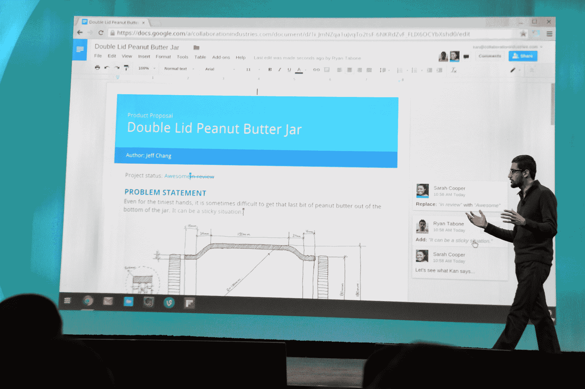

# 谷歌重新设计的硬盘注重速度、办公兼容性和安全性

> 原文：<https://web.archive.org/web/https://techcrunch.com/2014/06/25/googles-redesigned-drive-focuses-on-speed-office-compatibility-and-security/>

Google today [今天对](https://web.archive.org/web/20230309061425/http://googleappsupdates.blogspot.com/2014/06/a-faster-redesigned-google-drive.html)的 [Drive 在线存储服务](https://web.archive.org/web/20230309061425/http://drive.google.com/)进行了重大重新设计，同时，它也为其移动和桌面上的文档、表格和幻灯片生产力应用程序带来了许多新功能。

也许最重要的是，谷歌现在已经将 [Quickoffice](https://web.archive.org/web/20230309061425/https://support.google.com/quickoffice/answer/2986862?hl=en&ref_topic=2986859) 的技术内置到其生产力应用程序中，该技术是该公司[几乎在两年前收购](https://web.archive.org/web/20230309061425/https://techcrunch.com/2012/06/05/google-acquires-mobile-productivity-company-quickoffice/)的。这意味着由于新的 Office 兼容模式，您现在可以打开和编辑 Microsoft Word、Excel 和 PowerPoint 文件的原始格式。就像谷歌的桑德尔·皮帅[一年多前承诺](https://web.archive.org/web/20230309061425/https://techcrunch.com/2013/02/22/google-ports-quickoffice-to-native-client-for-chrome-will-launch-with-full-editing-features-in-about-3-months/)的那样，浏览器中的 Quickoffice 将使用谷歌的原生客户端技术在 Chrome 中快速呈现文档。然而，正因为如此，该功能暂时无法在任何其他浏览器中运行。虽然谷歌也在将 Quickoffice 构建到 Drive Android 应用程序中，但 iOS 用户仍需要再等一会儿。

随着所有这些功能都被整合到 Google Drive 中，现有的 Quickoffice 应用程序将很快走到生命的尽头。正如谷歌负责 Google Drive 的产品管理总监斯科特·约翰斯顿(Scott Johnston)本周早些时候告诉我的那样，该团队希望确保用户不必担心格式问题。他们不应该担心的另一件事是离线编辑文档，所以在这个版本中，任何可以使用谷歌生产力应用的平台都将支持离线编辑。

当我问 Johnston 为什么 Google 花了这么长时间才最终集成了 QuickOffice 时，他指出花了很长时间才把两个代码库整合在一起，并让它们以 Google 的规模运行。他还表示，团队希望确保一切都运转良好。“我们现在有如此多的设备，以至于我们不能推出任何只完成一半的东西，”他告诉我。

然而，在推出新的 Google Drive 时，用户首先会注意到的是新的外观。正如 Johnston 指出的，这背后的主要想法是简化体验，并使 web 应用程序感觉更像桌面应用程序。我有机会在最后一天在网上尝试新的驱动器，它确实感觉更快更流畅。

谷歌还做了一些更微妙的改变。例如,“与我共享”文件夹并不简单地称为“接收”驱动工具栏已经简化了一点，据我所知，谷歌取消了上传对话框，转而支持从桌面拖放文件和文件夹。

谷歌在 Chrome 上实现的一个很棒的功能是能够选择任何本地桌面应用程序作为默认程序来打开 Drive 中的文件。假设您的驱动器中有一个 Photoshop 文件。现在，您可以让 Drive 在 Adobe 的照片编辑应用程序中自动打开文件。这是一个小功能，但它绝对让 Drive 感觉比以前更贴近桌面。

谷歌保留了移动应用的最大变化。例如，活动标签现在也可以在手机上使用，共享链接只需点击一下。Johnston 告诉我，该团队还设法提高了上传性能。

除此之外，该团队现在还启用了新的安全功能，确保您存储在驱动器上的每个文档在静态和传输到您的浏览器以及谷歌服务器之间时都是加密的。