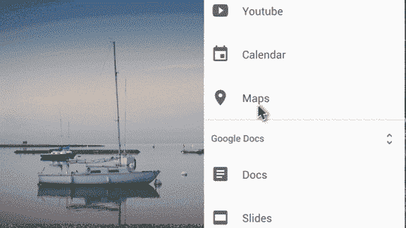

# 谷歌重新设计的谷歌网站上线

> 原文：<https://web.archive.org/web/https://techcrunch.com/2016/11/22/googles-redesigned-google-sites-goes-live/>

# 谷歌重新设计的谷歌网站上线

在很长一段时间里， [Google Sites](https://web.archive.org/web/20230305214810/https://sites.google.com/) 感觉像是 Google 生产力套件中被遗忘的应用。然而，今年早些时候，[公司宣布](https://web.archive.org/web/20230305214810/https://cloud.googleblog.com/2016/06/powering-a-more-connected-and-collaborative-enterprise.html)将最终对网站进行全面检查。今天，经过短暂的测试后，新版网站[将面向所有用户](https://web.archive.org/web/20230305214810/https://blog.google/products/g-suite/totally-rebuilt-sites-customer-tested/)上线。

Google Sites 本质上是一个拖放式网站构建器，用于创建面向公众的网页和内部网站，并与 Google 的其他工具深度集成。例如，你可以很容易地将谷歌文档、幻灯片、表格和 G Suite 工具的其他部分插入任何网站。它还直接与谷歌分析集成。新网站现在还允许多个用户合作编辑网站(使用该公司在谷歌文档中使用的相同技术)。

管理员可以选择用户是能够发布到 web 上，还是只能向他们自己域中的用户提供他们的页面。

有了这个更新，你在站点中创建的任何页面也将根据你正在使用的屏幕大小自动缩放——它的预览模式使你可以很容易地看到一个站点在手机、平板电脑和桌面上的样子。为了让这些网站看起来不那么专业，谷歌增加了六个新主题来帮助你入门。所有这些主题都有可定制的字体和颜色设置，但我希望谷歌会随着时间的推移增加一些选项。

遗憾的是，看起来你无法轻松地将现有网站迁移到新的体验中(这让我们在 TechCrunch 的编辑主任相当不高兴)，但至少目前，你可以在新旧编辑之间来回切换。**更新** : *谷歌发言人告诉我们，谷歌将在 2017 年提供并推荐从经典网站迁移到新网站的选项。*

不过，最重要的是，Sites 现在是人们想要使用的产品。它最终感觉像一个现代的应用程序，而不像谷歌旧的和被遗忘的设计原则的最后遗迹。

