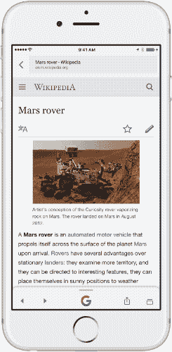

# 谷歌的搜索应用程序现在会推荐其他阅读内容 

> 原文：<https://web.archive.org/web/https://techcrunch.com/2017/09/19/googles-search-app-now-makes-suggestions-of-other-things-to-read/>

谷歌的 iOS 搜索应用今天[推出](https://web.archive.org/web/20221206153950/https://www.blog.google/products/search/search-and-discover-google-app-ios/)一项功能，让用户继续浏览网页，而不是回到主屏幕使用其他移动应用。该应用正在更新，以包括“相关内容”部分，该部分将出现在您使用谷歌应用时访问的网页的底部。

也就是说，如果你在谷歌上搜索一个主题，然后点击阅读关于该主题的文章，一旦你完成了，应用程序可能会提供其他相关文章的建议。这些建议出现在应用程序界面的底部，在“G”按钮的下方，但当你向下滚动阅读你所登陆的页面时，它们是不可见的。

相反，只有当你读完并开始向上滚动时，滚动条才会出现。即使这样，相关的文章仍然是部分隐藏的——你可以看到标题“人民也查看”和一些标题，但你必须实际上在这个谷歌栏上滑动才能看到完整的建议。

然后你可以在出现的相关文章列表中水平滑动，点击你想阅读的文章。

如果你在钻研一个话题，很容易跳过各种建议来继续阅读。但通常情况下，谷歌搜索是为了找到一个非常具体的答案，而相关文章并不能很好地解决这个问题。

例如，如果你搜索火星漫游者，你可能是在寻找关于那个特定漫游者的信息——而不仅仅是一般的太空探索信息。但谷歌的相关文章建议你阅读机遇号火星车、火星探索项目主管或圣托里尼全景图。这不一定会对你最初的搜索查询有所帮助。

这并不是说你没有陷入谷歌搜索漏洞的时候，你不断阅读更多的内容，因为一件事导致另一件事。但通常情况下，谷歌搜索并不是为了迷失在网络上，而是为了得到答案。就连谷歌自己也明白这一点，这就是为什么它构建了自己的知识图表，在搜索结果的顶部提供“即时答案”。

谷歌表示，这一变化是为了让浏览网页时更容易“探索和发现内容”，但它也有让用户在应用程序中停留更长时间的副作用。这对谷歌的底线产生了影响，因为谷歌可以在网络搜索者不离开其应用的情况下向他们显示更多的广告。

这一改变将于今天在 iOS 平台上推出。