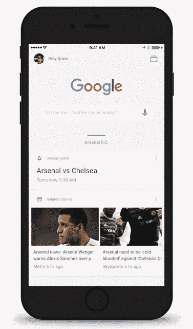

# 谷歌的搜索应用现在有了匿名模式 

> 原文：<https://web.archive.org/web/https://techcrunch.com/2016/09/28/googles-search-app-now-sports-an-incognito-mode/>

# 谷歌的搜索应用现在有了匿名模式

希望私下在移动网络上冲浪，但通常更喜欢谷歌搜索应用程序，而不是 Safari 或 Chrome 等独立浏览器？然后你会喜欢 iOS 版的[谷歌搜索应用](https://web.archive.org/web/20221025222927/https://itunes.apple.com/us/app/google-app-search-made-just/id284815942?mt=8)的最新更新，它现在引入了一种“隐姓埋名模式”，你可以使用触控 ID 进一步保护它，还有许多其他的变化。

虽然隐私浏览长期以来一直是大多数浏览器的一个选项，但谷歌的搜索应用程序一直没有这一功能，尽管今天许多移动消费者将谷歌的应用程序作为他们在 iPhone 上访问网络的主要入口。

事实上，这款应用今天的排名略高于谷歌的 Chrome 浏览器，在 iTunes 应用商店中排名第二和第三十，而 Chrome 在实用工具和整体应用中分别排名第三和第三十四。

要使用新的私人搜索功能，当你不想保存你的搜索和浏览历史时，你只需在设置中打开匿名模式选项。此外，您还可以打开触控 ID 隐名模式，这意味着除了您之外，没有人可以重新进入您现有的隐名会话。

一旦启用，你甚至可以通过 3D 触摸应用程序图标开始一个新的隐名模式会话。

添加隐姓埋名模式是更新后的应用程序中最大的新功能，但谷歌表示，还有其他调整，包括性能改进和 iOS 10 的稳定性增加，使应用程序的可靠性是早期版本的两倍。

另一个值得注意的功能是可以在搜索结果中观看 YouTube 视频。以前，你必须打开一个新页面或访问 YouTube 应用程序。

更新是[现在在 App Store](https://web.archive.org/web/20221025222927/https://itunes.apple.com/us/app/google-app-search-made-just/id284815942?mt=8) 上直播。