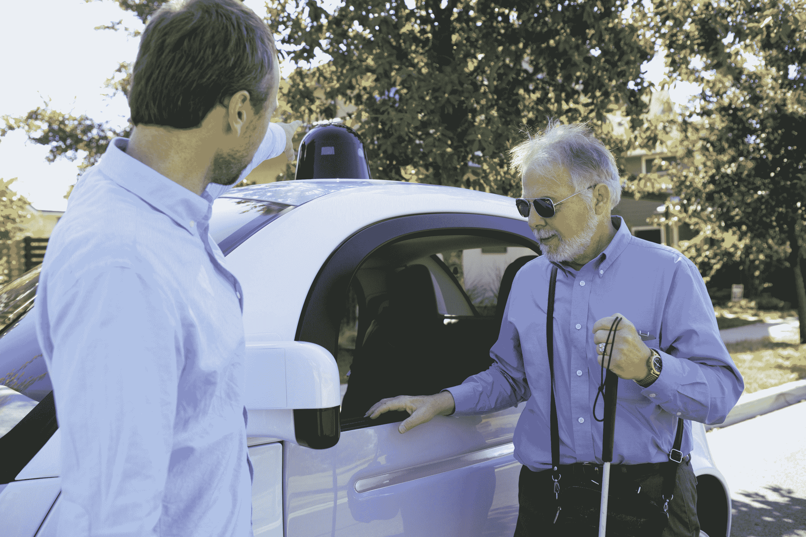
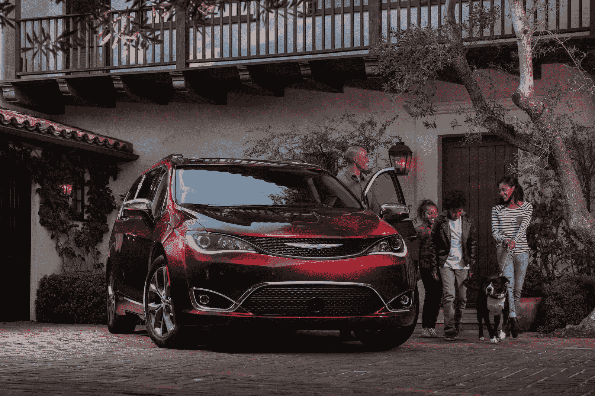

# 谷歌的自动驾驶汽车部门成为 way mo 

> 原文：<https://web.archive.org/web/https://techcrunch.com/2016/12/13/googles-self-driving-car-unit-spins-out-as-waymo/>

谷歌今天宣布，该公司正在建立自己的无人驾驶汽车部门，作为字母表旗下名为 Waymo 的独立实体。这个名字来源于它的使命:寻找“一种新的移动方式”

“我们现在是字母表保护伞下的一家独立公司，”Waymo 首席执行官 John Krafcik 今天在旧金山的一次新闻发布会上告诉观众。Krafcik 还指出，Waymo 团队去年在奥斯汀的公共道路上进行了第一次完全无人驾驶，在城市街道的“日常交通”中使用了一辆没有方向盘和踏板的汽车。

这是历史性的第一次在公共道路上完全无人驾驶，让 Waymo 首席工程师纳撒尼尔·费尔菲尔德(Nathaniel Fairfield)的法律盲人朋友史蒂夫·马汉(Steve Mahan)独自驾驶汽车。马汉以前曾乘坐过谷歌测试车，但他总是由警察陪同和护送。这一次，他两者都没有骑，汽车在奥斯汀的公共场合谈判了四个方向的车站，行人，狭窄的街道和更多。

在新闻发布会上，马汉将这次经历比作某种地球宇航员，并称自己为“骑手 1 号”。

谷歌自动驾驶业务部门最近的变化包括任命前现代北美高管 Krafcik 担任该项目的首席执行官。这一举动，加上今年晚些时候前 Airbnb 和猫途鹰高管肖恩·斯图尔特(Shaun Stewart)的加入，表明自动驾驶汽车部门现在不仅在研究和技术上取得突破，而且有望发展成为一家商业上可行的公司。

Krafcik 在活动中说:“我们已经谈论了很多关于我们在公共道路上行驶的 200 万英里的事情。“现在我们已经在公路上行驶了一百万英里。我们很少谈论我们在模拟中行驶的英里数。我们已经模拟行驶了超过 10 亿英里[……]，与谷歌员工和游客一起在山景城、奥斯汀和凤凰城等地进行了超过 10，000 次旅行。”

谷歌 X 和现在的 Waymo，在驾驶和测试的所有时间里取得了很大成就。尽管如此，Waymo 的自动驾驶技术负责人 Dmitri Dolgov 表示，还有很多工作要做，包括建立更好的地图，使骑行更加平稳，以及改善暴雨和大雪等恶劣天气下的导航。

至于在新的 Waymo 品牌下业务的走向，Krafcik 谈到了一系列潜在的机会。

新的 Waymo 标志。

“我们可以想象这种[技术]在拼车、运输、卡车运输、物流甚至个人使用的车辆和汽车制造商的许可、公共交通以及解决最后一英里问题上的应用，”他说。“自动驾驶技术在所有这些方面都很棒。”

克拉夫茨克还强调，新公司专注于技术，不一定是制造汽车。这与该公司将寻求与汽车制造商合作，而不是自己制造汽车的报道相吻合。

“我们是一家自动驾驶技术公司，”他直截了当地说。“我们已经非常清楚，我们不是一家汽车公司，尽管在这一点上有一些困惑。我们的工作不是制造更好的汽车。我们的工作是制造更好的司机。”

Krafcik 表示，Waymo 目前正处于在克莱斯勒 Pacifica 中部署下一代传感器负载的“构建阶段”。今年早些时候，它宣布了与菲亚特克莱斯勒合作的 100 辆汽车试点项目。他说，他们目前正在为这些车辆的道路测试做准备。

优步还在与汽车制造商合作，为其打车服务部署自己的无人驾驶汽车，包括福特和沃尔沃。其他汽车制造商，如大众汽车和通用汽车，已经选择建立或收购自己的自动驾驶技术和按需移动服务产品。

彭博[周二](https://web.archive.org/web/20221226092116/https://www.bloomberg.com/news/articles/2016-12-13/google-said-to-plan-ride-sharing-service-with-chrysler-minivans-iwnox94h)报道称，Alphabet 新独立的自动驾驶汽车公司将与克莱斯勒合作部署共乘服务，这将使半自动驾驶 Pacifica 面包车最早于 2017 年底上路载客。

如前所述，谷歌此前宣布了一项计划，将与菲亚特克莱斯勒合作，基于 Pacifica 平台制造 100 辆原型自动驾驶汽车，但这项新计划将涉及更广泛的范围和更高的车辆要求。菲亚特还计划在今年即将在拉斯维加斯举行的 CES 展会上推出一款全电动 Pacifica，这可能是其与谷歌合作的一个关键因素，因为电动汽车车队对于未来的自主按需服务来说是更实用的选择。

作为 Alphabet 旗下的一家独立公司，Waymo 可能不会像其业务那样免受审查，因此其在合作伙伴关系和销售或许可模式方面的下一步将非常值得关注。