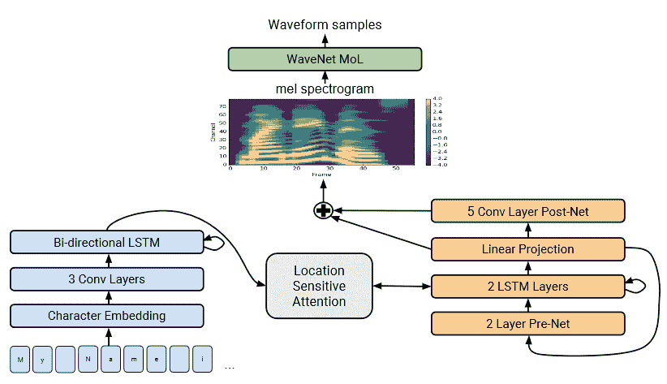

# 谷歌的 Tacotron 2 简化了教人工智能说话的过程 

> 原文：<https://web.archive.org/web/https://techcrunch.com/2017/12/19/googles-tacotron-2-simplifies-the-process-of-teaching-an-ai-to-speak/>

# 谷歌的 Tacotron 2 简化了教人工智能说话的过程

创造令人信服的人工语音是当下的热门话题，谷歌无疑处于领先地位。该公司今天宣布推出 Tacotron 2，这可能是又一次飞跃，这是一种训练神经网络的新方法，可以从几乎不需要语法专业知识的文本中产生逼真的语音。

这项新技术吸取了谷歌之前两个语音生成项目的精华:WaveNet 和最初的 Tacotron。

WaveNet 一次制作一个音频样本，制作了我称之为[“出奇地令人信服”的演讲](https://web.archive.org/web/20230202225756/https://techcrunch.com/2016/09/09/googles-wavenet-uses-neural-nets-to-generate-eerily-convincing-speech-and-music/)，这对于任何了解声音设计的人来说，听起来可能有些过头了。尽管 WaveNet 很有效，但它需要大量关于语言的元数据:发音、已知的语言特征等。Tacotron 合成了更多高级功能，如语调和韵律，但并不真正适合制作最终的语音产品。

[Tacotron 2](https://web.archive.org/web/20230202225756/https://research.googleblog.com/2017/12/tacotron-2-generating-human-like-speech.html) 使用了两者的部分，尽管我会坦率地承认，在这一点上，我们已经达到了我的技术专长的极限，尽管如此。但据我所知，它使用文本和文本的叙述来计算所有的语言规则，而系统通常必须被明确告知这些规则。出于节奏和强调的目的，文本本身被转换成 Tacotron 风格的“Mel-scale spectrom ”,而单词本身是使用 WaveNet 风格的系统生成的。

这应该让一切都清楚了！

由此产生的音频，[你可以在这里听到几个例子](https://web.archive.org/web/20230202225756/https://google.github.io/tacotron/publications/tacotron2/index.html)，几乎和外面的任何东西一样好，甚至更好。讲话的节奏很有说服力，尽管可能有点过于轻快。它主要是偶然发现发音不是特别直观的单词，可能是因为它们来自美国英语以外的地方，比如“decorum”，它强调第一个音节，还有“Merlot”，它就像它看起来一样欢快地发音。“在极端情况下，它甚至可以随机产生奇怪的噪音，”研究人员写道。

最后，没有办法控制说话的语气，例如乐观或关切，尽管口音和其他微妙之处可以像 WaveNet 一样融入其中。

降低训练系统的障碍意味着可以训练更多更好的系统，并且集成新的方法，而不必重新评估复杂的手动定义的规则集或为新的语言或演讲风格寻找新的规则集。

研究人员已经将它提交给 IEEE 声学、语音和信号处理国际会议审议。[你可以在 arXiv](https://web.archive.org/web/20230202225756/https://arxiv.org/abs/1712.05884) 阅读报纸本身。