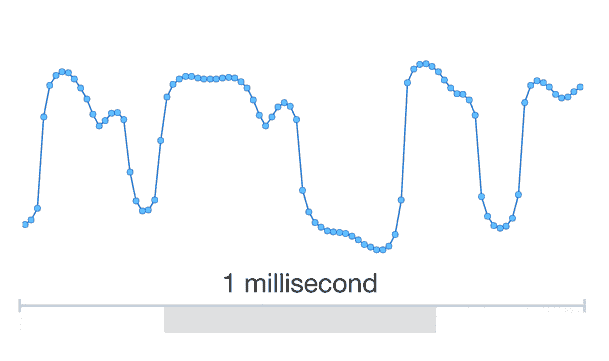

# 谷歌基于 WaveNet 机器学习的语音合成来到助手 

> 原文：<https://web.archive.org/web/https://techcrunch.com/2017/10/04/googles-wavenet-machine-learning-based-speech-synthesis-comes-to-assistant/>

去年，谷歌[展示了 WaveNet](https://web.archive.org/web/20220930185500/https://beta.techcrunch.com/2016/09/09/googles-wavenet-uses-neural-nets-to-generate-eerily-convincing-speech-and-music/) ，这是一种新的生成语音的方式，它不依赖于庞大的词库或廉价的快捷方式，而这些会导致生硬的语音。WaveNet 使用机器学习一个样本接一个样本地构建语音，其结果，正如我当时所说的那样，“惊人地令人信服。”以前绑定在实验室的技术[现在已经部署在最新版本的谷歌助手](https://web.archive.org/web/20220930185500/https://deepmind.com/blog/wavenet-launches-google-assistant/)中。

这项技术背后的总体想法是，不是通过手动编码语法和音调规则来重建单词和句子，而是让机器学习系统看到语音中的这些模式，并逐个样本地生成它们。在这种情况下，样本是每 1/16，000 秒产生的音调。

 在第一次发布的时候，WaveNet 的计算非常昂贵，花了整整一秒钟来生成 0.02 秒的声音——所以像“在雪松街右转”这样的两秒钟的剪辑将需要将近两分钟来生成。因此，它不太适合实际使用(到那时你已经错过了机会)——这就是谷歌工程师着手改进它的原因。

新的、改进的 WaveNet 以 20 倍的实时速度生成声音——在十分之一秒内生成同样的两秒剪辑。它甚至可以以更高的采样率来创建声音:每秒 24，000 个样本，16 位对 8 位。并非高保真声音真的可以在智能手机扬声器中欣赏，但鉴于今天的公告，我们可以预计 Assistant 很快会出现在更多地方。

WaveNet 生成的语音听起来比以前使用的最先进的拼接系统好得多:

又旧又破:

<https://web.archive.org/web/20220930185500im_/https://beta.techcrunch.com/wp-content/uploads/2017/10/hol_before.wav?_=3>

[https://beta . TechCrunch . com/WP-content/uploads/2017/10/hol _ before . wav](https://web.archive.org/web/20220930185500/https://beta.techcrunch.com/wp-content/uploads/2017/10/hol_before.wav)

最新热门产品:

<https://web.archive.org/web/20220930185500im_/https://beta.techcrunch.com/wp-content/uploads/2017/10/hol_after.wav?_=4>

[https://beta . TechCrunch . com/WP-content/uploads/2017/10/hol _ after . wav](https://web.archive.org/web/20220930185500/https://beta.techcrunch.com/wp-content/uploads/2017/10/hol_after.wav)

(更多的样本可以在 Deep Mind 的博客文章中找到，尽管很快这个助手也会发出这样的声音。)

WaveNet 还有一个令人钦佩的优点，那就是非常容易扩展到其他语言和口音。如果你想让它带着威尔士口音说话，没必要自己去摆弄元音。只要让它听几十个小时的威尔士人说话，它就会自己发现细微差别。也就是说，新的声音目前只适用于美国英语和日语，其他语言还没有。

为了跟上“大型科技公司做其他大型科技公司正在做的事情”的趋势，苹果公司也在最近用机器学习驱动的语音模型改进了它的助手 (Siri，你不知道吗)。然而，这一个是不同的:它没有深入到声音中，以至于在样本水平上重建它，而是停留在半音素(仍然相当低)的水平上，或者一个音素的一部分。

WaveNet 背后的团队计划很快公开发布他们的工作，但现在你必须满足于他们的承诺，即它的工作和性能比以前好得多。