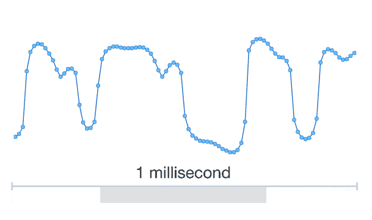
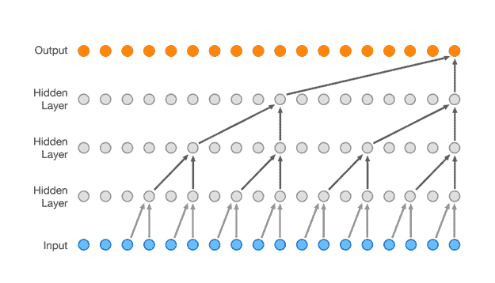

# 谷歌的 WaveNet 使用神经网络来生成令人难以置信的语音和音乐 

> 原文：<https://web.archive.org/web/https://techcrunch.com/2016/09/09/googles-wavenet-uses-neural-nets-to-generate-eerily-convincing-speech-and-music/>

从一段文本中生成语音是计算机承担的一项常见而重要的任务，但结果很少会被误认为是普通的语音。Alphabet 的 DeepMind 的研究人员采用了一种完全不同的方法，产生了听起来像真的一样的语音甚至音乐。

早期的系统使用一个大的词类库(音素和语素)和一个大的规则集来描述字母组合产生这些声音的所有方式。这些片段被连接在一起，创造了可以处理大多数单词的功能性语音合成，尽管没有令人信服的节奏和音调。后来的系统将声音的产生参数化，使得语音片段库变得不必要。更紧凑——但通常效率较低。

[WaveNet，这个系统被称为](https://web.archive.org/web/20221206091507/https://deepmind.com/blog/wavenet-generative-model-raw-audio/)，把事情看得更深。它以尽可能低的水平模拟语音:一次一个样本。这意味着从头开始构建波形——每秒 16，000 个样本。

每个点是单独计算的样本；集合就是数字波形。

你已经从标题中知道了，但是如果你不知道，你可能已经猜到是什么使这成为可能:神经网络。在这种情况下，研究人员将大量普通的录音语音输入到卷积神经网络，该网络创建了一套复杂的规则，来确定在每个常见的语音上下文中，哪些音调跟随其他音调。

每个样本不仅仅是由之前的样本决定的，而是由之前的数千个样本决定的。它们都被输入到神经网络的算法中。它知道某些音调或样本将几乎总是彼此跟随，而某些其他音调或样本将几乎从不跟随。例如，人们不会用方波说话。

 如果 WaveNet 用来自单个说话者的数据进行训练，得到的合成语音将类似于那个说话者，因为实际上，网络对语音的所有了解都来自他们的声音。但是，如果你用多个扬声器训练它，一个人的声音的特质可能会被另一个人的抵消，结果是更清晰的讲话。

<https://web.archive.org/web/20221206091507im_/https://beta.techcrunch.com/wp-content/uploads/2016/09/wavenet-1.wav?_=5>

[https://beta . TechCrunch . com/WP-content/uploads/2016/09/wave net-1 . wav](https://web.archive.org/web/20221206091507/https://beta.techcrunch.com/wp-content/uploads/2016/09/wavenet-1.wav)

很明显，它轻而易举地超越了现有的系统，尽管它也有自己的怪癖——也许还需要增加几个扬声器。

它还不能直接阅读文本；书面单词需要由另一个系统翻译，不是翻译成音频，而是翻译成音频前体，比如计算机可读的语音拼写。一个有趣的副作用是，如果他们在没有文本输入的情况下训练它，它会产生令人不安的胡言乱语，就好像计算机在说方言一样。

<https://web.archive.org/web/20221206091507im_/https://beta.techcrunch.com/wp-content/uploads/2016/09/wavenet_speaker-2.wav?_=6>

[https://beta . TechCrunch . com/WP-content/uploads/2016/09/wave net _ speaker-2 . wav](https://web.archive.org/web/20221206091507/https://beta.techcrunch.com/wp-content/uploads/2016/09/wavenet_speaker-2.wav)

然而，真正有趣的是 WaveNet 的可扩展性。如果你用美国人的语言训练它，它就会产生美国人的语言。如果你用德语训练它，它就会产生德语。如果你用肖邦来训练它，它会产生…嗯，不完全是肖邦，但在逻辑上是钢琴，人们甚至会说是创造性的。

<https://web.archive.org/web/20221206091507im_/https://beta.techcrunch.com/wp-content/uploads/2016/09/wavenet_sample_1.wav?_=7>

[https://beta . TechCrunch . com/WP-content/uploads/2016/09/wave net _ sample _ 1 . wav](https://web.archive.org/web/20221206091507/https://beta.techcrunch.com/wp-content/uploads/2016/09/wavenet_sample_1.wav)

<https://web.archive.org/web/20221206091507im_/https://beta.techcrunch.com/wp-content/uploads/2016/09/wavenet_sample_5.wav?_=8>

[https://beta . TechCrunch . com/WP-content/uploads/2016/09/wave net _ sample _ 5 . wav](https://web.archive.org/web/20221206091507/https://beta.techcrunch.com/wp-content/uploads/2016/09/wavenet_sample_5.wav)

它是否能产生一个完整的两分钟前奏还很难说；作曲不像基本和弦和半音和弦那么容易系统化。

WaveNet 需要大量的计算能力来模拟这种极低水平的复杂模式，所以它不会很快出现在你的手机上。如果你想知道他们到底是如何安排卷积层和其他技术细节的，[描述 WaveNet 的论文就在这里](https://web.archive.org/web/20221206091507/https://drive.google.com/file/d/0B3cxcnOkPx9AeWpLVXhkTDJINDQ/view)。