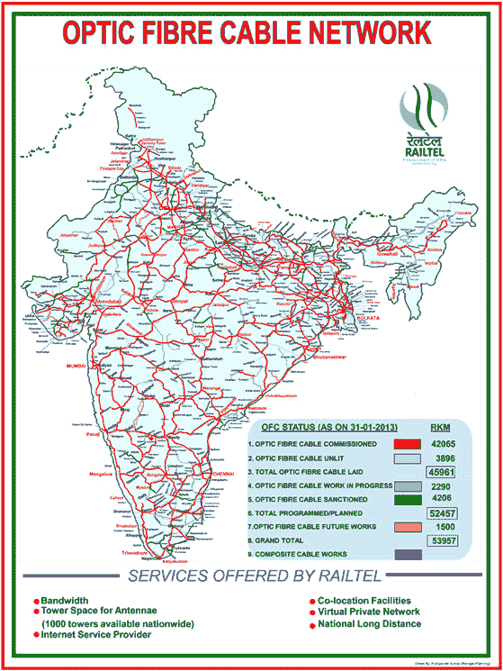
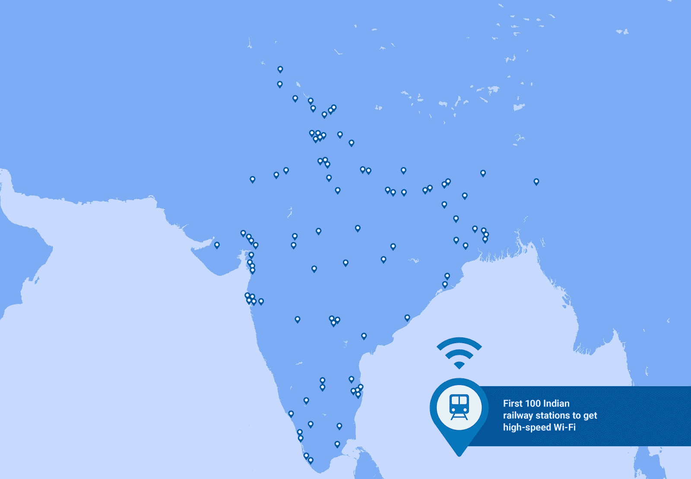

# 谷歌面向印度火车站的 WiFi 将于明天在孟买中央火车站发布 

> 原文：<https://web.archive.org/web/https://techcrunch.com/2016/01/21/googles-wifi-for-indian-train-stations-launches-tomorrow/>

# 谷歌面向印度火车站的 WiFi 将于明天在孟买中央火车站发布

谷歌期待已久的印度火车站无线网络从明天开始慢慢运行。正如去年 9 月底宣布的那样，孟买中央火车站将是谷歌提供高速互联网接入的第一个地点。

该项目是谷歌接入和能源团队的一部分，与印度国有公司 [RailTel](https://web.archive.org/web/20221221124201/http://www.railtelindia.com/) 合作。RailTel 已经在全国大多数主要铁路沿线建立了一个光纤线路网络，谷歌将利用该网络支持火车站的无线接入点。

最初，该伙伴关系旨在为印度 100 个火车站提供接入点，并计划发展到全国 400 个火车站。 [RailTel 的光纤基础设施](https://web.archive.org/web/20221221124201/http://www.railtelindia.com/index.php?option=com_content&view=article&id=119&Itemid=172)覆盖了超过 26000 英里的铁路轨道，该公司计划将其扩展到覆盖 33000 英里的轨道。

目前，互联网接入仅限于火车站，接入点没有安装在列车上。

去年九月，印度总理纳伦德拉·莫迪参观谷歌园区时首次宣布了该计划，谷歌首席执行官桑德尔·皮帅在谷歌官方博客上对此进行了进一步的详细描述。

目前，孟买中央车站和其他试点车站的互联网服务将是免费和不受限制的。

皮查伊在谷歌的官方博客上写道:“最重要的是，这项服务将免费启动，长期目标是使其能够自我持续，以便在未来与 RailTel 和更多合作伙伴一起扩展到更多的车站和其他地方。”

看一看印度铁路系统的范围，就能真正了解运营的规模。仅孟买中央火车站[一天就支持 962 列单独列车](https://web.archive.org/web/20221221124201/http://erail.in/mumbai-central-railway-station)，既有孟买当地的通勤列车，也有长途城际列车。仅该市的通勤铁路服务每天就运送约 700 万人，这让你对该系统支持的带宽有所了解。随着它扩展到全国更多的车站和铁路子网，看看谷歌是否能继续支持目前承诺的速度和连接将是一件有趣的事情。

谷歌决定一开始就提供免费的互联网服务，这对于印度来说是一个有趣的时间[，因为脸书的免费基础程序正在印度](https://web.archive.org/web/20221221124201/https://techcrunch.com/2015/12/23/free-basics-trai-suspension/)争论不休。虽然目前通过新系统的互联网接入是免费和不受限制的，但谷歌确实有计划使该系统在财务上可行。目前还不清楚这是否会得到接入费或其他类型的盈利途径的支持。