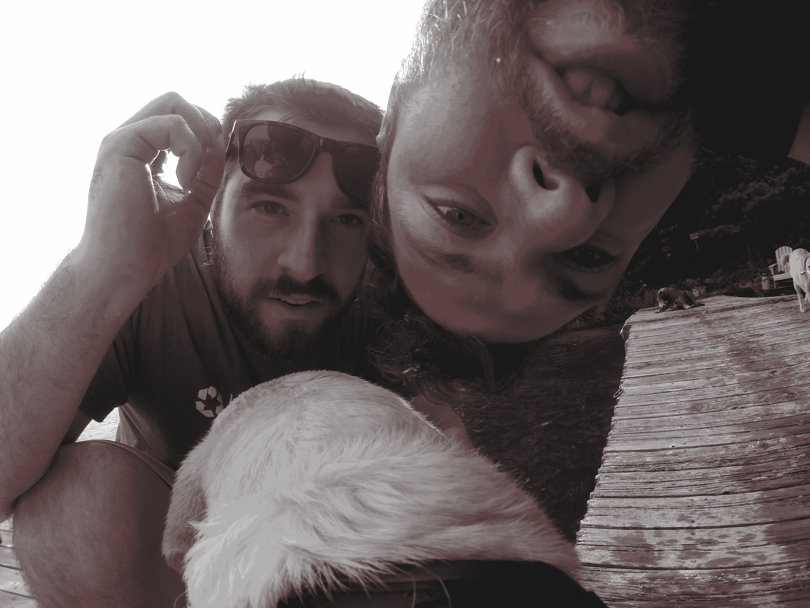

# GoPro Fetch 点评:你会羡慕你家狗狗的工作/生活平衡 

> 原文：<https://web.archive.org/web/https://techcrunch.com/2014/09/05/gopro-fetch-review/>

# GoPro Fetch 点评:你会羡慕你家狗狗的工作/生活平衡

【YouTube https://www.youtube.com/watch?v=7koVxnJW0OM&w=854&h=510]

今天，我们为你准备了一个六分多钟长的视频，一只狗正在体验一种比你或我所知道的更纯粹的快乐。请享用。

不过，说真的，这个在周末度假别墅旅行期间使用新的 GoPro Fetch mount 拍摄的镜头只是一个更长系列的一小部分，这个系列让我和我的家人娱乐了太久太久。

我通常从来不认为自己“极端”到足以拥有自己的 GoPro(我也没有马特·伯恩斯这样的孩子)，但这款新的 Fetch mount 让我重新考虑个人购买。视频中的狗是我的昆西，一只属于我弟弟的黄色实验室，它显然很喜欢水。

我自己的狗狗切尔西在我戴上它的时候基本上僵住了，这很搞笑，但并没有产生引人入胜的镜头。她后来喜欢上了它，就像大多数狗喜欢毛衣或外套一样，但她不是水狗，游泳看起来特别有趣——事实上，近乎治疗。

这是一张我和我哥哥通过安装在相机上的 GoPro 拍摄的非常讨人喜欢的照片。

Fetch 的可调节性意味着它可以与我所知道的一系列不同的狗一起工作，从非常小到非常大，两个安装位置提供了一个有趣的视角转换(尽管背面安装通常产生更好的镜头)。没有一只狗成功地破坏了 Fetch，尽管没有一只狗真的那么努力地尝试过，正如你所看到的，它很好地经受住了在水中长时间的使用。

GoPro 越来越多的坐骑为动作摄像机提供了很多选择，动作摄像机曾经青睐这个世界的滑雪者，但现在甚至可以娱乐像我这样最厌恶风险的人。售价 60 美元，现在可以在 GoPro.com 买到。