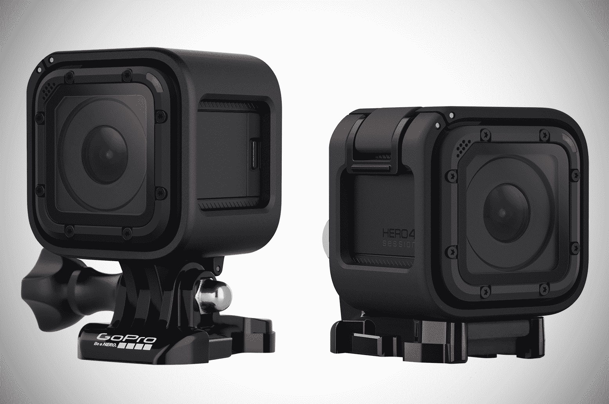
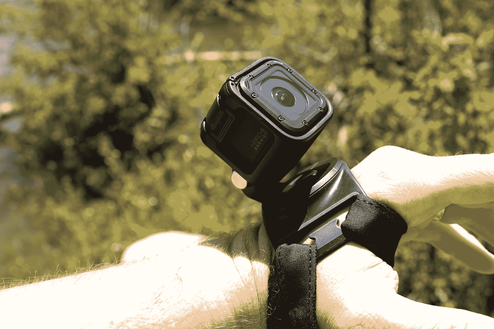
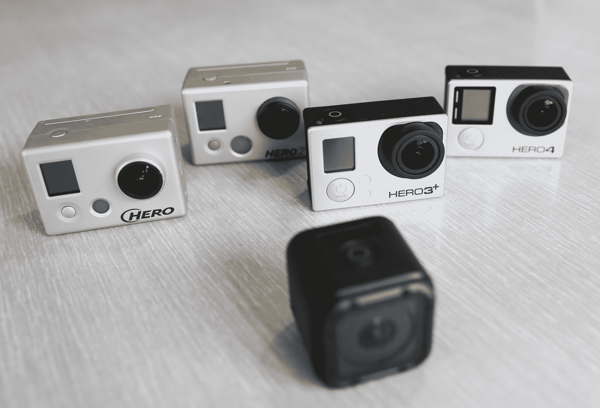

# GoPro 凭借 hero 4 Session TechCrunch 重塑其动作摄像机

> 原文：<https://web.archive.org/web/https://techcrunch.com/2015/07/06/gopro-reinvents-its-action-camera-with-the-hero4-session/>

认识下一代go pro 动作相机。这款新相机名为 Hero4 Session，是该公司自 2007 年推出最初的数字英雄相机以来，对这款无处不在的相机的首次重大重新设计。但这不仅仅是一张漂亮的新面孔。这款相机是 GoPro 向前迈出的重要一步。这是第一个不需要外壳就能在极端活动中生存的 GoPro。

Hero4 会话是迄今为止最小的 GoPro。它是一个 1.5 英寸的立方体，重量只有 2.6 盎司。这大约是 iPhone 6 重量的一半。用户也不需要拖着不同的箱子来使用相机。它是防水的。这是该公司努力减少使用 GoPro 相机所需物品数量的一部分。

较小的尺寸伴随着让步。这款相机缺乏 GoPro 高端机型中的 4k 录制功能。电池也不可更换或更换。然而，相机仍然击中了一个甜蜜点。Hero4 会话是迄今为止最好的 GoPro。

## 酝酿多年

Hero4 Session 花了 GoPro 三年时间来构建和开发。在花了几分钟时间使用新相机后，很明显这是 GoPro 的未来。

Hero4 会议与同类会议相比有几个明显的优势。首先，它不需要外壳防水或防震。这是关键。其他 GoPro 相机需要各种外壳和配件，才能在游泳池中浸泡或在地板上弹跳。该会议防水到 10 米。

通过防水，GoPro 建立了一种新的麦克风系统，其工作原理类似于人的耳朵。一层薄膜将滞留在麦克风上的水排出。这发生得非常快:仅仅一两秒钟。这意味着 GoPro 在离开水面后可以拾取清晰的音频瞬间。还有一个后置麦克风，当摄像头检测到前置麦克风有大量风噪时，就会切换到这个麦克风。

会话检测其安装方向，并自动旋转视频。

> 由于它是一个立方体，GoPro 明智地建立了一个系统，允许相机在其安装框架中旋转，同时总是记录视频，就好像它是正面朝上的。

把它扔在汽车或无人机或滑板的底部，它会像正面朝上一样进行记录。

该会话缺少可更换的电池，但智能电源控制弥补了这一点。点击顶部按钮打开相机，相机开始记录。再次按下按钮，相机停止记录并关闭。电源方案的这一简单改变减少了相机闲置的时间。以前的 GoPro 相机有一个电源按钮和一个单独的录制按钮。在会话中，一个按钮可以处理这两种任务，让 GoPro 可以自由地实现更符合逻辑的控制方案。

最后，会话有一个顶部安装的 LCD 状态屏幕。它很小。这没关系。小屏幕显示相机的模式、电池寿命和连接状态。但是顶部安装的位置远远优于其他 GoPro 相机上的前置屏幕。也就是说，这个小屏幕仅限于几个功能，并迫使用户使用 GoPro 智能手机应用程序来改变一般的相机设置。

GoPro Hero4 会话安装在表带上，这是 GoPro 的最新安装，旨在与会话和所有其他 GoPro 相机配合使用。

## 向前两步，向后一步

Hero4 环节感觉棒极了。一种令人愉快的橡胶材料覆盖在照相机上。它坚固耐用，感觉就像能从山上摔下来一样。顶部安装的按钮需要用力按压。液晶屏明亮清晰。

> 这是迄今为止最容易使用的 GoPro。这很重要。

这是迄今为止最容易使用的 GoPro。这很重要。GoPro 相机一直有点令人费解。这些按钮从来没有标签，很容易混淆。我的许多 GoPro 视频经常以无意的自拍开始，这是我在试图改变设置时按错按钮时意外开始录制的。会话中不会发生这种情况。

会话顶部是一个带红圈的大按钮。按下此按钮打开相机电源并开始录制。就这么简单。背面有一个较小的按钮，按下后会点亮 LCD 显示屏，以改变模式并检查电池的寿命。这两个按钮区别明显，不能混淆。

会议的按钮布局清楚地表明 GoPro 正在努力使他们的相机更容易使用。这正是公司需要做的。如果 GoPro 要继续与智能手机作战，相机需要更简单、更直观。

视频质量与其他 GoPro 相机不相上下。该会议缺乏 500 美元的 Hero4 黑色相机中的超高清和高速捕捉模式。没有 4k 对我来说没什么，但在我的会议期间，我错过了以全高清分辨率记录高帧速率的能力。该会话在 1080p 时最高可达 60 fps，这并不适合慢动作视频。

虽然该会话不能以 4k 录制，但视频质量对于高清观看来说非常好。大多数用户都会对这款新 GoPro 的 1440p30 或 1080p60 录制功能感到非常满意。弱光记录是可以接受的，像其他 GoPro 一样，相机可以轻松捕捉快速移动的物体。

然而，这种视频质量的倒退让人感觉索然无味。这个疗程 400 美元，并不便宜。它位于 GoPro 系列的高端，因此应该具有类似的视频录制功能。尽管这次会议的视频质量足够好，但对于 400 美元来说，我希望它比足够好还要好。

> GoPro 通过缩小 LCD 屏幕的尺寸，牺牲了相机上的设置变化。

这需要所有者将他们的相机连接到智能手机或 GoPro 无线遥控器，以改变视频捕捉分辨率、帧速率等项目，或者启用 GoPro 的 ProTune 系统，让所有者指定白平衡等。起初这感觉很奇怪，因为 GoPros 一直都有摄像头控制功能。然而，无论如何，用智能手机改变这些设置要容易得多。我宁愿有一个更小的更容易控制的 GoPro 相机，而不是一个有一堆令人困惑的按钮的 GoPro 相机。

## 极端选项

曾几何时，GoPro 卖的是单动相机。一路走来，该公司不断增加更多的型号，以达到不同的价位。现在，随着会话的进行，GoPro 卖出了 5 台相机。会话位于范围的上层。它的价格与配备 LCD 的 Hero4 Silver 相同，仅比支持 4k 的 Hero4 Black 便宜 100 美元。

该会议包有两个安装框架，两个安装架，和重新设计的安装扣，比以前的 GoPro 扣更小。

会话是要购买的 GoPro。视频质量很好，更重要的是，它最容易使用。但是它要 400 美元，太贵了，真遗憾。GoPro 需要吸引更多的消费者参加 Hero4 会议。这款相机是 GoPro 的未来。