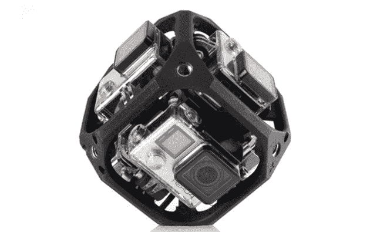

# GoPro 致力于虚拟现实摄像机阵列和四轴飞行器 

> 原文：<https://web.archive.org/web/https://techcrunch.com/2015/05/27/gopro-working-on-6-camera-spherical-array-for-vr-content-available-this-year/>

今天，GoPro 宣布它正在开发一个阵列，该阵列结合了六个 GoPro Hero 相机，可同时进行球形拍摄。首席执行官尼克·伍德曼表示，当脸书收购 Oculus 时，“挑战已经结束”，GoPro 开始研究一种球形设置，可以为虚拟现实和增强现实系统生成内容。

伍德曼还表示，该公司目前在内部安装了“alpha”软件，允许用户将 GoPro 相机自动同步到云端，以便他们可以访问他们的镜头。伍德曼说，这仍处于“早期阶段”，但理论上这将允许人们不必“触摸 SD 卡或 USB 线”就可以查看和编辑。

该公司还在研究一种使用 GoPro 相机进行空中摄影的四轴无人机。

“对我们来说，我们在 GoPro 实现业务中似乎很自然，无人机是 GoPro 的最终配件……这就是我们需要说 OK 的所有理由。伍德曼说:“这对我们的业务至关重要，因此我们有理由自己制作。”他指出，GoPro 相机也将与其他无人机保持兼容。

从极限运动到婚礼，用 GoPro 相机拍摄无人机视频已经成为一切事物的必备工具。所以 GoPro 自己收购这项业务是非常有意义的。《华尔街日报》最近报道称，该公司正在考虑推出无人机。许多 GoPro 用户已经将他们的相机连接到第三方公司提供的各种无人机上。

伍德曼没有透露定价，但表示将于明年下半年上市。

**虚拟现实的野心**

该阵列将于 2015 年下半年上市。伍德曼说:“这对制作公司和消费者来说真的很有吸引力。他补充道,“普通”人最终肯定会买它，但第一个版本是给专业人士的。GoPro 设想这种挂载可以为 Oculus、HoloLens、Cardboard 和 YouTube 360 视频等 VR 和 AR 系统捕捉视频。

伍德曼将目前的 6 摄像头单元的价格称为“DSLR 级”，因此价格可能在 1，500 美元至 2，000 美元之间。第三方在这方面也有其他尝试——例如，Shapeways 上有一个模型，[允许安装 6 个摄像头](https://web.archive.org/web/20221207090552/http://www.shapeways.com/product/P7ETQAR56/fullvision6-spherical-panorama-6-gopro-mount-299)。

GoPro 迅速接受了虚拟现实内容，可能是为了像对待动作视频一样确保其市场地位。上个月，[公司宣布收购卡拿](https://web.archive.org/web/20221207090552/https://beta.techcrunch.com/2015/04/28/gopro-drops-4-after-reporting-better-than-expected-q1-profit-and-revenue/)，该公司为虚拟现实和球形视频处理开发软件。当时，伍德曼表示，凭借他公司的相机和卡拿的软件，GoPro 将能够提供一种捕捉、创建和共享球形内容的解决方案。

伍德曼今天在加州的代码会议上接受了采访。

GoPro 已经与极限运动的兴起密不可分，但其坚固的相机被用于跳伞和摩托车越野赛之外的各种事情。由于我们的许多设备都努力追求轻薄和技术优势，因此它们变得越来越容易受到自然环境的影响。GoPro 凭借其块状但耐用的单元，已经成为任何你不想拿家庭相机或智能手机冒险，但你真的仍然想要视频的情况下的首选。

伍德曼于 2004 年创办了这家公司，靠的是在自己的货车后座上出售贝壳腰带，并从父母那里获得了 23 万美元的天使投资，如今该公司已发展成为一家价值超过 70 亿美元的企业。由于价值 2.85 亿美元的股票奖励，他是 2014 年薪酬最高的首席执行官。

这些天来，引发整个“动作相机”经济的 GoPro 受到了小米“易相机”(Yi Camera)等价格较低的仿制品[的全面困扰——最近的一项](https://web.archive.org/web/20221207090552/http://www.engadget.com/2015/04/29/xiaomi-yi-camera-versus-gopro-hero/)[苹果动作相机专利](https://web.archive.org/web/20221207090552/https://beta.techcrunch.com/2015/01/13/apple-patents-a-wireless-action-camera-and-wrist-based-remote/)申请导致其股票单日下跌 13 美元(目前徘徊在 50 美元左右)。

伍德曼最近因放弃价值 2 . 29 亿美元的股票而成为头条新闻，这是为了实现 10 年前他经营公司时对大学室友的口头承诺。

*马特·伯恩斯补充报道*