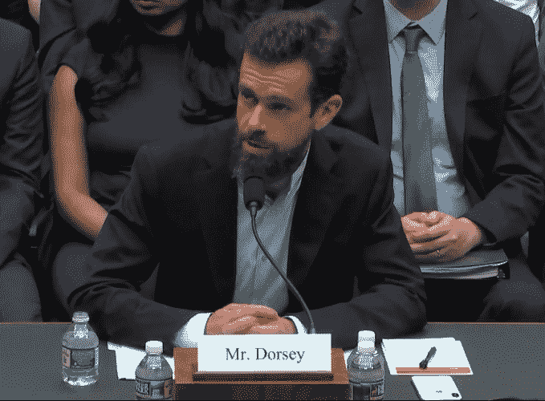
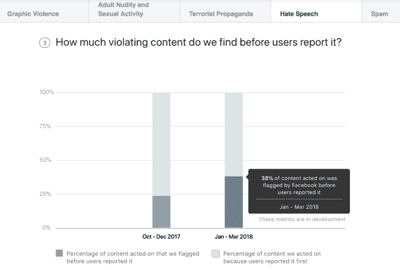
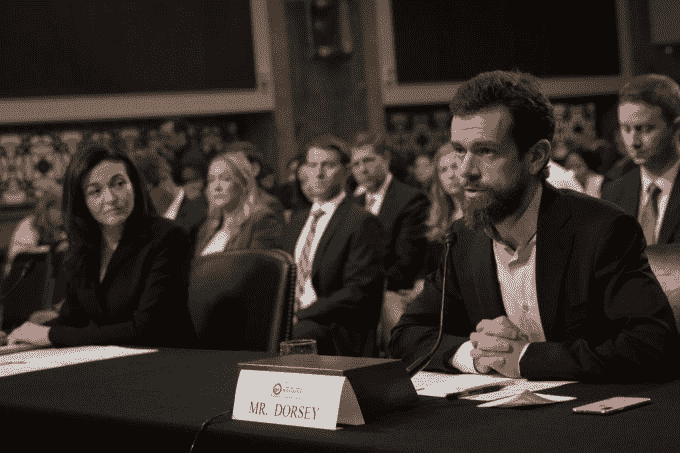

# Twitter 同意滥用——透明度报告、民权审计

> 原文：<https://web.archive.org/web/https://techcrunch.com/2018/09/05/government-vs-twitter/>

当 Twitter 首席执行官杰克·多西回应众议院能源委员会共和党人关于他的服务是否对保守派有偏见的问题时，他温和而平静地说“不”。一些民主党人，如众议员萨班斯(D-MD)指出，听证会的全部目的是“操纵裁判”，试图让推特陷入矫枉过正的境地，这将促进保守派，并使其更难执行针对右翼巨魔和阴谋论者的政策。

听证会开始前，多尔西公布了数据，显示民主党和共和党国会议员在控制追随者计数时，每条推特的印象数相同，驳斥了它压制保守派信息的理论。鉴于会议的虚假目的，许多问题只是询问 Twitter 是否基于政治意识形态进行歧视的不同方式，多尔西一再否认这一点。

有时候，多尔西确实显得毫无准备，无法提供足够的数据或对具体轶事的理解来反驳指控。众议员 Duncan (R-SC)曾详细描述了 DC 的一名新 Twitter 用户如何只收到了关注自由派政客和专家的建议，而很少或根本没有保守派。多尔西笨手笨脚地说，Twitter 有很多工作要做。

然而，听证会上确实出现了两个要点，这是在[今天早上与多尔西和脸书·首席运营官·雪莉·桑德伯格](https://web.archive.org/web/20230306043024/https://techcrunch.com/2018/09/05/highlights-from-the-senate-intelligence-hearing-with-facebook-and-twitter/)关于他们努力防止选举干预的会谈之后。

首先，多尔西表示，Twitter 将发布一份滥用透明度报告，以量化其服务上的骚扰及其在防止骚扰方面的进展。众议员 DeGette (D-CO)引用了大赦国际的“有毒 Twitter”关于服务中骚扰妇女的研究。她询问 Twitter 是否有基于人口统计的虐待数据及其对骚扰报告的回应。

多尔西回应道，“我们确实有我们在整个平台上看到的所有违规行为的数据，以及这些违规行为的背景。我们确实打算，这将是今年的一项举措，创建一份透明度报告，使数据更加公开，这样所有人都可以从中学习，我们可以对公众负责。”

今年 5 月，脸书[开始发布虐待报告](https://web.archive.org/web/20230306043024/https://techcrunch.com/2018/05/15/facebooks-new-transparency-report-now-includes-data-on-takedowns-of-bad-content-including-hate-speech/)，详细列出它删除的裸体/性内容、图形暴力和[仇恨言论帖子的数量](https://web.archive.org/web/20230306043024/https://transparency.facebook.com/community-standards-enforcement#hate-speech)，以及被自动系统捕获的百分比。

Twitter 已经发布了透明度报告，其中充满了政府要求获取私人用户数据或内容删除的信息，以及侵犯版权和内容所有者要求暂停盗版的信息。但公众对该平台上发生了多少起虐待事件、多久被举报一次、Twitter 回应举报的速度和准确性，以及能够在虐待蔓延之前阻止或消除虐待的产品开发情况知之甚少。我们已经向 Twitter 询问了将包含哪些内容的细节。

其次，多尔西同意 Twitter 接受民权审计。众议员弗兰克·帕隆(新泽西州民主党)问道:“你会承诺与独立的  第三方机构合作，对推特进行公民权利审计吗？以及将结果公之于众，用它们来改变政策。多尔西表示同意，同时指出，它已经与信托和安全委员会进行内部审计。

同样在五月，脸书同意进行类似的民权审计和政治偏见审计。这些将调查脸书是否歧视少数民族或压制保守观点。目前还不清楚 Twitter 的审计范围，但我们已经问过该公司。

这些承诺可能会给 Twitter 更多的弹药，以反击对其未能解决滥用问题和偏好自由主义者的指控——如果结果是积极的。但它们也可能成为证明它进展太慢的一种方式，任何偏见的信号，无论多小，都肯定会被现任政府抓住。

DC 华盛顿——9 月 5 日:(L-R)脸书首席运营官雪莉·桑德伯格和推特首席执行官杰克·多西于 2018 年 9 月 5 日在 DC 华盛顿国会山举行的参议院情报委员会听证会上就外国影响力运营对社交媒体平台的使用作证。Twitter 首席执行官杰克·多西和脸书首席运营官雪莉·桑德伯格面临外国特工如何利用他们的平台试图影响和操纵公众舆论的问题。(图片来自德鲁·安格雷尔/盖蒂图片社)

然而，尽管多尔西花了一天时间表示 Twitter 正在尽一切努力防止选举干预并公平执行其政策，但它尚未对这一努力做出可量化的财政承诺。

脸书同意将其安全和内容审核人员增加一倍，从 1 万人增加到 2 万人，即使这会损害其利润。然而，当众议员帕隆问 Twitter 有多少人类内容版主，他们的薪酬是多少，他们是如何培训的，多尔西回避了。这位首席执行官说:“我们想考虑的不是这个问题的人数，而是我们如何做出投资新技术的决策。”。

在经历了多年的亏损后，Twitter 上季度公布了创纪录的 1 亿美元利润。现在是时候承诺一些利润，而不仅仅是更多的言语，来解决它的问题了。