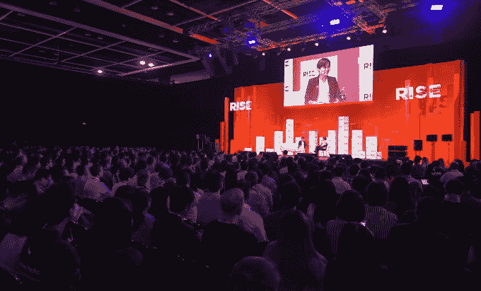

# Grab 联合创始人表示，尽管优步已经退出，但东南亚仍有很多竞争对手 

> 原文：<https://web.archive.org/web/https://techcrunch.com/2018/07/09/grab-co-founder-says-southeast-asia-still-has-plenty-of-competition/>

Grab 可能通过收购优步的区域业务在东南亚获得了主导地位，但该公司仍然认为打车领域存在竞争，尽管消费者可能会有所感受。

但是 Grab 的客户并不是唯一觉得 Grab 和优步的交易有害的人，[CCCS 竞争和消费者委员会上周表示担心这种合作伤害了消费者，缺乏竞争会减少创新。监管机构正在对该交易进行调查，可能会对优步和 Grab 处以罚款，或者可能彻底取消在新加坡的交易。](https://web.archive.org/web/20221207150449/https://techcrunch.com/2018/07/05/singapore-watchdog-threatens-to-unwind-ubers-southeast-asia-exit-deal/)

尽管威胁迫在眉睫，Grab 联合创始人陈慧琳(Hooi Ling Tan)在[的 Rise 会议上告诉观众，尽管优步退出了，但东南亚的市场，更普遍的叫车服务，仍然具有竞争力。](https://web.archive.org/web/20221207150449/https://riseconf.com/)

“现在仍有很多竞争，我们不认为它会结束..老实说，我们不希望这样，因为我们还在继续向他们学习，”谭说。“我们继续从采取另类战略(和)战术的另类玩家那里学习。”

Go-Jek 是一家市值 10 亿美元的公司，在印尼占据主导地位，并计划进行区域扩张以填补优步的空缺，可能是最明显的竞争对手，但 Tan 表示，Grab 正在与更基本的力量竞争。

“从第一天开始，我们的主要竞争对手就不是其他打车应用，而是(Grab 首席执行官安东尼·谭)所说的手——在路边招手打车的手，”与 Grab 首席执行官无关的谭说。“这个市场是巨大的，(这是)我们试图提供替代服务的地方，因为它并不完全像现在这样有效。”

2018 年 7 月 10 日；Grab 联合创始人 Tan Hooi Ling(左)和 Recode 执行主编 Kara Swisher 在香港香港会议展览中心 RISE 2018 第一天的中心舞台上。由斯蒂芬·麦卡锡/ RISE 通过体育档案拍摄

然而，新加坡监管机构 CCCS 不同意这种说法。上周，该公司表示担心，没有其他打车应用能与 Grab 相匹敌，而且成本和网络效应构成了令人望而却步的障碍，阻碍了新进入者的正面竞争。它认为，缺乏竞争已经导致 Grab 提高价格，尽管 Grab 否认这样做。

谭没有直接对监管机构的评论发表评论，但她在随后的新闻发布会上说，监管打车是一个棘手的过程。

“我们都在努力找出平衡消费者需求和创造支持创新的环境的正确方法，”她说。“我们一起试图解决问题，我们一起犯错误，但就我们的意图而言，我们百分之百地团结在一起。”

与 Grab 更意外结合的一个实体是，谭的评论无疑将这两个曾经不共戴天的敌人描绘成非常友好的关系。

“这种伙伴关系对我们来说意义重大，因为我们把视为真正的潜在合作伙伴，”谭说。“例如，他们一直在帮助我们的一些事情……他们在东南亚有 Uber Eats，这是我们没有的，自从我们帮助接管他们的运营以来，我们已经帮助他们通过一系列更多的增长扩张计划，现在已经从两个国家扩展到六个国家。

“他们还拥有一些最好的技术诀窍，无论是地图绘制还是基本的扩展基础设施，这些都是我们继续从他们那里学到的一些东西，”她补充道。

谭表示，和 Grab 正在就各自的业务发展进行相互教育，在这方面，Grab 今天推出了整合第三方服务的“超级应用程序”。[优步通过收购 Jump Bikes](https://web.archive.org/web/20221207150449/https://techcrunch.com/2018/04/09/uber-acquires-bike-share-startup-jump/) 拥抱了踏板车，但这个打车巨头将 Grab 这样的非交通服务引入支付和金融服务还需要一些想象。

但这完全是它退出东南亚的目的。人们普遍认为，优步离开东南亚亏损市场是为了在未来 IPO 之前清理资产负债表。尽管如此， [作为回报，它在 Grab](https://web.archive.org/web/20221207150449/https://techcrunch.com/2018/03/25/gruber-official/) 中获得了 27.5%的股份，而且这家总部位于新加坡的公司正在以超过 100 亿美元的估值筹集资金，优步已经在账面上获得了回报。

上个月，Grab 从丰田公司筹集了 10 亿美元，这是在东南亚后优步世界支持一站式“超级应用”战略的更大筹资努力的第一部分。