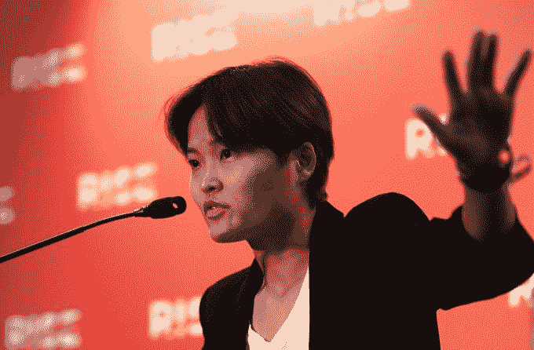

# 客户忠诚度计划变化引发的强烈反对冲击了东南亚市场 

> 原文：<https://web.archive.org/web/https://techcrunch.com/2018/07/23/grab-loyalty-program/>

没有优步的生活对 Grab 来说应该很简单，但与新加坡监管机构的斗争可能会导致 T2 公司对优步东南亚业务的收购失败，而 T4 一些消费者对缺乏竞争表示担忧。

Grab 联合创始人 Hooi Ling Tan 最近声称市场上仍然存在竞争，但这并没有阻止消费者的另一次反弹，因为这家打车公司在没有警告的情况下改变了其忠诚度计划。

公平地说，为打车赚取忠诚度积分是一件独特的事情——例如，优步不提供任何类型的计划——上周开始的变化似乎旨在将好处扩展到出租车以外的领域，并扩展到 Grab 的新业务，包括 GrabPay 支付服务和食品配送。

然而，在这样做的时候，该公司犯了两大罪。这些变化包括降低 Grab 最高层(即最忠诚的)客户的福利——回扣从 3.5-4.5%降至 0.7-1.7%，正如 MileLion 详细解释的。更糟糕的是，它在周五启动了新条款，其中包括这些大幅下降，并立即生效。

这意味着过去一年赢得的积分突然贬值，没有明显的追索权。

2018 年 7 月 10 日；Grab 的联合创始人 Tan Hooi Ling 在香港香港会议展览中心举行的 RISE 2018 第一天的新闻发布会上发表讲话。由斯蒂芬·麦卡锡/ RISE 通过体育档案拍摄

不出所料，这引发了强烈反对，许多消费者指责 Grab 做出这些改变是为了省钱。尽管一些消费者声称价格上涨，但 Grab 表示在优步退出后并未涨价。)

这导致周一晚些时候发布了第二份公告，将推出新的忠诚度计划条款的时间推迟至 9 月 30 日。然而，它并没有放弃新的变化本身。这是正确的举措，它让客户有机会在改变生效之前，以他们认为会被赎回的方式使用他们获得的信用。

“我们承认，客户需要时间来适应这些变化。从明天(7 月 24 日)上午 8 点到 9 月 30 日，GrabRewards 会员可以按之前的价格申领乘车奖励积分。该公司在一份声明中说:“根据新费率购买 Grab ride 奖励的客户将获得退款差额。”

该公司还表示，计划在年底前为更高级别的“白金”和“黄金”客户推出“更多专属优惠”。TechCrunch 认为这将与第三方合作有关，使用户能够在更多地方使用 Grab 积累的积分，尽管细节尚未最终确定。

在过去，与优步的竞争可能会给 Grab 留下一些与用户沟通混乱的余地。但是，正如这个最新的传奇故事所显示的，竞争的消除削弱了消费者对 Grab 的信心，这意味着每一个失误都有可能比过去更加疏远或扰乱用户。这是从一个对抗全球巨头的失败者调整为池塘里最大的鱼的重要组成部分。