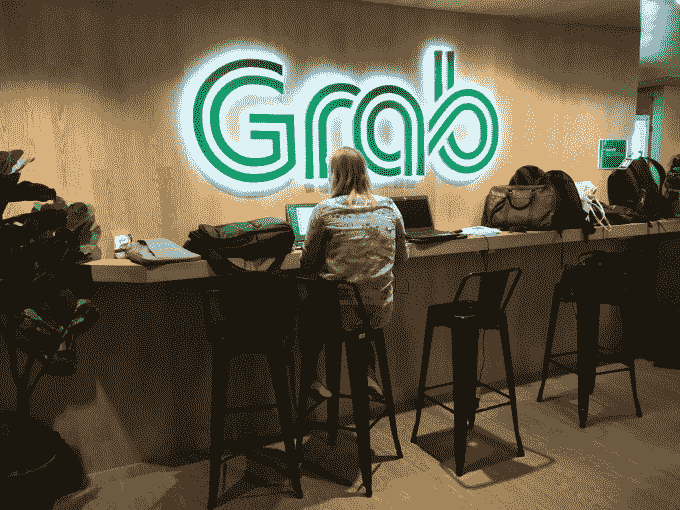
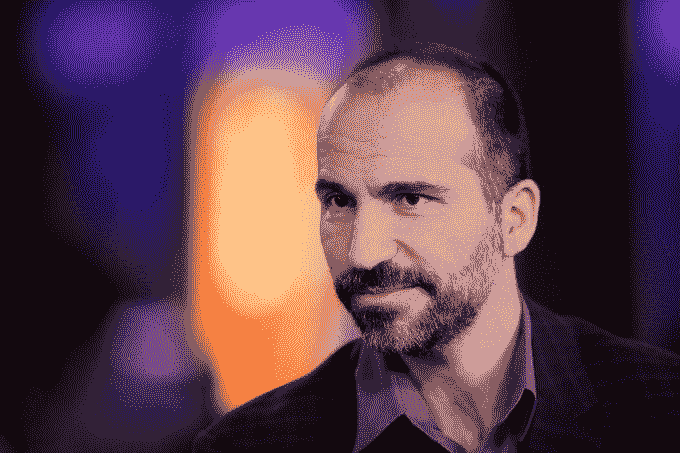
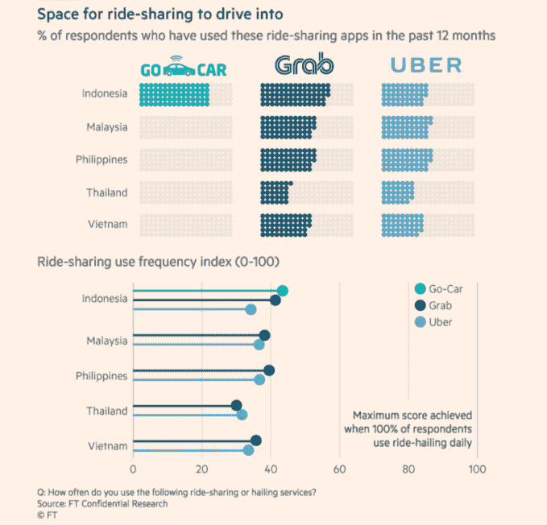

# Grab 收购优步东南亚公司陷入困境 

> 原文：<https://web.archive.org/web/https://techcrunch.com/2018/04/24/grab-uber-deal-southeast-asia/>

[传闻已久的抢](https://web.archive.org/web/20221012163116/https://techcrunch.com/2018/03/25/gruber-official/) 收购优步的东南亚业务现在可能正式了，但远未完成。

事实上，对于这位东南亚本土冠军来说，本应是一个值得庆祝的成年时刻，但由于顽固的监管机构、恐慌的优步员工以及不情愿的司机(作为安排的一部分，他们本应改用 Grab)，这个时刻可能会变成一场噩梦。

根据达成的协议，优步将持有 Grab 27.5%的股份，并退出东南亚无利可图的市场。

这些举措释放了优步的资源，供其他地区更有效地使用。作为交换，总部位于新加坡的 Grab 获得了优步在该地区的运营权，包括打车业务和 UberEats 送餐服务。与此同时，优步在该地区 8 个市场招募的 500 名员工中的大多数人及其平台上的司机现在都可以选择迁移到 Grab。

Grab 想要的结果很简单:消除其直接竞争对手的威胁，并通过新员工和司机来加强其业务。简而言之，正如首席执行官安东尼·谭(Anthony Tan)所说，它使亏损的 Grab 在盈利的道路上走得更远、更快。

双方提议快速退出优步——该应用计划在交易完成两周后的 4 月 9 日关闭。UberEats 将于 5 月底推出 GrabFood 服务。

对于有数百个空缺职位的 Grab 来说，一个关键因素是优步员工的招聘以及优步乘客和司机的移民。

现在，交易一个月后，事情不会按计划进行。整个交易将比最初想象的时间更长——可能长达几个月才能全部结清——让许多困惑的顾客滞留在路边。

Grab 在新加坡的一个办公室(Jon Russell/Flickr)

## 监管问题

最明显的是，Grab 面临的监管挑战比最初预期的更为严峻。

交易宣布后大约一个月[，优步的应用程序仍在新加坡运行](https://web.archive.org/web/20221012163116/https://techcrunch.com/2018/04/13/singapore-orders-grab-to-delay-closing-uber-app-for-an-additional-3-weeks/)，并在菲律宾延长了一周，这两项变化都是应反垄断监管机构的要求做出的，他们寻求更多时间来评估交易的影响。包括印度尼西亚和马来西亚在内的其他一些东南亚国家政府也在排队参与此次合并。

Grab 注册地新加坡的监管机构最为积极。

新加坡(CCCS)竞争和消费者委员会将移除优步应用的最后期限推迟至 5 月 7 日(T1)，比原定时间晚了一个月，以便对交易进行审查。欧盟委员会还命令 Grab 和优步“保持交易前的独立定价、定价政策和产品选择”，同时仔细研究细节。

[CCCS 认为其有“合理的理由”](https://web.archive.org/web/20221012163116/https://techcrunch.com/2018/03/30/singapore-says-uber-grab-deal-may-violate-competition-laws/)怀疑该交易可能与新加坡竞争法第 54 条相冲突，该条款旨在禁止过度垄断。

在新加坡和菲律宾的这些扩展意味着 Grab 的额外支出，Grab 正在支付成本，并帮助管理优步的应用在东南亚的延续。优步没有承担任何责任。

“截至周一，优步退出了包括菲律宾在内的八个市场。现在，我负责 10 个市场，而不是 18 个。我们的资金没了。我们的人走了。据 Rappler 报道，优步亚太区业务主管 Brooks Entwistle 本月早些时候在菲律宾[对菲律宾反竞争委员会说。](https://web.archive.org/web/20221012163116/https://www.rappler.com/business/199625-philippine-competition-commission-uber-grab-separate-operations)

在交易受到审查时保持优步开放无疑是一件好事，但在这种情况下，该服务几乎不是优步。

首先，它只覆盖新加坡，这个小小的城市国家的司机和乘客在最初被告知优步的服务将关闭后，理所当然地感到困惑。这是在承认优步应用程序由 Grab 资助之前——这种情况如此荒谬，以至于 Monty Python 可能想要授权。

优步和格雷布都对造成目前的不确定状态负有责任。在没有事先与监管机构协商的情况下，为取消该应用设定了两周的时间框架，这两家公司往好里说是咄咄逼人和天真，往坏里说是不顾一切地决定推进交易，而不考虑他们需要获得批准的监管机构。

Grab 的一名代表告诉 TechCrunch，它在交易之前“非正式地”联系了 CCCS，但 CCCS 称该交易是“未经通知的合并过渡”法律并未要求 Grab 和优步提前与新加坡当局联系，但这样做——或者提供更长的时间框架，因为计划中的关闭——显然可以避免这种情况。

尽管存在不便和成本，Grab 最终还是得到了它想要的，因为优步不顾监管机构的要求离开了该地区，正如路透社指出的那样，但其他问题仍然存在，应该引起这家总部位于新加坡的公司的关注。

新加坡和菲律宾的监管机构要求 Grab 将优步应用的维护期延长一周

## 优步员工“失望”

拟议合并的一个关键部分是 Grab 在该地区招募约 500 名优步员工的潜在能力。鉴于优步全球紧缩的大背景，这可能很容易被忽视，但 TechCrunch 从消息来源了解到，这是 Grab 的主要关注点。

Grab 不仅渴望填补公司近 500 个职位空缺中的至少一部分[，而且特别渴望避免优步员工大批转移到*直接竞争对手，如打车服务领域的 Go-Jek 或送餐服务 Deliveroo 和 FoodPanda。*](https://web.archive.org/web/20221012163116/https://grab.careers/)

早期迹象表明，Grab 的最佳计划正在土崩瓦解。

通过与来自不同国家和管理层的十多名优步员工的交谈，TechCrunch 了解到许多员工对加入 Grab 的前景感到不安。一些人告诉 TechCrunch，他们觉得优步已经抛弃了他们。

主要担心的是，即将离开优步的东南亚员工无法掌握自己的命运。

除了少数员工(估计约 50 人)之外，优步的东南亚员工不允许在优步地区内部调动。一些人说，他们被告知，他们甚至被禁止申请公司内的其他工作。

这些限制几乎迫使优步的员工搬到别处去抢东西——不管他们愿不愿意。高压手段并没有就此结束。据提供给 TechCrunch 的细节显示，离职条款也将潜在的前优步员工推入了 Grab 的轨道。

如果 Grab 决定提供一份与他们在优步挣得“基本相似”的薪水——还不完全清楚“基本相似”是什么意思——但员工不想跳槽，那么他们将只能获得基于他们居住地方法律的最低法定遣散费。

他们得到包裹的唯一方法是如果 Grab 不想要他们，在这种情况下，这是最低限度。

以下是优步在宣布合并当天给员工的信息公告:

> 今天没有人会失业。过渡到 Grab 的每个人都将继续是优步的员工，直到他们正式接受邀请，与 Grab 签署一份雇佣协议，并从优步辞职。
> 
> *   如果你得到一个角色，你将没有资格获得任何遣散费。
> *   如果你接受了 Grab 的一个职位，后来又辞职，你将没有资格获得遣散费。
> *   如果 Grab 向你提出实质上类似的提议，而你拒绝了，你将不再是优步的一员，因此你的雇佣关系将终止，你将有资格获得遣散费。根据您所在国家的当地法律，您将获得最低法定遣散费。
> *   如果 Grab 向你提出了一个实质上不相似的提议，而你拒绝了，你将有资格获得遣散费。您将获得最少四个月的基本工资以及每服务一年最少一个月的基本工资(例如，如果您服务了两年，您将获得总共六个月的遣散费(最少四个月加上两个月的基本工资)。)
> *   如果您在收到 Grab 的录用通知之前辞职，您将只会收到您的通知和其他法定权利。
> *   如果 Grab 无法为你找到合适的职位，我们会通知你，并根据你在优步的服务年限向你提供遣散费。您将获得至少四个月的基本工资，每服务一年再加一个月。

如你所见，优步的东南亚人也没有离职金。

考虑到该公司在中国和俄罗斯提供“绩效奖金”，这是一个惊喜。在那里，它告诉人们，他们的辛勤工作和对事业的奉献得到了赞赏，并在分别与滴滴出行和 Yandex 达成潜在有利可图的退出交易中发挥了关键作用。

由于优步退出东南亚与其说是失败，不如说是胜利——它在 Grab 的大量股份将会随着时间的推移而增值——因此，忠诚的员工被扫地出门，却连一点小费都没有，也没有对他们的劳动表示认可，也就不足为奇了。但是，为了保持优步以前的管理风格，该公司似乎更擅长制造混乱，而不是补偿那些不得不收拾残局的人。

达拉·科斯罗萨西(Dara Khosrowshahi)因不与优步在东南亚的员工直接接触而受到批评。(摄影师:马修·劳埃德/彭博 via 盖蒂图片社)

最重要的是，优步首席执行官达拉·科斯罗萨西(Dara Khosrowshahi)尚未与东南亚员工直接接触。几位接受 TechCrunch 采访的人感到失望的是，他们没有参加与 Khosrowshahi 的内部全员视频电话会议——该会议只包括优步在东南亚的“幸存”员工。

“他的到来被宣传为优步文化的一个积极变化，但他甚至都懒得去办公室一趟，也不联系一下。优步中国被卖给滴滴时，特拉维斯·卡兰尼克做到了这两点，”一名即将离职的优步东南亚员工告诉 TechCrunch。

很多不满似乎都集中在沟通问题上。

TechCrunch 从优步内部的消息来源了解到，该公司正在大力教育员工如何选择，包括可能允许那些希望留在公司的人这样做。优步已派遣高级管理层及其亚太和拉美地区人力资源主管夏嫣·格兰特(Andrew Grant)进行“员工路演”，旨在亲自拜访优步东南亚的每个办事处，帮助员工亲自评估他们的选择。

尽管如此，优步和 Grab 面临的最大障碍之一也是最基本的障碍之一。仅仅是与即将离职的优步员工取得联系就很有挑战性，因为一旦 Grab 交易被传达，他们就从优步的系统中被删除了，包括电子邮件目录。这是常见的安全协议，但设置和交流新的电子邮件地址和电话号码使保持对话成为一个挑战。

这些努力显然正在进行中，但大多数接受 TechCrunch 采访的优步员工尚未联系到 Grab，此外，尽管 Grab 和优步做出了努力，但大多数人都不确定沟通是否会发生以及何时会发生。优步内部的一名消息人士表示，优步或 Grab 可能需要“几个月”才能联系所有离开优步的人，并评估他们在 Grab 的未来角色。

在此期间，这些员工仍将由优步全额支付工资，但如果没有更新，那就要等很长时间了。然而，一个噩梦般的场景已经开始酝酿了。

## 招聘人员蜂拥而至

TechCrunch 了解到，正在越南、新加坡和菲律宾推出服务的 Go-Jek 正投入大量精力招募优步的前员工和该平台的司机，以便为其期待已久的区域扩张打下基础。

> Go-Jek 正试图从优步现已倒闭的东南亚业务中招聘关键人员

当然，Go-Jek 不会接受所有的优步校友，但这些条件无疑使其处于有利地位，可以挑选关键的新员工来填补其在印尼以外的业务。其他 Grab 竞争对手，包括资金雄厚的物流初创公司 NinjaVan、食品配送公司 Deliveroo 和 FoodPanda、自行车共享初创公司，甚至脸书、WeWork、谷歌和网飞等公司，据悉都匆忙安排了与优步即将离职的东南亚员工的面试，以吸引新人才。

这正是 Grab 试图避免的情况。

司机端的过渡也存在挑战，许多为优步开车的人不愿意或不确定是否要转向 Grab 的平台。

TechCrunch 采访了新加坡和泰国的十几名司机，在新加坡，优步仍在运营，在印尼，这项服务已经关闭。

在泰国和新加坡，司机们已经穿越到 Grab，但他们抱怨这种体验。主要是应用程序质量差，他们赚的钱少，他们觉得自己别无选择。

Grab 本月早些时候表示，该公司已与印尼 75%以上的优步司机签约，但没有其他市场的数据。到目前为止，还没有独立的数字来提供司机转型成功的更广泛的情况。

“当这些拼车巨头合并时，司机们往往会觉得自己像是棋子。许多司机已经开始为优步开车，并对他们的体验感到满意，所以迁移到一个新平台的想法可能会令人生畏，”Harry Campbell 告诉 TechCrunch，他在拼车博客上为司机写了关于拼车体验的文章。

“竞争的好处之一是，在争取司机并善待他们的问题上，它能让这些公司受到约束。许多车手选择优步是有原因的，”Campbell 补充道，他最近[主持了美国车手和优步首席执行官 Khosrowshahi](https://web.archive.org/web/20221012163116/https://therideshareguy.com/recap-of-my-live-qa-with-uber-ceo-dara-khosrowshahi/) 之间的问答。

这是新加坡一名优步司机的观点，他[在他的博客](https://web.archive.org/web/20221012163116/http://uberinginsingapore.blogspot.sg/2018/04/one-more-week-for-uber.html)上写道，许多担心用 Grab 赚钱少的司机仍然希望看到优步留下来的“奇迹”。除了这种担忧，TechCrunch 本周报道称 [Go-Jek 已经与新加坡最大的出租车运营商](https://web.archive.org/web/20221012163116/https://techcrunch.com/2018/04/23/go-jek-is-in-talks-with-former-uber-ally-comfortdelgrow/) ComfortDelGro 进行了谈判，目的是成为该公司的打车合作伙伴。Comfort 之前与优步签署了一项协议。

最后，消费者自己也不得不习惯用 Grab 代替优步。许多人表达了各种问题，从主观诉求，如 Grab 上的劣质体验，到更可量化的问题，包括更高的定价和更长的乘车等待时间。

关于这一点，Grab 解释说，它采用了不同的定价模式。Grab 表示，它“始终保持每公里票价的竞争力，最高可达 2.0 英镑”，而不是优步那种更强调激增定价的低距离票价方式 Grab 说，优步的增长可能达到 4 倍。

## 高杰的机会

所有这些因素都给了 Go-Jek 一个巨大的机会，让它步入优步的阴影，成为百事可乐在东南亚抢夺的可口可乐。正如英国《金融时报》最近的分析所表明的那样，已经有了这样做的记录。

该报的研究部门调查了新加坡、越南、印尼、泰国、马来西亚和菲律宾的 5000 名消费者，发现在大多数国家，Grab 和优步的服务之间的差距很小。主要的例外是印度尼西亚，Go-Jek 及其 GoCar 服务是该国的主导者。

这表明，如果 Grab 不能充分利用对优步的收购，情况可能会比最初设想的更为严峻。

*乔纳森·谢伯[补充报道和协助。](https://web.archive.org/web/20221012163116/https://techcrunch.com/author/jonathan-shieber/)*