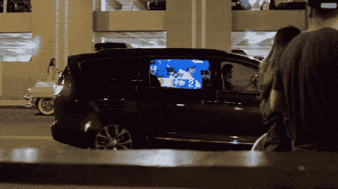
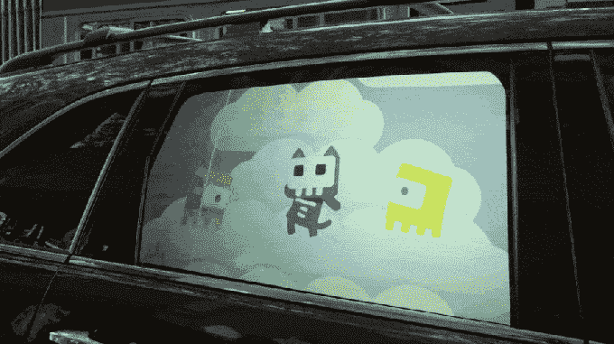

# Grabb 它想把你的车窗变成一个迷幻的视频广告牌

> 原文：<https://web.archive.org/web/https://techcrunch.com/2018/08/15/grabb-it-wants-to-turn-your-cars-window-into-a-trippy-video-billboard/>

这让我想起了银翼杀手。

也许是因为它看起来有点未来派——有点不真实。也许是因为我正在某个地方看一个广告，我从没想过会看到，就像雷德利·斯科特未来的摩天大楼广告。

Grabb-It 将汽车的后窗变成全彩显示屏，向任何可能站在路边的人播放位置感知广告。他们目前的目标是与拼车/送货司机合作，使他们能够在开车的同时赚点外快。

当司机穿越城镇时，广告可以自动切换到关注附近的企业。在棒球场附近？它可能会让你获得今晚比赛的门票。任务结束了吗？它可以在你身后的酒吧播放一则关于欢乐时光的广告。

那么它是如何工作的呢？我第一眼看不出来——但是一旦他们打开车门，一切都豁然开朗了。

关键是:投射。它可以把你的窗户变成某种轮子上的背投电视。

grabb-它将一种材料应用到汽车右后窗的内部，作为投影表面。这种材料足够薄，以至于窗户仍然可以打开——但是，可能会惹恼一些乘客的是，它还不够薄，以至于你可以透过它看到很多东西。他们在车内安装一个小型投影仪，对着窗户，投射出一幅从外面也能看到的明亮图像。我看到它在昏暗的地下停车场和室外阳光直射下运行，两种情况下的图像都出奇的清晰。

最终的结果非常清晰(这是我真的不习惯说的让我看广告的技术)。因为投影材料是为每辆车定制的，所以图像可以覆盖几乎整个车窗玻璃表面。它给人一种为汽车轮廓定制的显示器的错觉。

它应该只在司机休息的时候运行。一旦乘客上车，投影仪就会关闭——因为，没人希望在去下一个会议的路上，投影仪的光线射到他们的脸上。

虽然该公司正在开发自己的硬件套件，但我看到的构建是运行小型现成投影仪的早期迭代。即使在这个阶段，这也是一个非常有效的演示。虽然这个原型需要司机通过遥控手动切换投影仪，但 grab-It 的创始人告诉我，他们最终的硬件会自动检测后门何时打开，并在运行中切断投影仪。当怠速发动机振动时，图像有点抖动，尽管这似乎可以通过更好的阻尼来改善。

我对分散注意力的因素有点担心；你旁边的车上播放的全动画广告会让你看不到前方的路吗？虽然 grabbing 告诉我，他们正在与适当的当局合作，以确保这一切都是合法的，但我想随着越来越多的汽车利用这项技术上路，人们可能会对此提出质疑。

Grabb 它说他们将支付驱动程序的安装费用——如果驱动程序决定移除它，只需卸下投影仪并从窗口剥离投影材料即可。

该公司告诉我，它目前正在旧金山对大约 25 名司机进行测试，每周驾驶 40 小时的司机每月收入约为 300 美元。光靠自己来支付账单是不够的，但如果一切按计划进行，这将是完全自动化的一个坚实的变化。

grabb-它是 Y Combinator 2018 年夏季课程的一部分，已经在 YC 以外从 Lyft 创始投资者 Sean Aggarwal 那里筹集了 10 万美元。