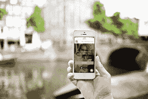
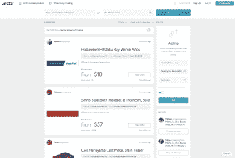

# Grabr 获得 800 万美元，将有行李空间的旅行者与渴望国外产品的人联系起来 

> 原文：<https://web.archive.org/web/https://techcrunch.com/2018/03/06/grabr-gets-8m-to-connect-travelers-with-space-with-those-longing-for-products-abroad/>

如果 Daria Rebenok 的计划成功的话，如果你在包里留一些自由空间，或者根本不用支付旅行费用，你可能真的会在旅行时省钱。

作为狂热的旅行者，以及那些渴望从国内购买在国外买不到的产品的人，她和 **Artem Fedyaev 决定启动 [Grabr](https://web.archive.org/web/20221209035724/https://grabr.io/en/) 来解决这个问题。虽然你可能无法在亚马逊上的外国货架上或任何其他地方的网上买到你在任何地方都能找到的产品，但无论出于什么原因，总有人往返于这些国家。Grabr 为那些在包里有几平方英寸或几英尺的旅行者提供服务，让他们付费将这些产品带回国外。Grabr 今天表示，它已经筹集了由 Foundation Capital 牵头的新一轮 800 万美元融资，我们将在底部添加一些其他投资者。**

 **“在我们搬到旧金山之前，我们曾经住在西班牙，我们错过了一些西班牙商品，”雷贝诺克说。“虽然听起来很傻，但我们在亚马逊上找到了它。我们甚至在旧金山都找不到，在那里你可以买到任何你想要的东西。没有便捷的方式获得它，也没有运输选择。但是在西班牙，这就像去杂货店一样简单。我们想，应该有人做到这一点，有这么多的国际比赛，但那里什么也没有。”

你可以把它想象成旅行者和购物者的一种全球结缔组织，灵感来自 Postmates 这样的产品。这里有一个潜在的例子，如果这个故事像 Rebenok 希望的那样发展的话:比如说，在意大利的佛罗伦萨，有一家定制服装店，他们没有自己的在线产品。但是你知道你的尺寸，你知道你想要从那里得到什么东西，而运送它将是一场噩梦。相反，你可以通过 Grabr 付钱给已经前往佛罗伦萨的人，让他在去机场的路上顺道过来取货，然后他会带着它通过海关，然后把它送到你那里。

“我们以为所有的东西都能装进行李箱里，”雷贝诺克说。“但我们有人送自行车和滑雪板，并检查额外的行李，人们花这么大的价钱是有道理的。人们认为，他们第一次听说 Grabr 时，很可能会认为我们正在将 iPhones 带到国外。事实并非如此，我们服务的是那些因为没有便捷的物流方式而无法在亚马逊购物的人们的需求。"

这项服务可能还没有完全到位*，为了保证质量，它需要一些护栏。但目前，它正努力确保支付通过适当的本地交易提供商进行，最终用户只是看到以美元进行的价值转移，并尽可能简化整个过程。从杂货店买几块当地的食物或糖果是很容易的，而且可以大大降低产品从一个国家到另一个国家的障碍。Grabr 向每个用户介绍海关政策，并确保任何额外的海关费用计入产品成本。但 Rebenok 说，最大的挑战之一是确保他们找出并加载所有的本地交易方法。*

 *

鉴于这里的机会——以及国际居民可能永远对家乡商品的渴望——可能会有相当多的竞争。有像 Backpack 和 PiggyBee 这样的[服务，尽管等式的一部分也将是弄清楚如何建立最无缝的平台，正确地弄清楚如何降低消费者和旅行者的准入门槛。随着 Grabr 获得更多关于其消费者想要什么的信息，它也许能够做到这一点。](https://web.archive.org/web/20221209035724/https://techcrunch.com/2014/08/13/backpack-connects-you-with-travelers-so-you-can-purchase-items-in-other-countries/)

Rebenok 和她的丈夫是狂热的积分黑客——他们致力于优化航空公司、酒店和信用卡奖励，以获得最好、最便宜的旅行选择。Rebenok 表示，这是那些热衷于积分黑客的旅行者的另一种方式，通过为他们提供为多余空间获得报酬的能力，同时仍然从他们自己的卡中积累里程和积分。她说，甚至开始与这些奖励项目合作也是有意义的。

“我们从第一天起就一直在考虑这个问题，”她说。“我们最大的梦想是，你从 Expedia 这样的网站结账，把你的行李箱和弹簧产品带回家，而不是花费 1000 美元。不用花 1000 美元去巴黎，你可以买两件东西，然后花 200 美元去那里。这就是我和我丈夫一段时间以来一直在做的事情，我们一直用 Grabr 带来产品，用我们的信用卡购物，还免费获得里程。”***