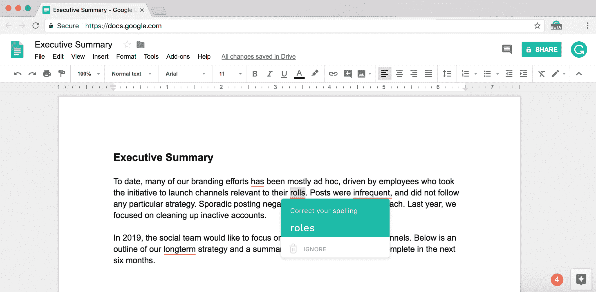

# Grammarly 现在也能让你避免谷歌文档中令人尴尬的错误

> 原文：<https://web.archive.org/web/https://techcrunch.com/2018/09/12/grammarly-now-saves-you-from-embarrassing-mistakes-in-google-docs-too/>

# Grammarly 现在也可以让你在谷歌文档中避免尴尬的错误

[语法上](https://web.archive.org/web/20221025230341/https://grammarly.com/)现在支持谷歌文档。在过去的几年中，Grammarly 已经成为市场上较好的语法和拼写检查工具之一。作为 Chrome 的扩展，它几乎可以与所有主要的在线工具和社交媒体网站整合，但直到现在，谷歌文档仍然是一个盲点。

因为它的实时协作特性，谷歌文档编辑器毕竟不仅仅是一个简单的文本字段，所以 Grammarly 团队不得不做一些额外的工作来使它的服务在那里工作。不过，一旦你安装了这个扩展，它现在就可以像在任何其他网络应用程序中一样工作了。

该功能实际上已经作为测试版向高级用户提供了一段时间，但现在每个人都可以尝试一下。

现在看到 Grammarly 来 Google Docs 很有意思。毕竟，7 月份，谷歌[宣布](https://web.archive.org/web/20221025230341/https://techcrunch.com/2018/07/24/google-docs-gets-an-ai-grammar-checker/)也将自己的语法检查器引入谷歌文档。谷歌在这里的转折是，它基本上使用了相同的机器学习技术，为其翻译软件提供动力，以检查你的文档中的错误。我的感觉是，Grammarly 实际上提供了一套更全面的工具来防止你因糟糕的语法而尴尬(例如，包括标点符号的帮助)，但谷歌的工具仍处于私人测试阶段，所以我还不能尝试一下。

Grammarly 的付费计划[起价为每月 29.95 美元](https://web.archive.org/web/20221025230341/https://www.grammarly.com/upgrade?utm_source=upHook&app_type=app&page=free&utm_campaign=editorMenu&utm_medium=internal)，但如果你预付三个月或一整年的费用，你就可以享受折扣(该公司还定期向其免费订户提供折扣)。还有一个面向企业的团队计划，起价为 10 美元/月/成员(至少有三个订户)。

