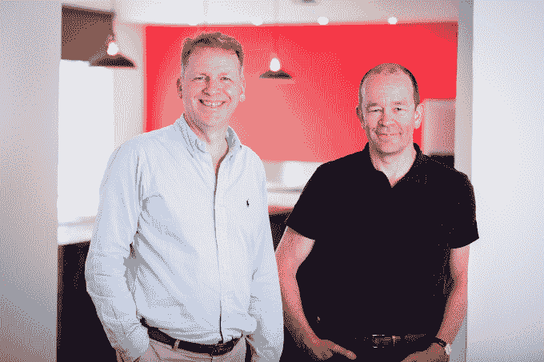

# Graphcore 的人工智能芯片现在由 Atomico、DeepMind 的 hass abis TechCrunch 提供支持

> 原文：<https://web.archive.org/web/https://techcrunch.com/2017/07/21/graphcores-ai-chips-now-backed-by-atomico-deepminds-hassabis/>

AI 芯片制造商 Graphcore 是不是要出来吃英伟达的午餐？联合创始人兼首席执行官奈杰尔·图恩(Nigel Toon)在采访开始时笑了——可能是因为他在 2011 年将自己的前公司卖给了芯片制造商。

“我相信英伟达也会成功，”他大胆说道。“他们已经在这个市场上非常成功了……成为一个可行的竞争对手并与他们并肩作战，我认为这将是我们自己的一个有价值的目标。”

图恩还指出，在竞争格局中，相对于其他主要参与者(如英特尔)，他称之为“有趣的缺席”。(尽管很明显[英特尔正在花钱填补缺口](https://web.archive.org/web/20230207122855/https://www.wired.com/2017/03/intels-15-billion-reasons-ai-chip-revolution-arrived/)。)

分析机构 Gartner 最近的一份[报告](https://web.archive.org/web/20230207122855/http://www.gartner.com/newsroom/id/3763265)显示，到 2020 年，人工智能技术将会出现在几乎所有的软件产品中。很明显，为支持机器学习软件海啸，对更强大的硬件引擎的竞争正在进行。

“我们比许多其他公司更早开始这一旅程，”图恩说。“我们可能领先两年，所以我们绝对有机会成为首批推出真正针对该应用设计的解决方案的人之一。因为我们处于领先地位，我们已经能够从这些给我们提供正确反馈的关键创新者那里获得兴奋和兴趣。”

总部位于英国布里斯托尔的 Graphcore 刚刚完成了由 Atomico 牵头的 3000 万美元的 B 轮融资，紧随 2016 年 10 月的 3200 万美元 A 轮融资。它正在为机器学习开发者构建专用的处理硬件和软件框架，以加速构建他们自己的人工智能应用程序——其既定目标是成为“机器智能处理器”市场的领导者。

在一份支持声明中，Atomico 的合伙人 Siraj Khaliq 加入了的 Graphcore 董事会，他大谈其“加快创新步伐”的潜力。“Graphcore 的第一个 IPU 比最新的行业产品提供了一到两个数量级的性能，使开发新模型成为可能，同时大大减少了等待算法完成运行的时间，”他补充道。

图恩表示，该公司在去年 10 月的 A 轮融资中发现了很多投资者的兴趣，因此决定“比计划的更早”进行 b 轮融资。“这将使我们能够更快地扩大公司规模，支持更多客户，并更快地增长，”他告诉 TechCrunch。“我们仍然可以选择在明年筹集更多资金，然后在我们推出产品后真正加速增长。”

新的资金带来了一些新的高调天使投资人，包括 DeepMind 联合创始人戴密斯·哈萨比斯和优步首席科学家邹斌·格拉马尼。因此，你可以大胆猜测 Graphcore 在其人工智能处理系统的开发阶段可能会与哪些科技巨头密切合作(尽管图恩很快强调，哈萨比斯等天使投资人是以个人身份投资的)。

“我们真的不能对谷歌可能在做什么发表任何声明，”他补充道。“我们还没有宣布任何客户，但我们显然正在与一些领先的参与者合作，我们已经得到了这些人的支持，你可以推断他们对我们正在做的事情非常感兴趣。”

其他加入 B 轮的天使包括 OpenAI 的 Greg Brockman，Ilya Sutskever，Pieter Abbeel 和 Scott Gray。Graphcore 的现有投资者 Amadeus Capital Partners、罗伯特·博世风险投资公司、C4 风险投资公司、戴尔技术资本公司、Draper Esprit、Foundation Capital、Pitango 和三星 Catalyst Fund 也参与了这轮投资。

优步的 Ghahramani 在一份声明中评论说，当前的处理硬件正在阻碍替代机器学习方法的发展，他认为这些方法可能有助于“机器智能的彻底飞跃”。

“深度神经网络让我们在过去几年取得了巨大的进展，但也有许多其他的机器学习方法，”他说。“一种能够支持和结合替代技术的新型硬件，加上深度神经网络，将产生巨大的影响。”

Graphcore】迄今已经筹集了大约 6000 万美元——图恩表示，其目前 60 人的团队已经“认真”开展这项业务整整三年了，尽管该公司的起源可以追溯到 2013 年。

联合创始人奈杰尔·图恩(首席执行官，左)和西蒙·诺尔斯(首席技术官，右)

2011 年，两位联合创始人将他们之前的公司 Icera 出售给了英伟达，该公司为移动通信的 2G、3G 和 4G 蜂窝技术提供基带处理。“卖掉那家公司后，我们开始思考这个问题和这个机会。他解释道:“大约在 2013 年，我们开始与该领域的一些领先创新者交谈，并开始组建一个团队。

Graphcore 正在建立它所谓的 IPU，也就是“智能处理单元”，提供专门为机器学习任务设计的处理硬件，而不是意外发现的重新调整用途的 GPU，这些 GPU 迄今为止一直在帮助推动人工智能的繁荣。或者实际上，对于这种密集处理来说，需要大量的 CPU 集群(但不是很合适)。

它还在构建与硬件接口的图形框架软件，名为 Poplar，旨在与不同的机器学习框架相结合，使开发人员能够轻松进入一个系统，该系统声称与“当今最快的系统”相比，它将把机器学习训练和推理的性能提高 10 倍至 100 倍。

图恩表示，它希望在今年年底前将 IPU 交到“早期用户”手中。“这将是一个系统的形式，”他补充说。

“虽然我们正在做的核心工作是构建一个处理器，我们正在构建我们自己的芯片——前沿工艺，16 纳米——我们实际上将把它作为一个系统解决方案来提供，所以我们将提供 PCI express 卡，我们将把它放在一个机箱中，这样你就可以把这些 IPU 的集群放在一起工作，使人们易于使用。

“到明年，我们将面向更多的客户。并希望将我们的技术应用到一些更大的云环境中，以便广大开发人员可以使用。”

在讨论其 IPU 与也用于支持机器学习的 GPU 的设计之间的差异时，他总结道:“GPU 有点死板，锁在一起，所有东西都在同一时间做同一件事……而我们有数千个处理器都在做不同的事情，都在一起完成机器学习任务。

“[通过 IPUs 进行处理]带来的挑战是让这些处理器真正协同工作，能够共享它们之间需要共享的信息，安排处理器之间的信息交换，并创建一个便于人们编程的软件环境，这正是复杂性所在，也是我们真正要解决的问题。”

“我认为我们已经为这些问题找到了一些相当好的解决方案，”他补充道。“这正是引起人们对我们所做工作兴趣的真正原因。”

他表示，Graphcore 的团队旨在通过其图形框架，在其硬件和广泛使用的高级机器学习框架(包括 Tensorflow、Caffe2、MxNet 和 PyTorch)之间实现“完全无缝”的接口。

“你使用相同的环境，编写完全相同的模型，并通过我们称之为 Poplar(一个 C++框架)来填充它，”他指出。“在大多数情况下，这将是完全无缝的。”

尽管他证实，在当前人工智能主流之外工作的开发人员——比如试图创建新的神经网络结构，或者与决策树或马尔可夫场等其他机器学习技术合作——可能需要进行一些手动修改，以利用其 IPUs。

“在这些情况下，他们可能需要修改一些原语或一些库元素，”他指出。“我们提供的库都是开放的，所以他们可以根据自己的目的修改一些东西。”

图恩说，科技行业对机器学习的明显无法满足的需求正在受到——至少部分受到——需要理解的数据类型从文本到图片和视频的重大转变的推动。这意味着越来越多的公司“真正需要机器学习”。“这是他们能够理清思路，理解网站上这种非结构化数据是什么的唯一方法，”他说。

除此之外，他指出了各种新兴技术和复杂的科学挑战，人们希望这些技术和挑战也能受益于人工智能的加速发展——从自动驾驶汽车到具有更好医疗效果的药物发现。

“许多癌症药物都具有很强的侵袭性和可怕的副作用，因此这项技术可以在各种领域产生真正的影响，”他建议道。“人们看到这一点，认为(人工智能技术的应用)将需要 20 年时间，但如果你有合适的硬件可用，(开发可能会加快)。

“看看谷歌翻译使用机器学习变得多快，我认为同样的加速也可以应用到这些非常有趣和重要的领域。”

在一份支持性声明中，DeepMind 的哈萨比斯还进一步暗示，专用人工智能处理硬件可能会为开发人工通用智能的科幻圣杯目标提供一条腿(相对于构成当前前沿的更狭窄的人工智能)。

“构建具有通用人工智能能力的系统意味着开发可以从原始数据中学习的算法，并将这种学习推广到广泛的任务中。这需要强大的处理能力，而支撑 Graphcore 处理器的创新架构有着巨大的潜力，”他补充道。