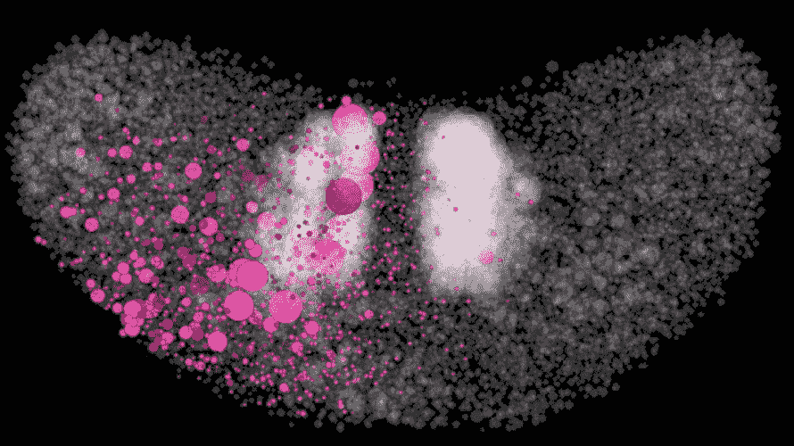

# Graphika 将 Twitter 在美国的过滤气泡可视化 

> 原文：<https://web.archive.org/web/https://techcrunch.com/2018/08/27/graphika-visualizes-twitters-filter-bubbles-in-the-us/>

毫不奇怪，美国的政治话语存在分歧——尤其是在网上。在上周的《麻省理工科技评论》中，*、*、数据可视化公司 [Graphika](https://web.archive.org/web/20230219195300/https://www.graphika.com/) 用 3D 彩色描绘了美国 Twitter 上的过滤气泡，将这些分歧展现得栩栩如生

Graphika 的首席执行官约翰·凯利和该公司的研究总监卡米尔·弗朗索瓦共同撰写了这些图形，这些图形将 Twitter 用户想象成彩色的球体(根据他们的粉丝数量而变大或变小)，并根据谁关注谁来对他们进行分组。

作者告诉 TechCrunch，为了创建这些特定的数据可视化，他们使用了大约 13500 个最佳连接账户的数据，这些账户关注国会议员和国家级官方政党账户。作者说，其他起点，如单一州或基层政党，也说明了这些隐约可见的国家回音室。

视觉效果有助于将一些可预测的趋势清晰地呈现出来。例如，极端特朗普支持者和极端反特朗普者之间的追随者基本上为零。进步运动在民主党人和左翼记者之间的联系最为紧密，但在保守领域也有一些联系。

渐进数据

该图引起关注的一个有趣的点是，尽管我们先入为主地认为整个左翼或整个右翼代表一种单一的意识形态，但事实上主要是这些群体中最边缘的人在说话。作者指出，对于其中一些账户，大量相同的推文指向一个机器人，而不是实际用户。

这种两极分化正是让坏的外部行动者(如俄罗斯)有可能在社会领域影响政治话语和行动的原因。这些行为者可以与两极分化的社区接触，获得他们的信任，并引入新的或加剧的意识形态，而不是针对中间群体——用户通常更安静，他们的观点通常没有那么严格的党派性。

“这在数字上相当于搬到一个孤立而紧密的社区，使用自己的语言怪癖并迎合其痴迷，竞选市长，然后利用这一职位影响国家政治，”作者写道。

如果这些数据说明了什么，那就是我们该开始重视听而不是说了。

“极端在尖叫，而中心在低语，”作者告诉 TechCrunch。

想要和认同你的人确认你的信仰是人的天性，尤其是在不确定或恐惧的时候。然而，退回到充斥着坏演员的回音室，我们对任何人都没有好处，尤其是对我们自己。