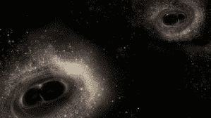
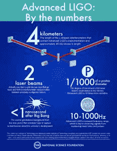
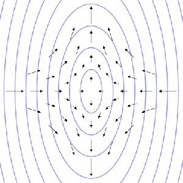
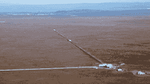

# 历史上第二次探测到引力波 

> 原文：<https://web.archive.org/web/https://techcrunch.com/2016/06/16/gravitational-waves-have-been-detected-for-the-second-time-in-history/>

有史以来第二次，科学家们直接探测到了引力波。就这样，天文学的新时代开始了。

就像探测到的第一个引力波一样，科学家认为信号是由两个黑洞碰撞产生的，尽管这是一个与第一个完全不同的二元黑洞系统。

这两个信号都是在激光干涉引力波天文台( [LIGO](https://web.archive.org/web/20230131001457/https://www.nsf.gov/news/special_reports/ligoevent/pdfs/LIGO_factsheet_v01.pdf) )探测到的。LIGO 团队由来自麻省理工学院和加州理工学院的研究人员组成，他们领导了设计和建设，并合作运营该设施。

在排除了检测到的波纹的任何其他可能的来源后，LIGO 团队确定，该波与成千上万种已知波形可能性中的一种情况相匹配:14 亿光年外的两个黑洞以光速的一半相撞。

> “第一场比赛太美了，我们几乎不敢相信。现在，看到另一个引力波的事实证明，我们确实正在观察宇宙中的一群二元黑洞。我们知道，我们会经常看到许多这样的东西，足以从中产生有趣的科学。”塞尔瓦托·维塔莱，麻省理工学院研究科学家，LIGO 团队成员

引力波是宇宙中时空结构的波纹，由阿尔伯特·爱因斯坦在 100 多年前提出。它们是由发生在外层空间的极端灾难性事件引起的——就像两个黑洞相互碰撞。

黑洞合并图解/图片由 LIGO/加州理工学院提供

直接探测引力波是一件大事，因为通过这样做，科学家们正在证实爱因斯坦的广义相对论。

有了广义相对论，爱因斯坦以一种全新的方式解释了引力的概念。他的理论是，宇宙中的大质量物体扭曲了时空结构，这被认为是重力。

我们可以把宇宙想象成一块巨大的橡胶，类似于一个大蹦床。如果你把一个巨大的物体放在宇宙的蹦床上，它会扭曲它周围的附近区域，导致附近的物体被“吸引”向它。更大质量的物体会产生更大的扭曲。

这就是为什么宇宙中更大、更重的物体会获得更大的引力。

爱因斯坦对引力的解释回答了牛顿的引力理论所不能回答的问题。

牛顿将重力描述为一种恒定的瞬时力，其中质量较大的物体比质量较小的物体具有更强的吸引力。

这是一个有助于解释宇宙内部运作的概念。但是有一个问题。当谈到这个力到底是如何存在的，或者这个力到底是如何从一个物体传递到另一个物体的时候，牛顿没有答案。

爱因斯坦的理论更好地解释了科学家对宇宙的观察，因此它成为了普遍的引力理论。

如果引力以爱因斯坦理论的方式存在，那么引力波应该存在并且能够被探测到。从技术上讲，任何物体都可以产生引力波，但只有难以置信的大质量物体和极端事件才能产生大到我们可以测量的引力波。

直到最近，科学家们还缺乏必要的工具来探测宇宙中的这些波纹。随着 LIGO 的诞生，这一切都改变了。

LIGO 由阿德里安·阿波达卡和国家科学基金会提供的数字/信息图

LIGO 是一个巨大的设施，花了超过 5.7 亿美元和 40 年来设计和开发。迄今为止，这是美国国家科学基金会有史以来最大的科学投资。

这个概念相当简单。引力波应该在一个方向拉伸空间，在另一个方向压缩空间。如果科学家能够找到一种极其精确和灵敏的方法来测量地球上 X-Y 平面上的空间，他们就可以直接探测到引力波。

引力波对时空的拉伸/图片由维基公共提供

事实证明，LIGO 是那种极其精确、敏感的工具。

该设施有两个主要位置:一个在路易斯安那州，另一个在华盛顿。每个设施都有一条 L 形隧道，每条隧道有 4 公里(2.5 英里)长，相互垂直。

激光束在垂直的腿中发出脉冲，然后 LIGO 的科学家测量激光束击中隧道腿的一端并返回起点所需的时间。

华盛顿州汉福德的 LIGO 工厂

因为我们知道光的速度，所以可以精确测量每一段隧道的长度。有了这些信息，科学家们可以确定空间是被压缩了还是被拉伸了。

运用这一策略，LIGO 在今年 2 月首次直接探测到引力波，创造了历史。该设施能够检测到 LIGO 腿中一个质子直径的*分数大小的拉伸。*

在宣布他们的发现后，LIGO 实验室执行主任大卫·雷茨说:“这是一次科学的登月拍摄。我们做到了——我们登上了月球。”

现在，同一个团队已经探测到了第二个完全独立的引力波，它拉伸了 LIGO 的腿，拉伸量甚至比第一个波还要小。

LIGO 让科学家们可以通过一个全新的视角来观察宇宙。通过研究引力波，研究人员可以更多地了解黑洞的频率以及它们是如何合并的。

有了 LIGO，科学家们开启了天文学的一个全新时代。

> “你可以想象，对我们大多数人来说，这些探测对我们的生活产生了非常强烈的影响，因为我们等待这一天已经很久了。过去几个月，这是一次不可思议的经历。”Lisa Barsotti，麻省理工学院首席科学家，LIGO 团队成员