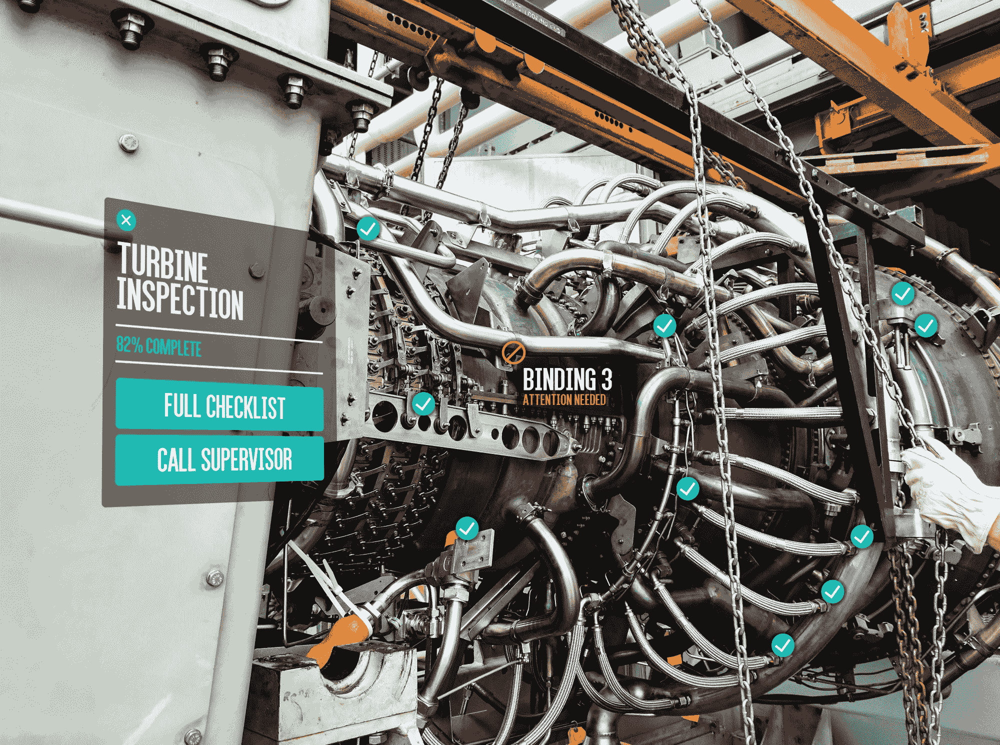

# Gravity Jack 的 PoindextAR 可随时随地追踪增强现实中物体的最小细节 

> 原文：<https://web.archive.org/web/http://techcrunch.com/2017/04/11/gravity-jacks-poindextar-tracks-objects-smallest-details-for-augmented-reality-anywhere/>

增强现实是一个困难的命题，无论是在用于正确完成它的方法上，还是在完成它所需要的资源上。Gravity Jack 的一个新的 AR 系统在该领域取得了一些重大进展，在真正的 3D 中跟踪真实世界的物体及其组件，而不是通过标签或欺骗。该公司认为它可以在工业应用中占据显著地位，并由此扩展开来。

像任何其他任务一样，AR 可以用简单的方法和困难的方法来完成。有时候简单的方法也是最好的方法，就像当你有一个游戏弹出 3D 头像的卡片时——你不需要太多地跟踪真实世界，只需要看到某个符号并在它上面放一个 3D 模型就足够了。添加像跟踪牌桌、掷骰子等硬任务并没有真正的好处。

但是，例如，如果你使用 ar 来帮助你找到汽车中的火花塞，你不能在每个组件上都贴一点 AR 贴纸，即使你贴了，它们也会进出视图，必须考虑零件和观察者的角度，等等。

然而，如果 AR 软件知道发动机的确切 3D 形状，并能将其与现实世界的图像进行匹配，它总是知道你从哪个角度观看，哪个部分遮挡了其他部分，以及那些该死的火花塞在哪里。这是 Gravity Jack 向 [PoindextAR](https://web.archive.org/web/20230125144656/https://gravityjack.com/poindextAR/) (以其首席技术官 Shawn Poindexter 命名)做出的承诺。(**更新**:几个月后，tech 和相关 API 等的名字改成了 Adroit，所以更新你的 rolodex。)

有了相关物体的 3D 模型(实时创建或下载)，无论用户或物体本身是否在移动，该应用程序都可以跟踪现实生活中物体的位置，精确到几分之一英寸。不需要图案、纹理或特殊照明(例如红外线发射器)。

 这让应用程序高亮显示，例如，需要取出的紧固件的位置，并叠加位置、所需工具、方向等。PCB 可以标有适当的引线，或者电池系统可以标有极性。或者你正在学习一种新的工业设备；该应用程序可以显示安全机制、充电端口、拆卸说明等等。当你站在它面前时，比用户手册好得多。

这种方法当然是专有的，该公司拒绝向我透露他们正在申请专利的秘密。它没有提取轮廓(我的第一个猜测)或使用任何类型的深度映射——不像微软的 HoloLens 或谷歌的 Project Tango，它可以与普通智能手机和平板电脑上的普通 RGB 相机配合使用。

https://www.youtube.com/watch?v=T5qW0UVUFQE

这涵盖了代表 AR 做出的许多常见承诺，但能够在没有标记的情况下，在各种照明条件下，以非常低的延迟和高精度完成它——这是许多公司可以在维护和培训等日常应用中使用*的东西。*

这就是为什么重力杰克开始关注工业:许多公司都听说过 AR 的潜在好处，但这些好处往往是在不久的将来。PoindextAR 现在似乎可以提供这些服务，Gravity Jack 希望通过一个合作项目来吸引顾客。

还没有美国宇航局或通用汽车公司(虽然他们有来自“家喻户晓”的应用)，但想想公用事业公司，制造商或可能是军方，在这些地方，该技术可以帮助加快日常维护或检查。Gravity Jack 将与他们合作(并承担成本)开发一个解决方案来满足他们的需求，然后以此为立足点，接触该领域中可能(或许有理由)对采用该技术持谨慎态度的其他人。

AR 领域多年来承诺过多，交付不足，即使像 Pokémon GO 这样的突破性应用程序也引起了人们对该领域的关注。PoindextAR 的多功能性和易于部署可能有助于打破迄今为止对该技术持怀疑态度的行业的坚冰。

关于科技和重力杰克现有合作伙伴的更多细节可以在[的新闻稿](https://web.archive.org/web/20230125144656/http://www.prweb.com/releases/prweb14206414.htm)中找到。