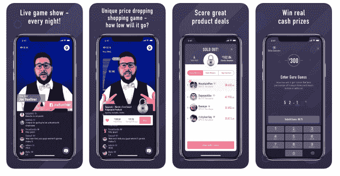

# 肉汁的新手机游戏节目是“价格是正确的”与 QVC TechCrunch 混合

> 原文：<https://web.archive.org/web/https://techcrunch.com/2018/05/25/gravys-new-mobile-game-show-is-price-is-right-mixed-with-qvc/>

在现场直播的手机游戏节目 HQ Trivia 取得成功之后，一群连续创业者已经开始测试市场，看看另一个游戏节目的概念是否也能奏效。他们的新游戏节目启发的应用，[肉汁](https://web.archive.org/web/20221025222307/https://gravy.live/)，是“价格是正确的”与 QVC 风格的购物体验相结合的翻版。也就是说,“参赛者”竞争广告产品 30%到 70%的折扣，部分收入将捐给慈善机构。此外，通过一个附带游戏，用户可以猜测产品(其数量未知)何时售罄以及价格。猜得最接近的人赢得现金奖励。

这家初创公司是由马克·麦奎尔、布莱恩·韦根和克雷格·安德勒创建的，他们是 Jellyfish.com 背后的创始团队，后者是一家老牌社交购物网站，早在 2007 年就被微软收购，帮助创建了必应购物。他们还在其他项目上合作，包括 NameProtect(在水母之前)、可打印优惠券资源 [Hopster](https://web.archive.org/web/20221025222307/https://www.crunchbase.com/organization/hopster) 、社交网络 [Nextt](https://web.archive.org/web/20221025222307/https://finance.yahoo.com/news/nextt-raises-700-000-seed-130000937.html) 和电子商务订阅零售网站[Alice.com](https://web.archive.org/web/20221025222307/https://techcrunch.com/2012/01/31/e-commerce-site-for-household-goods-alice-com-raises-3-6-million/)。这些已经[退出](https://web.archive.org/web/20221025222307/http://www.madisonstartups.com/hopster-acquired-by-inmar/)或[关闭](https://web.archive.org/web/20221025222307/http://host.madison.com/ct/news/local/writers/mike_ivey/local-start-up-alice-com-files-for-corporate-bankruptcy/article_cf5bba9c-14de-11e3-9098-001a4bcf887a.html)或两者。

该团队的努力暗示了与品牌合作的明确热情，但正如他们的记录所示，让消费者以新的方式与品牌联系起来要困难得多。

这就是为什么他们现在尝试肉汁。

希望看到产品每晚发布的兴奋感——并且知道如果你购买，你将获得很大的折扣——将成为一种全新的广告单元，同时让玩家参与到类似游戏节目的体验中。

“千禧一代面临的挑战之一是他们的注意力持续时间短，他们对打断性广告的反应不佳，”Wiegand 解释了团队为什么要建立这家初创公司。“我不认为有人真正掌握了如何利用视频直播赚钱。因此，我们想出了这个机会，来创建这个新的广告单元，让品牌可以讲述他们的故事，并且——用七、八或九分钟——创建一个现场购物活动，让千禧一代可以收听这个故事，但以一种有趣、游戏化的方式，”他说。

肉汁是这样工作的。每天晚上，在肉汁 iOS 应用程序中的美国东部时间晚上 8 点 30 分，一名直播主持人将公布用户可以购买的产品。目前，有一个轮流选择的主持人，他们根据每场演出的合同工作，通常是当地的喜剧演员，而不是品牌代表。

玩家不会被告知有多少物品可用，但通常是 2 到 20 个。

然后价格开始下降。如果你早点买，你将有机会以稍微的折扣买到它。但是你等待的时间越长，折扣的百分比就越高。然而，你不知道还有谁会在什么时候第一个把它抢走。如果你等得太久，产品会卖光。

同时，如果你对产品本身不感兴趣，你可以猜猜你预计它什么时候会卖完(意思是，以什么价格)。)最接近的 10 人左右将获得一小笔现金奖励——可能是 200 美元或 300 美元的分成，第一名获得的奖金最多。

至少 20%的销售额捐给了慈善机构——我想这是对千禧一代对做好事的公司感兴趣的认可。但最终，这个决定更多的是因为肉汁店的目标不是成为零售商——它不是像 Woot 一样的另一个每日交易目的地！，尽管在制造产品刺激方面有相似之处。

相反，它希望品牌捐赠产品，并为利润丰厚的“广告机会”付费。

韦根说，品牌会喜欢肉汁，因为它们能吸引千禧一代 7 分钟或更长时间的注意力。“他们喜欢订婚。这是一个高度参与的观众…我有机会购买产品，所以我非常专注于思考该产品。他补充道:“回忆、记忆和所有随之而来的轰动——推文和由此产生的所有社交媒体——都很棒。”。

然而，这些都没有被证实——肉汁只有几周的历史。

到目前为止，它所展示的大约 50%的产品实际上是由品牌捐赠的，包括 23andMe、3D Doodler、Tapplock 等。其余的都得到了丰厚的补贴，包括更大的抽奖——比如 DJI 无人机。

它也没有对广告机会收费，因为它希望首先增加观众。

该公司表示，这已经在进行中。Wiegand 声称，在提醒朋友和家人该应用程序的发布后，游戏每晚都有 600 多名玩家，其观众人数每周增长 15%。他说，大约一半报名参加演出的人每周会回来看三场演出。

虽然早期的数字如果属实的话很有希望，而且很明显该团队喜欢在连接品牌和消费者的一般空间中工作，但肉汁仍然感觉——就像创始人以前创造的许多东西一样——设计时首先考虑的是品牌的需求，而不是消费者的需求。

“价格合适”风格的应用程序会很有趣，但这不是它——在一天结束时，它是一个观看广告和打折购物的邀请。从长期来看，这可能不是消费者每天都想做的事情——即使你试图通过猜谜游戏赢得一小笔现金奖励来吸引他们。

和 Trivia HQ 一样，它已经从应用商店总排名的前 20 名跌至第 140 名(按应用商店总排名来看，它的光芒可能最终也会消退。尤其是因为它主要不是一个游戏——千禧一代，尽管他们可能善变且注意力持续时间短(真的吗？在几天内狂吃整季电视剧的一代？)，会知道的。

不过，韦根并不担心。

他说，几周后他会对琐事应用感到厌倦，但肉汁是不同的。

“我总是购物，我总是喜欢交易。交易行业和购物行业比琐事空间大得多，”韦根坚持说。“看到自己喜欢的产品降价六七成，那种兴奋感简直令人难以置信，”他兴奋地说。“我们能够展示这个星球上第一批产品中价格最优惠的东西……它创造了这种惊心动魄、令人振奋的体验，就像‘我应该买吗？天啊，看看这个价格。我不能拒绝，”他说。

该公司从一系列投资者那里筹集了 210 万美元的种子资金，其中包括年初的创始人。大约 80%是外来资本，以新资本为首。这个 20 岁以下的团队在麦迪逊和明尼阿波利斯都有基地。

肉汁在 App Store [这里](https://web.archive.org/web/20221025222307/https://itunes.apple.com/us/app/gravy-live-shopping-game/id1354510058?mt=8)。