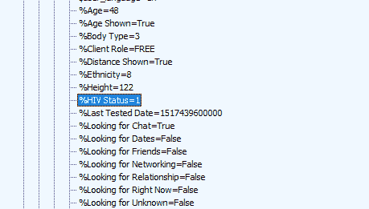

# Grindr 将 HIV 状态发送给第三方，一些个人数据未加密 

> 原文：<https://web.archive.org/web/https://techcrunch.com/2018/04/02/grindr-sends-hiv-status-to-third-parties-and-some-personal-data-unencrypted/>

紧随上周的安全问题之后，约会应用 Grindr 再次受到抨击，原因是与第三方(不是广告商，正如我之前在这里写的)不恰当地分享艾滋病毒状况，以及对其他个人数据传输的安全性不足。对于一家声称隐私至上的公司来说，这不是一个好兆头。

挪威研究机构 SINTEF [分析了该应用的流量](https://web.archive.org/web/20230128125634/https://github.com/SINTEF-9012/grindr-privacy-leaks)，发现用户可以选择将艾滋病毒状态包含在他们的个人资料中，这些信息包含在发送给 Apptimize 和 Localytics 的数据包中。用户不会被告知该数据正在被发送。

这些不是广告公司，而是测试和改进移动应用的服务——Grindr 不会向他们出售这些数据或任何东西。该公司的首席技术官[告诉 BuzzFeed News](https://web.archive.org/web/20230128125634/https://www.buzzfeed.com/azeenghorayshi/grindr-hiv-status-privacy) “与这些平台共享的有限信息是在严格的合同条款下进行的，这些条款提供了最高级别的保密性、数据安全性和用户隐私。”据我所知，HIPAA 等法规并不阻止公司将用户自愿提供的医疗数据传输给隐私政策中规定的第三方。

也就是说，以这种方式分享像艾滋病毒状况这样的隐私是一种相当严重的背信行为，即使这样做并没有任何恶意。对这一极其重要的私人信息处理的松懈破坏了 Grindr 精心培养的关心和同意的信息。

**更新** : Grindr 的安全主管[告诉 Axios](https://web.archive.org/web/20230128125634/https://www.axios.com/exclusive-grindr-security-chief-on-hiv-disclosure-b5a64fdb-8c1d-4a08-a94e-67506d4a0d0b.html) 公司将停止向第三方发送 HIV 状态数据。

然而，从系统的角度来看，也许更严重的是大量敏感数据的未加密传输。

SINTEF 的研究人员发现，精确的 GPS 位置、性别、年龄、“部落”(如熊、爸爸)、意图(如朋友、关系)、种族、关系状态、语言和设备特征都通过 HTTP 发送给各种广告公司。Grindr 的一名代表证实，位置、年龄和部落“有时”是不加密发送的。我已经要求对此进行澄清。

这不仅是极其糟糕的安全实践，而且 Grindr 似乎陷入了一个谎言。该公司上周告诉我，当另一个安全问题的消息出现时，“用户设备和我们的服务器之间传输的所有信息都是加密的，不会向未知的第三方透露你的具体位置。”

当时，我问他们关于该应用程序发送一些未加密数据的指控；我从未收到回复。对用户来说幸运的是，虽然对 Grindr 来说不幸的是，我的问题由一个独立的机构回答，上面的陈述显然是错误的。

仅仅与广告商和其他第三方分享这些数据是一回事——尽管这不是许多用户会选择的事情，但假设他们至少同意将其作为注册的一部分。

但是，公开发送这些信息会给世界上许多不能公开表明身份的同性恋者带来实质性的危险。未加密发送的细节可能足以识别某个人的身份，比如说，咖啡店里的任何人，只要有点技术知识，都可以监控这些细节。在许多宣布同性恋为非法的政府之一的要求下，也可以在日志中识别有罪的流量。

我已经联系了 Grindr 进行评论，希望能很快得到一份声明；我一收到这个帖子就会更新。

**更新**:以下是 Grindr 关于 HIV 数据共享的完整声明；值得注意的是，它没有解决其他数据的未加密传输。

> 作为一家服务于 LGBTQ 群体的公司，我们理解艾滋病毒状况披露的敏感性。我们的目标一直是支持全球用户的健康和安全。
> 
> 最近，Grindr 的行业标准使用第三方合作伙伴，包括两家备受推崇的软件供应商 Apptimize 和 Localytics，来测试和验证我们推出平台的方式，这引起了人们对我们共享用户数据的方式的关注。
> 
> 为了澄清任何错误信息，我们认为有必要声明:
> 
> Grindr 从未也不会向第三方或广告商出售可识别个人身份的用户信息——尤其是关于艾滋病毒状态或上次测试日期的信息。
> 
> 作为行业标准实践，Grindr 确实与备受推崇的供应商合作，测试和优化我们如何推出我们的平台。这些供应商受到严格的合同条款的约束，这些条款提供了最高级别的保密性、数据安全性和用户隐私。
> 
> 在使用这些平台时，除非必要或适当，否则我们会限制信息共享。有时，这些数据可能包括位置数据或来自 HIV 状态字段的数据，因为这些是 Grindr 的功能，但是，这些信息总是以加密方式安全传输，并且有数据保留政策来进一步保护我们用户的隐私不被泄露。
> 
> 重要的是要记住 Grindr 是一个公共论坛。我们让用户可以选择发布自己的信息，包括 HIV 状态和上次测试日期，我们在隐私政策中明确规定，如果您选择在您的个人资料中包含这些信息，这些信息也将公开。因此，您应该仔细考虑在您的个人资料中包含哪些信息。
> 
> 作为 LGBTQ 社区的行业领导者和倡导者，Grindr 认识到一个人的艾滋病毒状况可能会受到高度指责，但在咨询了几个国际卫生组织和我们的 Grindr 平等团队后，Grindr 根据社区反馈确定，让用户选择自行发布用户的艾滋病毒状况和最后一次测试日期，这将有利于我们社区的健康和福祉。由每个用户决定在他们的个人资料中分享什么。
> 
> 在我们的平台中包含 HIV 状态信息时，我们始终会考虑到用户的隐私，但像任何其他移动应用程序公司一样，我们也必须按照行业标准操作，以帮助确保 Grindr 继续为我们的社区做出改进。我们向所有人保证，我们一直在检查我们与第三方的隐私、安全和数据共享流程，并一直在寻找超越行业最佳实践的额外措施来帮助维护我们用户的隐私权。