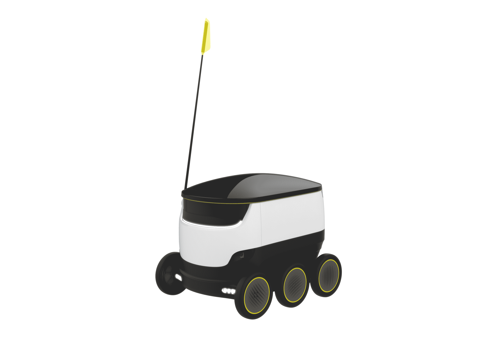

# 通过滚动无人机运送杂货将于今年秋天在华盛顿特区启动

> 原文：<https://web.archive.org/web/https://techcrunch.com/2016/09/22/grocery-deliveries-via-rolling-drone-will-kick-off-in-washington-d-c-this-fall/>

# 通过滚动无人机运送杂货将于今年秋天在华盛顿特区启动

滚动机器人将很快在美国进行上门服务，今年秋天将在华盛顿特区开始试运行。报道 [Recode](https://web.archive.org/web/20230307052919/http://www.recode.net/2016/9/22/13018370/robots-autonomous-starship-delivery-ground) 称，市政监管机构已经批准使用 Starship Technologies 的滚动送货无人机通过人行道进行城市送货，这为爱沙尼亚的初创公司提供了首次州级公开测试的载体。

你可能还记得 7 月在英国、德国和瑞士进行的[跨欧洲公开测试](https://web.archive.org/web/20230307052919/https://techcrunch.com/2016/07/06/self-driving-delivery-bots-europe/)中的星际飞船技术。这家初创公司由 Skype 联合创始人贾纳斯·弗里斯(Janus Friis)和阿赫蒂·海因拉(Ahti Heinla)创立，显然目标是解决与他们之前公司截然不同的问题。

Starship 的地球机器人很容易让人想起轮式冷却器(它们实际上也可以保持事物凉爽——对杂货交付很有用)，有六个轮子和一个大型天线，用于接收中央调度的命令。与车辆相比，它们很慢，最大速度为每小时 10 英里，但和许多慢跑者一样快。他们可以在他们温和的圆顶内部携带大约 40 磅，这使得一个体面的杂货拖运(特别是对于单人或双人住户)。

华盛顿特区是第一个使无人驾驶冰盒在人行道上合法化的地方，但 Starship 也在旧金山测试了他们的机器人，这要感谢旧金山市授予的临时有限许可证，正如 [SF Chronicle 今天](https://web.archive.org/web/20230307052919/http://www.sfchronicle.com/business/article/Starship-robots-try-out-deliveries-on-SF-sidewalks-9235330.php)报道的那样。

这些测试可能回答的最大问题是 Starship 的无人驾驶飞机是否可以在美国处理公众曝光。当 Starship communication s 经理 Henry Harris-Burland 开始他们的欧洲试验时，他告诉我，在那次发射之前的 5000 英里更有限的测试中，他们没有遇到任何滥用事件，但真实世界的大规模使用可能会提供非常不同的结果，特别是一旦机器人开始在没有人类陪伴的情况下运行。