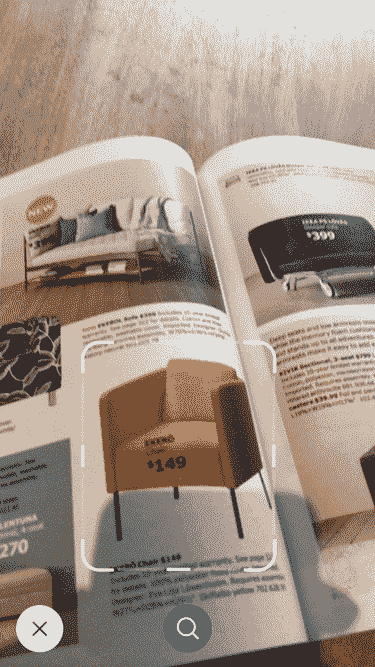

# GrokStyle 的视觉搜索技术进入宜家的 Place AR 应用程序

> 原文：<https://web.archive.org/web/https://techcrunch.com/2018/03/16/grokstyles-visual-search-tech-makes-it-into-ikeas-place-ar-app/>

GrokStyle 的简单概念“把你的相机对准一把椅子(或灯，或桌子……)并找到其他类似的东西出售”[去年吸引了 200 万美元的资金](https://web.archive.org/web/20230306192652/https://techcrunch.com/2017/04/04/grokstyle-is-putting-computer-vision-to-work-on-home-decor-with-2m-in-funding/)，该公司一直在将这笔资金投入使用。对于一家试图打入家居市场的公司来说，值得注意的是，它将家具巨头宜家作为其第一个真正的客户；GrokStyle 的点击搜索功能正在被添加到 IKEA Place AR 应用程序中。

如果你不记得了，GrokStyle 做的是识别你的相机可以看到的任何一件家具——在你的房子里，在商店里，在目录里——并立即返回类似的甚至是完全一样的家具，并提供购买链接。

我记得去年我怀疑该产品是否能像他们说的那样有效。但是一个演示让我很快闭上了嘴。这个不断壮大的团队由 Sean Bell 和 Kavita Bala 领导，他们将 GrokStyle 从康奈尔大学的计算机视觉工作中分离出来，很明显他们知道自己在做什么。

GrokStyle 的技术正在从目录中抓取图像。

宜家也这么认为。12 月，贝尔和巴拉有机会将它展示给宜家“数字化转型的领导者”迈克尔·瓦尔兹加德。他很喜欢。

“他只是说，‘好吧，这需要在下一个版本中实现，’”贝尔回忆道，“3 个月后，我们就能为他们扭转局面了。”

对瓦尔兹加德和格罗斯特尔来说，所有形式的混合现实的出现都需要一种完全不同的探索，这一点似乎很清楚。如果信息是可视化地呈现和混合的，为什么不能以同样的方式查找和浏览呢？

“为了让 AR 发挥作用，这就是你真正需要视觉搜索等技术的地方，”Bala 说。“它可以让你找到东西，很酷的设计和家具，所有的一切都在原地*，并将其可视化。”*

 *此外，她指出，图像和视频只是人们现在交流和记录事物的方式。“人们会拍下所有的东西。如果你想记住某人的电话号码，有时你只是给它拍张照片。这就是我们现在生活的世界。”

能够在视觉记录中搜索是一个强大的工具，少数公司已经以任何一种强大的方式解锁。GrokStyle 可能很容易就做过头了，试图为消费者提供一个在你的照片和其他照片中进行分类和搜索的应用程序，但这种方式存在巨大的成本和可疑的效用。

我最初认为家具是一个相当乏味和狭窄的领域，在其中部署他们明显有效的技术，但事实上这是一个非常明智的选择。宜家是一个大目标，但从长远来看，它只是一个楔子的窄端。

“我们也在建立推荐系统和商业智能工具，”Bala 说。“一旦你看到人们在寻找什么，就会有大量的机会。”

例如，想象一下，有人在 Crate and Barrel 购物时使用 GrokStyle 的技术。他们扫描一件商品，看看它在他们的客厅里会是什么样子，然后看到一个竞争对手提供的类似但稍便宜的商品。这是零售业的一个关键时刻:板条箱和桶以及其他零售商争夺消费者的注意力和金钱。处于中心是一个吉祥的位置。

目前，我们的计划是在宜家执行，让人们知道这种做法存在，而且效果很好，足以被大型零售商采用。“我们邀请零售商来与我们交谈，作为与他们合作的一部分，我们正在建立试点和东西，”贝尔说。API 也在酝酿中。

除此之外，该公司最近还从国家科学基金会获得了另外 75 万美元的资助。作为小企业创新研究计划的一部分，GrokStyle 获得了 22.5 万美元，并成功竞争了第二阶段的另外 75 万美元。这应该能让灯亮一会儿。*