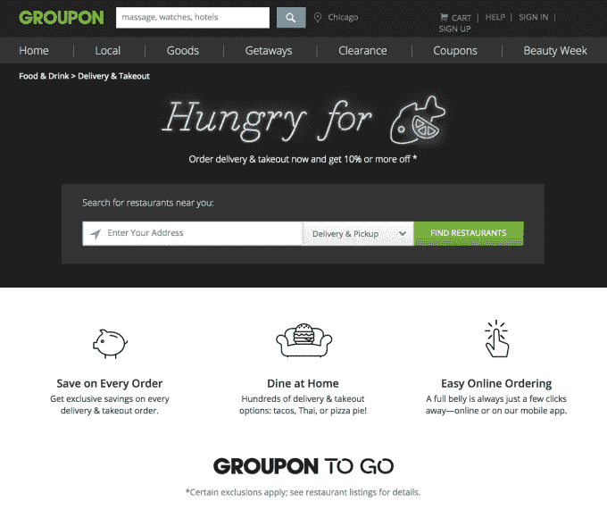
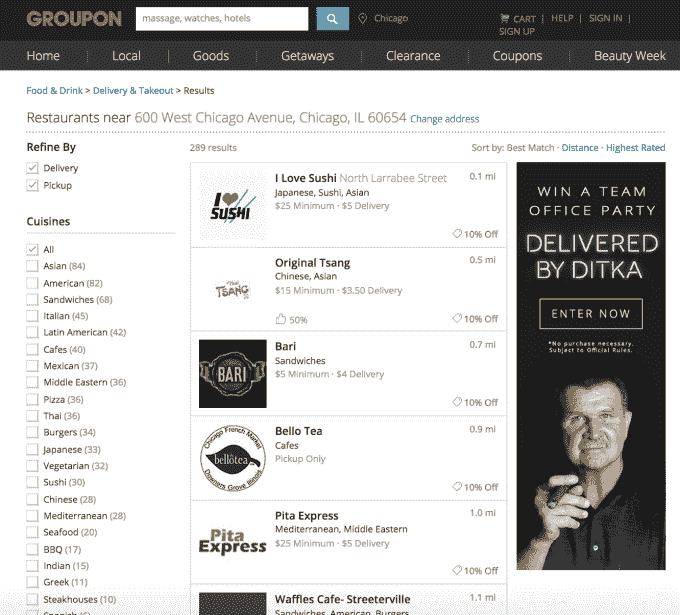

# Groupon 推出自己的送餐业务 Groupon To Go 

> 原文：<https://web.archive.org/web/https://techcrunch.com/2015/07/30/groupon-launches-its-own-food-delivery-business-groupon-to-go/>

继本月早些时候收购了食品配送服务 OrderUp 之后，Groupon 今天宣布推出自己的全国配送和外卖服务 [Groupon To Go](https://web.archive.org/web/20221207200930/https://www.groupon.com/togo#/) 。该计划最初在芝加哥推出，自 3 月以来已在 500 家餐馆进行试点测试，但该公司表示，今年将扩展到其他大都市地区，包括波士顿和奥斯汀。

虽然现在市场上有许多按需送餐业务，但 Groupon 服务的一大区别在于，它声称可以为客户的每笔订单节省高达 10%的费用。

这项新服务的“节省”方面反映了 Groupon 的整体品牌形象，这一形象历来都是为消费者寻找划算的交易。

Groupon To Go 副总裁兼总经理肖恩·史密斯(Sean Smyth)表示，Groupon 对建立送货服务的兴趣源于其自身客户的兴趣。他说，食品和饮料是 Groupon 最大和最受欢迎的类别之一，该公司目前与数千家餐厅合作，这些餐厅一直在寻找利用 Groupon 推广自己的外卖和送货选择的方法。

史密斯说，随着时间的推移，随着 Groupon 与更多餐厅签约，在其 deals 平台上推广他们的菜单和送货选择，该公司意识到有机会扩大并提供更多“端到端”的用户体验。

“推广菜单和获得订单是一回事，但如何到达最后一英里？“正是这最后一英里真正激励我们去寻找像 OrderUp 这样的公司，”他说，并解释了为什么公司[在 7 月初收购了总部位于巴尔的摩的初创公司](https://web.archive.org/web/20221207200930/https://beta.techcrunch.com/2015/07/16/groupon-acquires-orderup-food-delivery-service/)。

仍以自有品牌运营的 OrderUp 在美国 40 个城市提供送餐服务，主要是大学城。通过此次收购，Groupon 不仅能够在美国的几十个城市建立食品配送立足点，还正在努力将 OrderUp 的技术整合到 Groupon To Go 中。这包括在司机开车时跟踪订单进度的能力、分组订购、提前订购功能等。

然而，在推出时，Groupon To Go 主要是与那些已经有自己的外卖服务的餐馆合作。这包括像 Quiznos、Popeyes、Subway 和 Papa Johns 这样的全国连锁店，以及像 Ditka's Restaurant、Al's Beef、Adobo Grill、BIG & little's、Freshii、Rosati's Pizza、Star of Siam 和 Wishbone 这样的芝加哥餐馆。

然而，Smyth 表示，Groupon 还需要几个月的时间才能为那些尚未提供送货服务的餐厅推出自己的送货基础设施。像当今许多按需公司一样，这将涉及到雇佣独立承包商，他们将成为 Groupon To Go 的送货人员。(该公司尚未就员工人数置评。)

这种向无外卖餐馆的扩张也代表了 Groupon 认为这使其有能力在不断增长的市场中竞争，在这个市场中，许多公司只需按一下按钮就可以提供按需送餐服务。

虽然 Smyth 承认存在竞争，但他也表示，许多其他服务还没有真正成为主流。作为比较:Groupon 今天说它在北美有 2500 万活跃用户，而 GrubHub 最近说它有 590 万。

“其他服务在发展和宣传自己方面做得很好，”史密斯指出。“但它非常专注于某些领域……如果我们能够接触到迄今为止真正没有使用过在线送货或在线订购的消费者，这就是我们如何将它带入主流的方式。”

在推出时，Groupon 通过从订单佣金中扣除面向消费者的 10%折扣来补贴 Groupon To Go 服务。但随着时间的推移，特别是当它扩展到提供自己的送货基础设施时，该公司可以从那些使用 Groupon 送货服务的餐厅那里获得更高的利润。

[gallery ids="1189692，1189691"]

食品外卖配送服务也很好地与 Groupon 的交易引擎结合在一起，因为平台上的餐厅将能够登录他们的商业中心基于网络的仪表板来更改菜单，或者根据需求打开或关闭他们的配送业务的促销活动。

Groupon 还没有说它预计什么时候会看到 Groupon 走向全国，或者 OrderUp 是否会继续作为一个独立的品牌独立运营。然而，Groupon To Go 应该会在今年年底在更多的市场上线，未来的计划是快速扩张。史密斯指出，这可能包括食品配送领域的其他收购。

“我们希望积极地将它推向市场，”他说。“收购当然是实现这一目标的一种方式。”

芝加哥居民可以使用 Groupon 前往这里。除了在线，Groupon To Go 也是 Groupon 移动应用程序的特色。