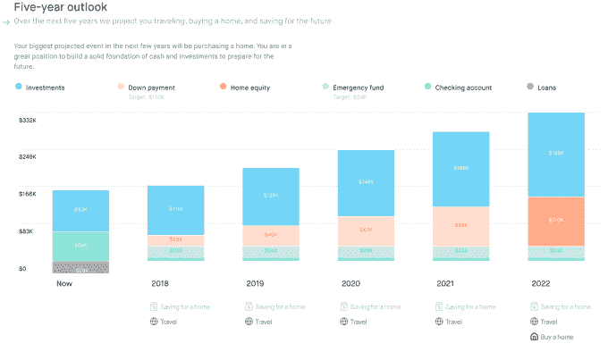
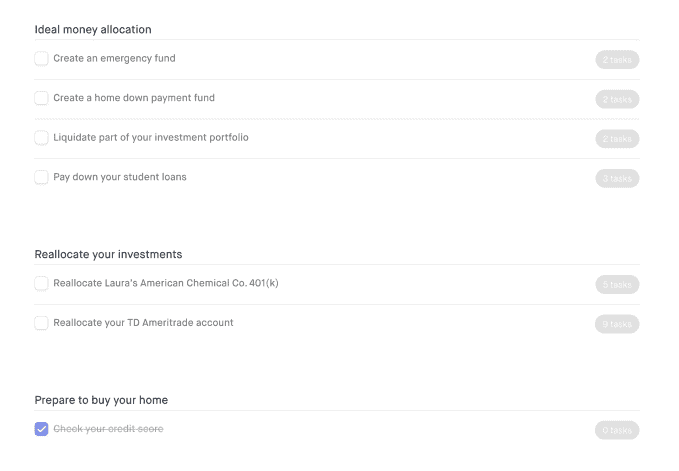
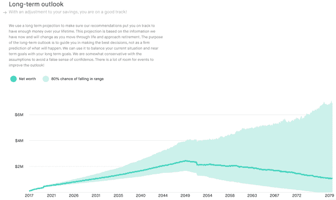

# Grove 筹集 210 万美元，在老派金融顾问和聊天机器人 TechCrunch 之间找到最佳平衡点

> 原文：<https://web.archive.org/web/https://techcrunch.com/2018/02/09/grove-raises-2-1m-to-find-the-sweet-spot-between-old-school-financial-advisors-and-chatbots/>

# Grove 筹集了 210 万美元，在老派金融顾问和聊天机器人之间找到了最佳平衡点

现在，如果你想要财务指导和规划方面的帮助，你基本上有两个选择——每年支付数千美元(或更多)给一个老派的华尔街附属顾问，或者在过去几年兴起的免费财务规划聊天机器人初创公司中试试你的运气。

这两者对大多数人来说都不理想；传统的顾问会给出很好的建议，但价格昂贵，而且在使用技术来帮助你跟踪进展方面落后了几十年——聊天机器人是高科技，但很少提供个性化的建议。

那么替代方案会是什么样的呢？

本周发布的, [Grove](https://web.archive.org/web/20221024052633/https://hellogrove.com/) 希望提供一个介于当前两种选择之间的解决方案。每年 600 美元，这家初创公司会让你与一名现实生活中的认证财务顾问配对，为你提供个性化的财务建议，同时还为你提供可视化技术，让你掌握你得到的建议。

这家初创公司由克里斯·哈钦斯(Chris Hutchins)创立，他与凯文·罗斯共同创立了 Milk，后来成为谷歌风投的合伙人。他已经筹集了 210 万美元的种子资金，由 Lowercase Capital、SV Angel、Box Group 和其他公司参与了首轮融资。

当用户第一次注册 Grove 时，他们会与一名国际金融理财师配对，后者将审查他们的情况并创建前进目标。他们也对你如何管理你的钱提出了具体的建议，比如告诉你用你的存款提前偿还你的学生贷款是否更划算。

这些目标进入一个仪表板，用户可以在完成时跟踪它们，如上图所示。任何时候你需要签到，你都可以给你的顾问发信息，该服务还会给你发送提醒，以确保你确实在做你需要做的事情。

Grove 能够给出如此准确的建议的部分原因是，它要求用户尽可能多地连接现有的金融服务，以了解你是如何花钱和存钱的。这包括信用卡和投资账户。Grove 也有自己的投资服务(收取 AUM 0.25%的费用)，所以他们可以自动管理你的投资，但如果用户想保留现有的投资组合，他们可以按照 Grove 的建议手动进行交易和重新分配。

尽管如此，Grove 仍然认为其主要收入来源将是每年 600 美元的订阅费，这意味着他们不打算推动用户注册额外的服务，或通过引导他们购买某种金融产品来产生推荐费。

该网站现已上线，用户可以在提交年度计划之前安排时间与顾问进行初步咨询。

