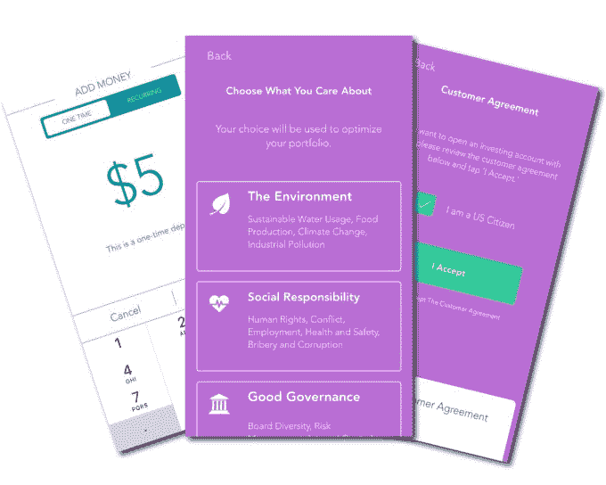
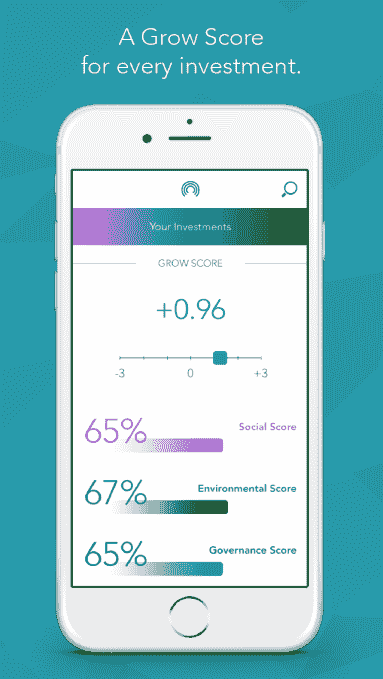

# Grow 推出其社会责任投资应用 

> 原文：<https://web.archive.org/web/https://techcrunch.com/2016/09/29/grow-launches-its-app-for-socially-responsible-investing/>

在 Betterment、Stash 和 Robinhood 等越来越多的机器人投资者中，一家总部位于旧金山的新金融科技初创公司 [Grow](https://web.archive.org/web/20230127213344/http://www.growapp.us/) 正在加入竞争，竞争基于投资类型，而不仅仅是财务回报。虽然这款应用在让新手投资者更容易快速建立投资组合方面的操作与竞争对手非常相似，但它最大的不同之处在于，它只关注治理良好、环境可持续、对社会负责的公司。

这使得这款应用可能对年轻用户有吸引力，他们通常对花钱的地方更有选择性。

例如，尼尔森研究发现，大多数千禧一代[将可持续发展作为购物的优先事项。](https://web.archive.org/web/20230127213344/http://www.nielsen.com/us/en/insights/news/2015/green-generation-millennials-say-sustainability-is-a-shopping-priority.html) Grow 旨在发现他们在开始投资时是否也将此作为优先事项。

这家初创公司是由拥有金融背景的产品负责人迈克尔·德玛利亚和首席技术官安东尼·兰达佐创立的。它由首席执行官道格·赫斯克领导，他是湾区的金融专家，于 2016 年 3 月加入。

为了确定在哪里投资，Grow 开发了自己的专有数据库和分析工具 Grow Analytics，以识别那些尊重某些价值观(如环境、社会和治理)的投资，同时将投资组合风险降至最低。它还寻求跨部门、行业和资产类别的投资，以提供平衡和多样化的投资组合。这意味着你可以将 Grow 作为你的主要机器人投资应用，而不是一个补充产品。

要使用这款应用，你首先要告诉它你最关心什么样的价值观——比如环境或社会责任。您可以向 Grow 添加资金，或通过连接您的银行安排每月存款，然后 Grow 将代表您自动投资于您的个性化投资组合。

你可以在应用程序的主页上看到你投资的增长，显示为一个圆圈，显示了现在和未来的价值。

为了创收，Grow 通过该应用收取 0.25%的管理费。然而，它的商业模式也包括应用之外的其他创收方式。例如，Grow 的全方位服务资产管理子公司 Grow Capital Management 收取 0.25%至 0.75%的管理费。此外，它许可投资和研究机构按月付费使用 Grow Analytics。

该应用程序本身于 2 月份在 iTunes 应用商店进行了测试，并得到了约 350 名用户的反馈。截至本周，一个经过修改和重新设计的版本上线了，现在每个人都可以使用。

这家初创公司直到上个月一直在自筹资金，但目前正在筹集 300 万美元的种子资金，这一轮只完成了一部分。迄今为止，两家总部位于加州的大型家族理财室已经承诺注资。

[gallery ids="1394466，1394465，1394464，1394461，1394462"]

Grow 是 iTunes 应用商店上的免费下载。