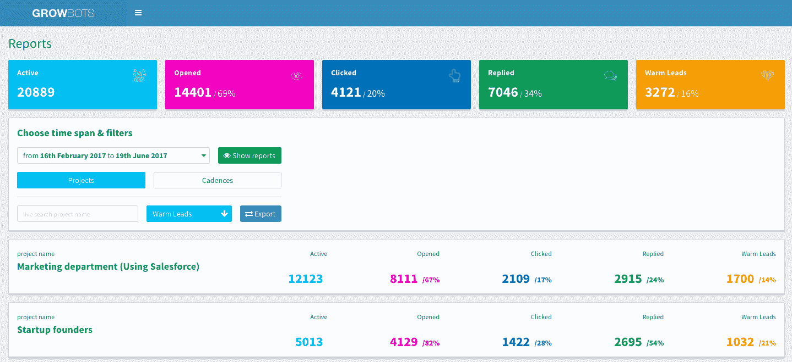

# Growbots 为其基于机器学习的销售自动化平台 TechCrunch 筹集了 250 万美元

> 原文：<https://web.archive.org/web/https://techcrunch.com/2017/06/21/growbots-raises-2-5m-for-its-machine-learning-based-sales-automation-platform/>

# Growbots 为其基于机器学习的销售自动化平台筹集了 250 万美元

Growbots 使用机器学习为销售团队提供正确的线索，以启动他们的对外销售流程。这项服务声称其产品可以每月为销售团队的每个成员节省几天的工作时间，今天宣布它已经从 Buran VC，Lighter Capital 和一些天使投资者那里筹集了 250 万美元的资金。这使该公司的资金总额达到 420 万美元。

Growbots 的服务着眼于公司自己的 CRM 数据，以了解其客户，提取有关他们的数据，并相应地调整其目标列表。该公司首席执行官兼联合创始人 Greg Pietruszynski 告诉我们:“G rowbots '人工智能算法将在几分钟内为你的团队生成定制的联系人列表，运行你的所有外联活动，优化团队/个人的结果，并管理他们的收件箱，因此每个人都可以完全专注于与潜在客户交谈。”

为了做到这一点，该公司从许多不同的来源收集了大约 2 亿个潜在销售目标。该服务还使用机器学习来分析每天数百万个网站，以提取关于人和企业的新信息。Pietruszynski 指出，该公司对数据来源的选择非常严格。“我们不会从任何地方购买联系信息，因为任何现成的列表都是不合格的，非常过时，”他告诉我们。

一旦结果出现，Growbots 将根据它看到的响应不断更新其算法，并根据这些数据优化下一次活动。该公司认为，在使用其服务一个月后，其客户看到的正面回应平均增加了 40%。Growbots 承诺只需几分钟就能获得更好的结果，而不是花几天时间建立联系人列表。

至于该服务的活动自动化部分，Growbot 指出，它让销售团队能够自动个性化电子邮件(如果他们选择这样做，也可以手动制作电子邮件)。除此之外，该服务还会在收到潜在客户的“不在办公室”信息时，自动发送后续电子邮件并重新安排电子邮件。

Growbots 目前每月增长 10 %, Pietruszynski 表示，他的公司在销售产品 16 个月后，年运营率达到 400 万美元。该公司现在有 500 名客户，其中大部分在美国，不过这项服务在全球范围内都有。其当前客户包括 Betterment、Relatable 和 Highfive。

Growbots 在旧金山和克利夫兰设有办事处，其美国团队目前有 20 人，并正在招聘另外 26 个职位。