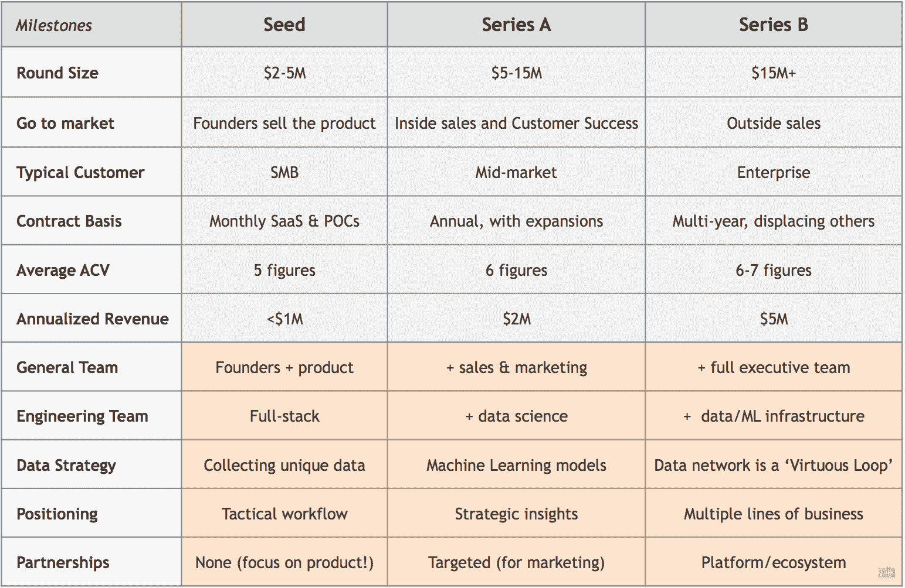
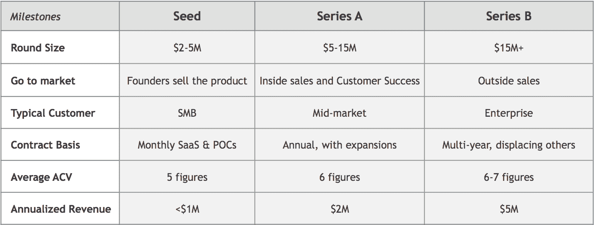
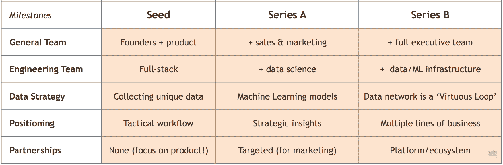
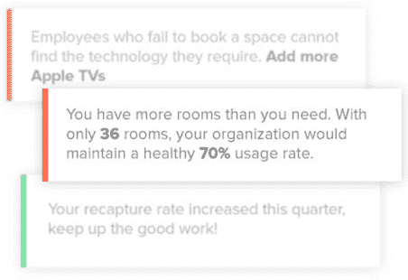

# 成长在智能时代 

> 原文：<https://web.archive.org/web/https://techcrunch.com/2016/08/26/growing-up-in-the-intelligence-era/>

阿什·丰塔纳是

[Zetta Ventures](https://web.archive.org/web/20230129084858/http://zettavp.com/)

，是《人工智能第一公司:如何与人工智能竞争并取胜》一书的作者

More posts by this contributor

马克·戈伦伯格撰稿人

15 年前，信息技术从永久许可的本地软件转变为软件即服务(SaaS)。

这种转变为创业公司创造了巨大的机会，但也导致了忽视这种变化的公司的死亡。这些公司震惊地发现，吸引力不足以引起投资者的兴趣，充其量，它们以低估值出售给了传统科技公司。

今天，信息技术正从代表云计算时代的 SaaS 工作流应用转向帮助客户*做决策的应用。*以智能时代为特征，竞争优势的来源正从代码转向独特数据+自学习代码。与之前的转变一样，这也改变了投资者的预期。我们看到投资者完全忽略了那些有着坚实牵引力的 SaaS 公司，而青睐那些凭借其“智能”软件在市场中拥有战略地位的公司。

这篇文章概括了智能时代企业软件投资者的要求，希望它能帮助企业软件公司的创始人思考如何安排他们的融资，产品开发和数据策略。

## 新的筹资战略

以下公司特征是投资者在这轮融资时的普遍预期。例如，A 轮投资者通常希望看到年度合同，其中有投资前你与特定客户扩大收入的例子。专注于智能企业软件的种子投资者通常希望看到你在投资前收集独特的数据。

我们看到这张表的下半部分(棕色阴影部分)越来越重要。公司需要证明他们正在通过独特的数据+自学代码建立竞争优势，以从世界级投资者那里筹集 A 轮资金。没有数据的 SaaS 是不够的。这意味着，公司需要挑选了解即将向智能时代转变的种子投资者，帮助他们实施这一战略，并拥有吸引世界级 A 轮投资者的记录。最好的种子投资者扮演“数据产品经理”的角色，直到整个团队走到一起。

让我们定义左侧的特征，并解释右侧的进展，将牌桌赌注与今天真正需要的区分开来。

## SaaS 赌桌

这张表的上半部分包括从世界级投资者那里筹集资金所需的特征，当时云是一个新事物，SaaS 是未来。*曾是。*如今，部署到云是必然的，您需要更多来摆脱竞争。但首先，让我们谈谈基本的。

**走向市场:**如何接触潜在客户。“自下而上”是指你不在销售和营销上花钱，而是依靠社交渠道的口碑和免费的公关来建立初始的客户群。公司现在倾向于从这里毕业，通过雇佣客户成功和内部销售代表来为那些有大预算的人挖掘最初的客户基础。外部销售代表在用尽这种自下而上的策略后被雇佣。

**典型客户:**典型购买者的特征。这决定了他们的复杂程度、收入潜力和销售周期。一些创业公司可能是从卖给大公司开始的。中小型企业(SMB)不太复杂，收入潜力较低，但更容易接触，销售周期较短，不太可能使用高质量的替代产品。有趣的是，一家初创公司可以收集中小企业的大量数据，从而可以建立机器学习模型，与大公司建立的模型竞争。

> 我的投资者将如何增值？

**合同基础:**收入重现的基础。随着公司通过提供更好的产品与客户建立粘性，它们获得了谈判更长期限的杠杆。

**平均 ACV:** 平均年度合同价值。更大的平均 ACV 意味着你成功地向更大的客户、更多的部门和/或更高的价格销售。一些公司可能会保持 ACV 不变，但会大幅增加销量。

**年化收入:**有许多有用的收入衡量指标，但这是一个通用的数字，你可以通过年化上个月的收入来计算。这与年度经常性收入(ARR)不同。流失在这里很重要，但很难定义一个里程碑。种子投资者将没有足够的数据来得出关于流失的结论。根据销售模式，首轮投资者将挖掘 12 个月以上的数据来了解客户流失情况，通常需要看到负面的客户流失情况。

## 你真正需要的

相对于这些特征向右前进，如表中的褐色阴影所示，意味着你正在通过独特的数据+自学代码建立竞争优势——这对从世界级投资者那里筹集 A 轮融资至关重要。

**一般团队:**团队中不是软件工程师的人。这可能只是种子阶段的创始人和设计师，在 A 轮阶段加入销售/营销(战略营销人员、内部销售和客户成功)，在 B 轮阶段完成高管团队(包括业务发展、财务、运营和人力资源)。

**工程团队:**制作软件的人。从那些能有效地将产品送到客户手中的人开始。然后，当您收集数据时，您可以使用数据科学人才以预测功能的形式向您的客户提供见解。这就是招聘变得困难的地方；你需要你的投资者给你所有你能得到的优势。随着规模的扩大，您将需要一些基础设施专家和优秀的工程经理。

**数据策略:**构建智能软件产品计划的关键部分。一个干净的，唯一的数据集本身就是一个竞争优势(所以不要卖！).在此基础上，您可以开始利用客户的数据构建预测模型，并将成功的实验转化为帮助他们做出决策的功能。最后，您将拥有一个使用增量数据来改进模型的产品；让产品变得更好，吸引更多的顾客，获得更多的数据等等——一个“良性循环”。"

> 公司震惊地发现吸引力不足以引起投资者的兴趣。

这种复合竞争优势是只有谷歌和少数其他公司建立的，但今天的创业公司可以实现。正如你所看到的，一个人必须从第一天起就对这个策略有明确的目标。优秀的投资者会专注于帮助你创建一个协调的数据和业务流程战略。它们将指导数据集、模型和功能开发，以建立良性循环。关注类似公司的投资者将帮助你评估，与你的竞争对手相比，你是否在收集独特的数据。

**定位:**你和市场上的其他人有什么不同？你在 Gartner 地图上的位置决定了有多少大企业客户关注你的公司——不管你喜不喜欢。种子阶段的公司通常有一个比现有产品更好/更便宜/更好的工作流产品，在后台收集数据。预测功能的增加有助于客户做出决策，使您的产品成为他们战略的关键，并为您提供锁定。功能齐全的产品将迅速扩展到客户公司的所有业务领域，成为“必备产品”

**合作关系:**在种子阶段之前，合作关系是一种干扰。然而，公司可以利用与互补产品公司的一些关键营销合作伙伴关系来获得足够的牵引力，以筹集 a 轮融资。此外，公司可以建立合作伙伴关系来访问大型数据集，从而推动他们的机器学习努力。在你的 A 轮之后雇佣全职的业务开发人才，将有助于你在 A 轮 b 之前形成一个销售、营销和产品合作伙伴关系的生态系统。

## 例子

*InsideSales*

[InsideSales.com](https://web.archive.org/web/20230129084858/https://www.insidesales.com/)是一个自动推荐潜在客户的销售加速平台。InsideSales 最初是一家 SaaS 公司，但现在是一家典型的智能软件公司，利用数据建立一个自学引擎，在短短 90 天内为客户带来高达 30%的收入增长。这是他们如何向右移动的。

**典型客户:** InsideSales *s* 从签约中小企业开始，收集这些客户的大量数据，用于建立机器学习模型。包括 ADP、GE 和 Salesforce 在内的 3，000 多家公司的大约 100，000 名销售代表目前正在使用他们的软件。

> 专注于智能企业软件的种子投资者通常希望看到你在投资前收集独特的数据。

**工程团队:** InsideSales 最初有一个通才工程师团队，现在有 30 名拥有博士学位的机器学习工程师，处理超过 1000 亿条数据记录，每月增加 50 亿条——这是世界上最大的销售数据库。

数据策略: InsideSales 从收集电话和电子邮件数据开始，然后建立了一些预测功能，告诉你何时给某人打电话/发电子邮件，以最大限度地增加达成交易的机会。该软件对来自一个客户的数据进行匿名化和规范化处理，对这些数据进行学习，将学习结果综合成预测，并提供给另一个客户。他们已经结束了良性循环。

**定位:**最初的产品是一个电话拨号器，帮助内部销售代表浏览潜在客户名单。自动推荐的加入使 InsideSales 重新定位为一个销售加速平台，并将其每席位的平均售价提高到生态系统中唱片供应商补充系统的 2-3 倍。

**合作关系:** InsideSales 与领先的 CRM 平台——Microsoft Dynamics 和 sales force——建立了营销合作关系，并获得了两家母公司的战略投资。最近推出的 Neuralytics 平台允许任何公司将其数据输入 InsideSales 的核心机器学习技术，为 InsideSales 开辟了销售用例之外的机会。

*确认*

[Affirm](https://web.archive.org/web/20230129084858/https://www.affirm.com/) 利用数据让公司有信心向客户提供月度付款条件。

**数据策略:** Affirm 最初为商家提供了一种基于公开数据向客户提供融资的方式。现在，它使用公共数据和个人贷款数据的组合来管理还款和买方欺诈风险。此外，Affirm 使用这些数据来优化商家的结账流程，增加平均购物篮大小。

**定位:** Affirm 将其定位从电子商务网站上的一个小工具演变为一家重建金融基础设施核心部分的公司和一个面向千禧一代的独立银行品牌。

**合作关系:** Affirm 在成长过程中建立了一系列强大的合作关系。首先，通过 Shopify 为任何 Shopify 商店提供融资。然后，First Data 通过 Clover 销售点系统向实体商店中的客户提供融资。这些伙伴关系还可以为 Affirm 提供新的客户数据，并将其纳入信用评分。

*欧几里德分析*

零售、快速服务餐馆和购物中心使用[欧几里得的](https://web.archive.org/web/20230129084858/http://euclidanalytics.com/)产品来了解客户在其物理位置的行为，以优化营销和运营。

**数据策略:**欧几里德发明了一种新颖的方法，通过 Wi-Fi 信号和手机来识别和三角测量购物者的行为。它使用数亿购物者事件和外部数据源的组合，向其零售、餐馆和商场客户提供建议。例如，哪些营销活动、人员变动和菜单更新增加了餐厅的访问量？

**定位:**欧几里德从“现实世界的谷歌分析”演变为“物理世界的洞察和个性化”也就是说，该公司从提供仪表板转变为通过添加补充数据源和支持在线到线下归属以及在物理位置参与来提供见解。

**合作关系:** Euclid 与 Wi-Fi OEM、var 和 MSP 合作，与主要硬件提供商进行集成。此外，Euclid 生态系统分析位置数据以及一系列其他数据源，包括柜台、POS、CRM、地图和人员配备系统。

*事件板*

[EventBoard](https://web.archive.org/web/20230129084858/https://eventboard.io/) 最初是你在会议室看到的那些 iPads，现在是优化工作场所和劳动力的领导者。这是他们如何向右移动的。

**数据策略:**该公司在筹集种子资金前与 300 家中小企业签约，此后已拥有 1800 多家客户，包括维亚康姆、国家仪器(National Instruments)和通用电气(GE)。该产品现在每月生成超过 1.5 亿个独特的数据点，将这些数据点与集成产品的数据相结合，并提供对工作场所和员工的分析，例如房间利用率、会议取消的原因、重新预订率、经常跳过的会议和会议成本。

**定位:** EventBoard 从会议室排班发展到数字工作场所和劳动力优化。该产品无缝地将人、地点和技术结合在一起，以创建更好、更高效的工作场所和更高效的员工队伍。

**合作关系:**苹果向许多大公司推荐 EventBoard，因为它改变了 iPads 在企业中的价值主张。如今，EventBoard 拥有强大的战略投资者，并与苹果、谷歌、阿鲁巴/惠普和通用电气建立了稳固的合作伙伴关系。通用电气提供对丰富数据集的访问，该公司利用这些数据集提供更深入的见解和分析。EventBoard 也开始构建渠道策略。

## 专注的新投资者

在未来十年，基于云的软件将需要智能特性来有效地帮助客户增加收入、降低成本或实现合规。对于企业中现有的业务线和新的市场，如工业互联网、精准农业、智能城市和生物信息学，都是如此。

对一个企业家来说，关键问题总是一样的:我的投资者将如何增加价值？如今，这意味着:我的投资者将如何帮助我建立下一代团队、制定数据战略、定位我的公司、建立合作伙伴关系，并让我在未来的马拉松比赛中获得最佳财团的资助？除了成为出色的业务合作伙伴，他们还需要成为帮助您在智能时代建立滩头阵地的专家。