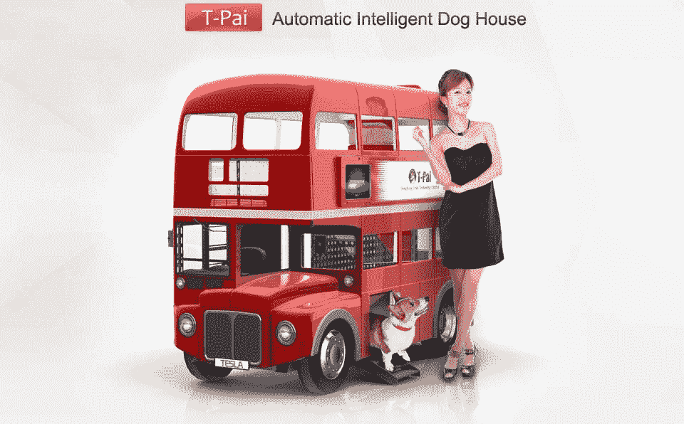

# 猜猜狗狗电脑做了什么 

> 原文：<https://web.archive.org/web/https://techcrunch.com/2016/09/12/guess-what-dog-pc-does/>

在这个世界上，有狗。还有个人电脑。但是狗电脑呢？你会说“荒谬”。但是女士们先生们，我已经看到了狗计算的未来，它就是狗 PC。狗用的电脑。

什么样的公司会为狗生产这样的 PC？当然是特斯拉。请注意，不是制造电动汽车的特斯拉。制造 T-Pai 的公司，这是一个内置在伦敦式双层巴士五英尺模型中的智能狗窝(不是真正喜欢 autotune 的家伙)。一天结束时，相比之下，狗电脑相当温顺:

在某些方面，该设备与 Petcube 等产品并没有太大区别，pet cube 允许客户远程喂养和监控他们的狗狗。但是除了内置的电子食物盒、摄像头和扬声器，狗电脑还有一个触摸屏，旨在最终将平板电脑游戏带入狗的世界。

该系统目前有三个游戏，包括一个水果忍者版本，狗可以用爪子玩。该设备旨在吸引和娱乐白天在家的小狗，因此它们可以在主人外出工作时玩 noobs。

该公司计划在未来六个月内推出 Indiegogo 活动，狗 PC 的价格在 400 美元至 500 美元之间。