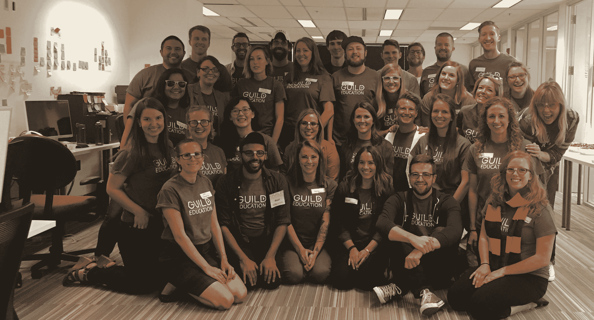

# Guild Education 获得由 red point TechCrunch 领投的 850 万美元 A 轮融资

> 原文：<https://web.archive.org/web/https://techcrunch.com/2016/09/16/guild-education-draws-8-5-million-in-series-a-funding-led-redpoint-and-social-capital/>

根据印第安纳波利斯的非营利组织[Complete College America](https://web.archive.org/web/20221005213231/http://completecollege.org/)2014 年的一份报告，只有 19%的全日制学生在公立大学的四年中获得学士学位。社区大学的统计数据更糟糕，5%的全日制学生在两年内获得了大专学位，只有 15.9%的学生按时获得了一到两年的证书。

学生需要更长时间才能毕业的部分原因在于缺乏清晰的规划、换专业、换大学以及选修不必要的课程，[建议进行多种研究](https://web.archive.org/web/20221005213231/http://college.usatoday.com/2015/12/16/breaking-the-4-year-myth-why-students-are-taking-longer-to-graduate/)。但是总部位于丹佛的[公会教育](https://web.archive.org/web/20221005213231/https://www.guildeducation.com/)的联合创始人兼首席执行官雷切尔·卡尔森说，还有很多非学术因素在起作用，包括飙升的学费和轮班工作会干扰社区大学的课程表。

为了帮助那些正在努力完成大学学业的学生，以及帮助那些认识到帮助员工实现其全部潜力的重要性的公司，成立 16 个月的公会与包括 Chipotle 在内的雇主合作，将教育作为一项福利，与医疗保健一起提供。

它是如何工作的？国税局已经[允许](https://web.archive.org/web/20221005213231/https://www.irs.gov/publications/p970/ch11.html)雇主每年提供高达 5250 美元的免税教育来帮助任何员工，只要这些福利“是由于他们的雇佣关系而提供的”如果雇主愿意，他们也可以支付超过 5250 美元的费用，尽管雇员通常必须为额外的金额纳税。(符合条件的员工还可以申请额外的 5815 美元的联邦拨款。)

无论如何，Guild 的平台让公司更容易将这种教育费用转化为员工福利，让员工获得大学学分，攻读本科和研究生学位。它通过两种方式做到这一点。Guild 创建了一些编程，目前包括 GED、ESL 和本科生管理培训课程。它还与四个在线大学项目有联系，包括科罗拉多州立大学的全球校园、西部州长大学、贝尔维尤大学和布兰德曼大学(查普曼大学的在线分支)。Guild 通过这些大学合作伙伴提供的一些本科学位集中在商业和先进制造领域。

员工上公会的课程，收益直接归公会。当他们选修大学的课程时，学校支付给 Guild 的费用大致相当于他们因不必支付招生营销费用而节省的费用。(公会不公开爆出这个费用。)

可以说，这一切都说明了问题。Chipotle 声称其员工每年只需支付 250 美元就可以上大学。

Guild 面临着竞争，包括许多直接提供在线课程的大学，以及像 [Udacity](https://web.archive.org/web/20221005213231/https://www.udacity.com/) 这样的公司，后者正与雇主合作，专门为他们的员工开发程序。

但你可以看到对雇主的吸引力，他们(随着时间的推移)可以看到一个广泛的学校菜单来引导员工。目前，Guild 与上述四所学校以及除 Chipotle 之外的六家雇主合作。然而，卡尔森——他拥有斯坦福大学的 MBA 和高等教育硕士学位——表示 Guild 正在运营许多其他试点项目，并且“有比我们所能支持的更多的(兴趣)”

当然，风投们似乎喜欢它所宣扬的东西。“毫不奇怪，教育是美国增长最快的企业福利项目，”红点风险投资公司的投资者斯科特·雷尼说。他称公会的提议是“各方共赢”事实上，这家 38 人的公司刚刚在 Redpoint 牵头的首轮融资中筹集了 850 万美元，参与投资的有 Social Capital 及其种子投资者 Harrison Metal、Cowboy Ventures 以及投资者兼斯坦福大学讲师 Fern Mandelbaum。

上图:联合创始人兼首席执行官雷切尔·卡尔森，她和她的老同学布列塔尼·施蒂希一起创建了这家公司。Stich 目前是该公司的学生服务和学术负责人。和卡尔森一样，她拥有斯坦福大学的 MBA 和教育学硕士学位。