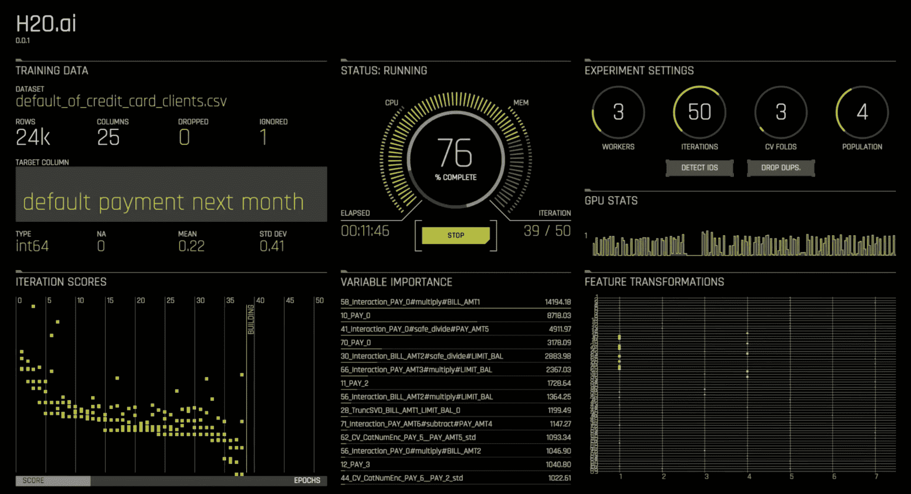

# H2O.ai 的无人驾驶人工智能为企业自动化机器学习

> 原文：<https://web.archive.org/web/https://techcrunch.com/2017/07/06/h2o-ais-driverless-ai-automates-machine-learning-for-businesses/>

# H2O.ai 的无人驾驶 ai 为企业实现了机器学习的自动化

[无人驾驶人工智能](https://web.archive.org/web/20230324115615/https://www.h2o.ai/driverless-ai/)是来自 [H2O.ai](https://web.archive.org/web/20230324115615/https://www.h2o.ai/) 的最新产品，旨在降低数据科学在企业环境中工作的障碍。该工具帮助非技术员工准备数据、校准参数和确定最佳算法，以利用机器学习解决特定的业务问题。

在研究层面，机器学习问题是复杂和不可预测的——在一个从未见过的用例中结合 GANs 和强化学习需要技巧。但现实是，今天许多公司使用机器学习来解决相对可预测的问题——例如，用支持向量机评估违约率。

但即使是这些相对简单的问题，对于非技术人员来说也很难理解。公司越来越多地将数据科学融入非传统的销售和人力资源流程，试图通过培训实现成本高昂的创新。

H2O.ai 的所有产品都有助于让人工智能变得更容易理解，但无人驾驶人工智能更进一步，它将准备模型时需要做出的许多艰难决定物理自动化。无人驾驶人工智能自动化了特征工程，即选择关键变量来建立模型的过程。

H2O 建立了无人驾驶人工智能，内置了受欢迎的用例，但它无法解决每一个机器学习问题。理想情况下，它可以找到并调整足够多的标准模型，使长尾的至少一部分实现自动化。

该公司在 1 月份推出深水时提到了今天的发布，这是一个允许其客户利用深度学习和 GPU 的平台。

我们仍然处于机器学习自动化的早期。谷歌首席执行官桑德尔·皮帅在今年的 I/O 大会上引起了很大的轰动，当时他提供了关于[公司努力创造一种人工智能工具](https://web.archive.org/web/20230324115615/https://research.googleblog.com/2017/05/using-machine-learning-to-explore.html)的细节，这种工具可以自动选择最佳模型和特征，通过试错和大量计算来解决机器学习问题。

无人驾驶人工智能是非技术用户民主化和抽象人工智能之旅的早期步骤。您可以下载该工具并从这里开始实验。