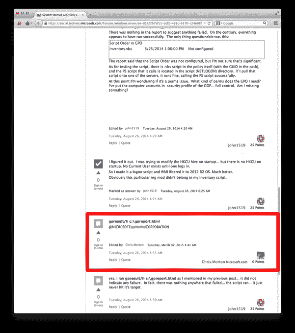

# 黑客利用热门网站攻击政府和其他目标 

> 原文：<https://web.archive.org/web/https://techcrunch.com/2015/05/14/hackers-are-using-popular-websites-to-attack-governments-and-other-targets/>

有证据表明，黑客正在利用热门网站攻击政府机构、非政府组织和其他网络间谍目标，手段越来越隐蔽。

这是根据安全公司 [FireEye](https://web.archive.org/web/20221006145424/http://fireeye.com/) 的一份新报告的发现，该报告上个月披露了[针对亚洲各地公司发起的为期十年的网络攻击的细节](https://web.archive.org/web/20221006145424/https://beta.techcrunch.com/2015/04/12/fireeye-apt-30-southeast-asia-india-report/)。该公司的最新报道揭露了另一个总部位于中国的黑客组织，该组织利用广受欢迎的微软网络论坛 [TechNet](https://web.archive.org/web/20221006145424/https://technet.microsoft.com/en-us/) 远程激活恶意软件，该恶意软件可能允许其访问一个组织的内部网络，并可能获得私人数据。

该程序由一个名为 APT17 的组织运行，现已被微软和 FireEye 关闭。它似乎没有对网站的普通用户构成威胁，而是 TechNet 被用作一种看似合法的媒介，该组织可以通过它来利用必要的杠杆渗透到目标中。

简单来说，apt 17——fire eye 称其目标是政府机构、非政府组织和律师事务所等——最初会在目标组织内部的个人中植入恶意软件，可能会使用通过电子邮件发送的恶意文件。如果恶意软件加载成功，它可能会被嵌入在 TechNet 论坛评论中的代码远程触发。

APT17 用于犯罪的软件 BLACKCOFFEE 可以让该组织进行一系列活动，包括上传和下载文件，终止主机上的进程以及引入其他后门命令。

尽管这些评论本身看起来毫无意义且垃圾，但它们代表了一种更隐蔽的方法，即在不引起内部安全系统注意的情况下放置激活码。

将编码的 C2 IP 地址嵌入到 TechNet 这样的站点(全球 IT 专业人员经常访问该站点)中，使得检测恶意活动比跟踪来自出于恶意目的而完全妥协的网站的威胁更具挑战性。换句话说，定期访问 TechNet 这样的网站不太可能像定期访问俄罗斯网站那样引起警觉。

“这种额外的混淆在 APT17 和试图追捕他们的安全专业人员之间又增加了一层，”FireEye 在其报告中说。

最终，FireEye 联系了微软，后者锁定了该组织在 TechNet 上的账户，但它表示，随着网络间谍技术变得越来越复杂，这种策略可能会变得越来越常见，“很少有安全公司公开讨论过”。

“组织将需要新技术来检测这些攻击，”FireEye 的 APAC 首席技术官布莱斯·博兰(Bryce Boland)在接受 TechCrunch 采访时表示。这个案例提醒人们，拥有“高度关键环境的组织不应该允许人们从互联网上接收内容。”

博兰补充说，但管理网络的责任不仅仅在于公司，允许用户生成内容的网站——包括社交网络——也应该谨慎。

“你看了很多网站和人们在评论区发布的废话，但你有没有想过它如此糟糕，可能是攻击者在寻求入侵？”他补充道。