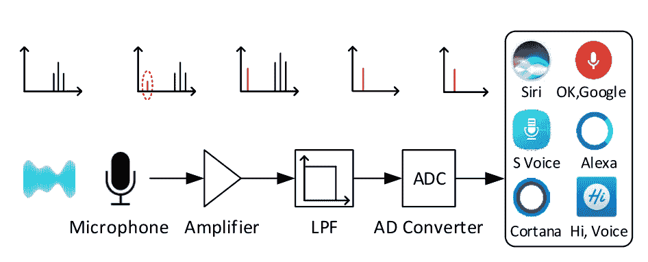
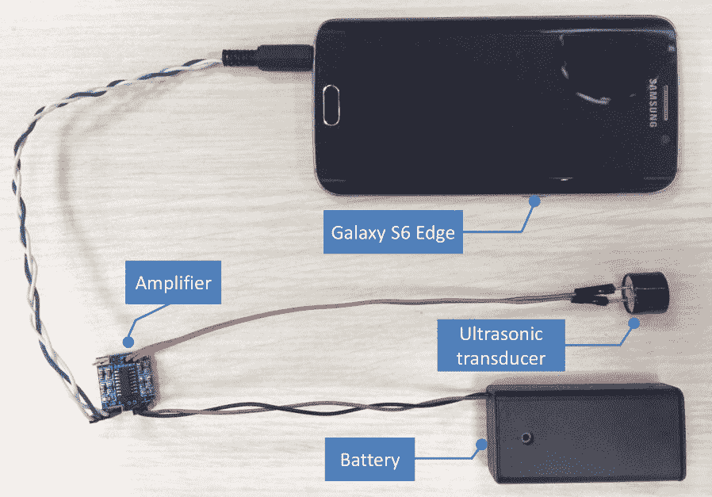

# 黑客通过超声波向语音识别系统发送无声命令 

> 原文：<https://web.archive.org/web/https://techcrunch.com/2017/09/06/hackers-send-silent-commands-to-speech-recognition-systems-with-ultrasound/>

中国的安全研究人员发明了一种不用说话就能激活语音识别系统的聪明方法。通过使用人类听不见但记录在电子麦克风上的高频，他们能够向每一个主要的“智能助理”发出命令，这些命令对除了目标设备之外的每一个听众都是无声的。

来自浙江大学的团队[将他们的技术称为海豚攻击(PDF)](https://web.archive.org/web/20221007215046/https://assets.documentcloud.org/documents/3987864/Dolphinattack.pdf) ，以动物的高音通信命名。为了理解它是如何工作的，让我们来上一堂简单的物理课。

## 科学来了！

像大多数电子产品中的麦克风一样，麦克风使用一种微小的薄膜，它可以响应声波引起的气压变化而振动。由于人们通常听不到任何高于 20 千赫兹的信号，麦克风软件通常会丢弃任何高于该频率的信号，尽管从技术上来说它仍然可以被检测到——这被称为低通滤波器。

一个完美的麦克风会以已知的频率在*振动，并且只在*振动，特定的输入频率。但在现实世界中，薄膜会受到谐波的影响，例如，400 Hz 的音调也会引起 200 Hz 和 800 Hz 的响应(我在这里捏造数学，但这是总体思路。维基百科上有一些很棒的 gif 图片说明了这个[。然而，这通常不是问题，因为谐波比原始振动弱得多。](https://web.archive.org/web/20221007215046/https://en.wikipedia.org/wiki/Harmonic)

但是，假设您希望麦克风记录一个 100 Hz 的音调，但出于某种原因不想发出这个音调。如果你产生一个足够强大的 800 Hz 的音调，它将产生 100 Hz 的音调及其谐波，*仅在麦克风上*。其他人只会听到原来的 800 赫兹的声音，而不会知道这个设备记录了其他任何东西。

## 平滑调制器

这基本上就是研究人员所做的，当然是以更精确的方式。他们确定，是的，事实上，大多数语音激活设备中使用的麦克风，从电话到智能手表到家庭集线器，都受到这种谐波效应的影响。

图中显示了超声波(黑色“波”)是如何产生的，产生红色的谐波，然后被低通滤波器减去。

首先，他们通过创造一个具有更高超声波频率的目标音调来测试它。这很有效，所以他们尝试用 500 到 1000 赫兹之间的分层音调来重现声音片段——这是一个更复杂的过程，但没有本质上的不同。而且不需要很多专门的硬件——不需要油炸食品或中国同类食品的外壳。

解调后的语音效果很好，可以在各种主要的语音识别平台上工作:

> DolphinAttack 语音命令虽然完全听不见，因此人类也察觉不到，但可以被设备的音频硬件接收，并被语音识别系统正确理解。我们在主要的语音识别系统上验证了 DolphinAttack，包括 Siri、Google Now、三星 S Voice、华为 HiVoice、Cortana 和 Alexa。

他们能够执行许多命令，从唤醒短语(“OK Google”)到多词请求(“打开后门”)。自然，不同的电话和短语有不同的成功率，或者在不同的距离效果更好。不过，没有一个能在 5 英尺以外工作。

由研究人员创建的系统的便携式实现。

这是一个可怕的想法——无形的命令可能会在空中嗡嗡作响，并导致你的设备执行它们(当然，人们可以说 Wi-Fi 也是如此)。但是这种危险是有限的，原因有几个。

首先，你可以通过关闭唤醒短语来击败海豚攻击。那样的话，你必须已经打开了语音识别界面，攻击才会起作用。

第二，即使你一直使用唤醒短语，许多设备也会限制访问联系人、应用程序和网站等功能，直到你解锁它们。攻击者可以询问天气或找到附近的泰国地方，但它无法将你发送到恶意网站。

第三，也许是最明显的一点，在目前的状态下，攻击必须发生在几英尺之内，并且针对的是户外的手机。即使他们能靠近到发出命令，如果你的手机醒来说，“好的，汇钱到莫斯科”，你很可能马上就注意到了

也就是说，仍然有一些地方是有效的。带有可以产生超声波的扬声器的受损物联网设备可能能够与附近的回声说话，并告诉它开门或关闭警报。

这种威胁可能不太现实，但它说明了攻击者可以通过多种途径试图危害我们的设备。对于任何希望在日常生活中使用的技术来说，将它们公之于众并设计对策是审查过程中必不可少的一部分。