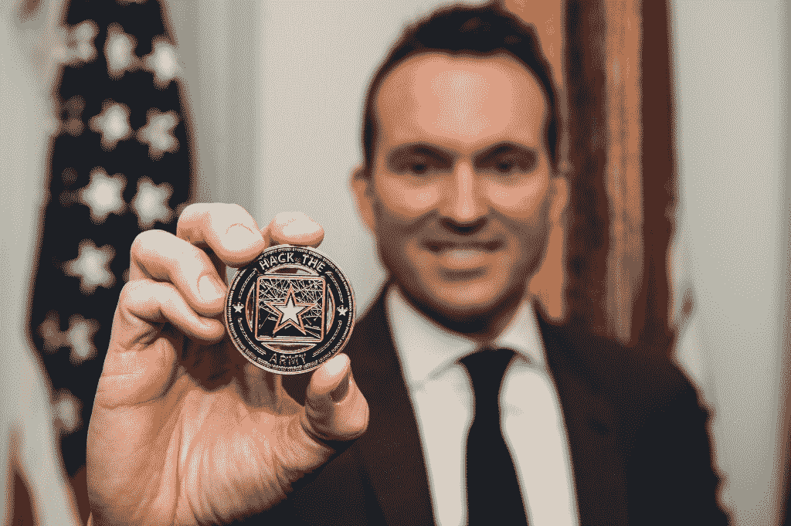

# 黑客入侵军队 

> 原文：<https://web.archive.org/web/https://techcrunch.com/2017/01/19/hacking-the-army/>

A

12 月初，黑客刺激了一个面向公众的军队[招募网站](https://web.archive.org/web/20230221171614/http://www.goarmy.com/)，无意中发现了一个漏洞，然后又是一个，直到他发现自己突然连接到一个国防部内部网络，这个网络应该会提示他特殊的访问凭据。到那天晚上结束时，五角大楼的员工正在交换疯狂的电话，并考虑彻底关闭受损的网络。这次入侵是意料之外的，但更令人担忧的是，黑客没有敲响任何警钟——直到他告诉国防部，国防部才知道他已经进入了内部网络。

发现这些漏洞的黑客正在参加美国陆军有史以来第一个漏洞奖励计划 [Hack The Army](https://web.archive.org/web/20230221171614/https://hackerone.com/hackthearmy) ，这项挑战邀请安全研究人员测试他们的技能，并为他们的努力支付报酬。国防部安全团队受过训练，能够对其网络上不明原因的流量做出快速反应，并且并非国防部 320 万成员中的所有人都知道正在进行 bug 赏金，因此恐慌是可以理解的。但是军队批准甚至庆祝了对其征兵网站的攻击——这意味着臭虫奖励计划正在起作用。

“坦率地说，我的反应是，‘太好了’，”陆军部长埃里克·范宁解释道。“很多人黑军队的第一反应是，‘你为什么要请人黑你？’好吧，我们每天都被黑客攻击，整天都被那些想要伤害我们的人攻击。所以设立这个比赛的想法，审查参与者，然后让他们告诉我们他们的发现是很棒的。如果他们没有找到漏洞，在某些情况下，找到了真正让我们惊讶的漏洞，那么我认为竞争对手没有做到我们希望它做到的一切。"

### 抓虫子

陆军部长埃里克·范宁展示奖励给成功的陆军黑客的硬币。照片:约翰·马丁内斯，美国陆军

秘书范宁的反应代表了政府看待安全研究的方式的演变——在谷歌和脸书等科技公司的引领下。政府机构和私营行业巨头并不总是对被黑客攻击漠不关心。在人事管理办公室和 T2 民主党全国委员会的大规模数据被盗后，对外国黑客的恐惧占据了国会山，公司以法律威胁回应漏洞报告。尽管今天许多大公司已经建立了允许安全漏洞披露的程序，黑客们仍然有理由担心被起诉和坐牢。

“这一阴影仍然强烈地笼罩着安全研究人员，” [HackerOne](https://web.archive.org/web/20230221171614/https://hackerone.com/) 的首席技术官 Alex Rice 说。“风险是巨大的，对这个行业来说是这样，对政府来说尤其如此。”

HackerOne 是提供 bug bounty 服务的几家公司之一，它将 Twitter、优步和 Dropbox 等公司与测试其网站和服务漏洞的黑客配对。HackerOne 的最新客户之一是国防部，它在去年春天推出了第一个 bug 赏金[黑客五角大楼](https://web.archive.org/web/20230221171614/https://techcrunch.com/2016/06/17/department-of-defense-expanding-hack-the-pentagon-program/)，随后在 11 月推出了黑客军队。

国防部一直相对缓慢地接受 bug 赏金的概念，只是在科技行业实施多年后才采用它。

A

尽管据报道，臭虫奖励的想法起源于 20 世纪 90 年代中期的网景公司。赖斯追溯得更远，翻出了 1983 年的一则猎人准备广告，该广告提供奖励在大众甲壳虫上发现其 VRTX 操作系统漏洞的黑客。标语写道:“如果你发现一个 bug，就去找一个 bug。”

直到谷歌在 2010 年推出第一个大规模的 Bug bounty 项目，bug bounty 项目才成为主流，随后脸书、雅虎和其他科技公司迅速跟进。苹果在这个概念上姗姗来迟，去年推出了一个只有受邀者才能参加的项目。

国防数字服务，美国数字服务的五角大楼分支，鼓励国防部赶上这个行业。诞生于 healthcare.gov 的灾难性发射， [USDS](https://web.archive.org/web/20230221171614/https://www.usds.gov/) 将技术工人与政府机构配对，以提高技术能力。

克里斯林奇(Chris Lynch)是国防数字服务部门的负责人，他在五角大楼内部和持怀疑态度的黑客中倡导 bug 奖金，这些黑客不相信他能让该项目启动。

“我们知道一个事实，将各种各样的黑客送到一个广阔的环境中会产生一些有意义的东西。这是事实。林奇说:“我们不可能雇佣每一个出色的黑客，让他们来为我们工作，但我们可以提供这些众包的 bug 奖金。“我不再害怕知道我们的弱点是什么。那不行。”

国防部与黑客五角大楼(Hack The Pentagon)进行了试水，邀请参与者攻击面向公众的国防部网站。黑客攻击五角大楼被认为是一个概念验证项目——这是林奇这样的 bug bounty 倡导者展示该计划将提高安全性，而不会有泄露机密材料或关键系统的风险。该计划成功后，对如果该机构欢迎黑客会发生什么的担忧开始消退。

> 我不再害怕知道我们的弱点。

——克里斯·林奇，国防数字服务

陆军网络司令部负责人中将·保罗·中曾根说:“与六个月前相比，如今这种疑虑有所减轻。”。“我的第一个想法是，‘哇，他们只用了 10 分钟就发现了一个漏洞。“我们需要多长时间才能发现，””(根据 Hack The Army 的官方统计，第一个漏洞仅在五分钟内就被报告了。)

中曾根中将的团队帮助修补 bug bounty 参与者发现的问题。他解释说，在一个有既定规则的公认网络中遏制黑客有助于缓解担忧。作为一个橄榄枝，军队不要求参与的黑客在加入该计划之前接受背景调查，即使一些私人公司强制进行背景调查。取而代之的是，黑客部队的参与者如果想获得经济奖励，只需接受背景调查。

黑客军队也给了黑客更多令人兴奋的目标，而不是像 defense.gov 这样面对公众的域名，这些域名在黑客攻击五角大楼期间受到攻击。该计划的军队版包括可以访问个人数据的招募网站和美国各地的招募站

“我们故意选择了这套资产，知道它们是皇冠上的宝石，”国防数字服务的数字安全主管丽莎·维斯威尔说。“在这里，我们让新员工输入他们的个人身份信息和各种东西。我们今天做了很多工作来保护它。”

即使有了这些防御措施，仍然只花了一天时间，一名黑客陆军参与者就注意到一个无人维护的路由器将陆军的征兵网站连接到了内部网络。通过将一系列小漏洞串在一起，黑客被路由到需要访问凭证的内部网站。“他们显然很聪明，马上就告诉了我们。我们不认为有任何邪恶的活动，”维斯威尔说。

维斯威尔解释说，保护个人信息是政府中许多人的痛处，他们希望避免重复人事管理办公室的黑客行为。她说，当黑客向军方报告他的发现时，随之而来的恐慌是一种自然反应。

“对很多人来说，尤其是军方的人来说，这仍然很不舒服。维斯威尔说:“当你日复一日依赖网络时，你很难在关闭或生活在一个可能会受到损害的世界中做出权衡。“但如果我们的好人得到了它，这可能意味着坏人已经有了关于那里的漏洞的信息。虫子奖金开始让竞争变得公平。毫无疑问，坏人会继续攻击我们。他们会在中国喝早茶的时候攻击我们。我们也允许好人进来帮忙。当你允许这种情况发生时，你就不必再坐以待毙了。”

P

或许是因为预计到公众会强烈抗议向黑客支付税款，国防部将黑客攻击五角大楼作为一项削减成本的措施。该计划耗资 15 万美元，但国防部表示，委托一家私人公司进行类似的安全审计将耗资超过 100 万美元。Hack The Army 的成本尚未确定，因为陆军仍在评估该计划期间发现的漏洞，但中曾根中将表示，预测表明该计划仍将是负担得起的。

Bug bounty 的支持者还认为，这些程序具有涓滴效应:研究人员可能会在供应商提供的代码中发现问题，当这些问题得到解决时，与供应商签约的每个组织都将获得安全提升。这些项目也为那些被允许作为进攻者和防御者参与 bug bounty 的军事成员提供了一种直接有效的训练形式。

> 我们也允许好人进来帮忙。当你允许这种情况发生时，你不必再坐以待毙。

—丽莎·维斯威尔

但是国防数字服务团队并不仅仅致力于捍卫 bug bounty 项目的价值，他们还想扩大这个项目。

五角大楼越来越接受黑客只是第一步。国防数字服务团队希望漏洞奖金将从根本上改变国防部对网络安全的思考方式。威斯维尔认为，在“黑客入侵陆军”期间引起关注的漏洞链可能会被自动漏洞扫描器发现，这证明了人类在安全方面的独创性和经验的必要性。像国防部这样的大型组织在自动漏洞扫描上花费了数百万美元，这有望比一组工程师更快、更有效地发现巨大网络中的问题。

“自动化本身很少能够实现这种逻辑跳跃，”维斯威尔说。“我们花了很长时间专注于自动扫描等银弹技术，这并不是一个完整的安全策略。我们做了很多事情来止血，但没有做很多事情来彻底改变我们对安全的看法。”

林奇过去曾表示，让黑客们自由处理日益敏感的数据集一直是 bug 赏金计划的一部分，他说这一点没有改变。他预计最终会在机密网络上运行一个 bug 赏金程序。

然而，还不清楚特朗普政府下的国防数字服务等项目会变成什么样。秘书奥巴马任命的范宁将离开五角大楼，为文森特·维奥拉让路，文森特·维奥拉是佛罗里达州曲棍球队的亿万富翁老板，特朗普已提名接替他。鉴于[情报界评估](https://web.archive.org/web/20230221171614/https://techcrunch.com/2017/01/06/intel-report-on-hacking-says-russian-interference-with-us-election-was-boldest-yet/)俄国参与了几次旨在影响选民支持他的黑客活动，川普可能希望对黑客表现出强硬，并反对国防部正在进行的漏洞赏金计划。

“我并不比你更清楚下一届政府会发生什么，但我不认为像这样的项目的必要性和价值会受到任何人的质疑。网络对对手来说是一个低门槛，每个人都相信——”范宁停顿了一下，然后纠正自己。“人们普遍认为，对这个问题有越多的关注，对我们越有利。”