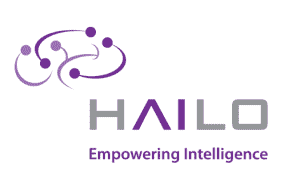

# Hailo 为其深度学习芯片 TechCrunch 筹集了 1250 万美元的 A 轮融资

> 原文：<https://web.archive.org/web/https://techcrunch.com/2018/06/05/hailo-raises-a-12-5m-series-a-round-for-its-deep-learning-chips/>

# Hailo 为其深度学习芯片筹集了 1250 万美元的 A 轮融资

在很长一段时间里，薯片有点无聊。但深度学习的革命现在已经为那些构建专用芯片来加速深度学习和模型评估的初创公司打开了市场。其中包括总部位于以色列的 Hailo 公司，该公司正在为嵌入式设备开发深度学习芯片。该公司今天宣布，它已经筹集了 1200 万美元的 A 轮融资。

投资者包括以色列众筹平台 OurCrowd、Maniv Mobility、Next Gear，以及一些天使投资人，包括 Hailo 自己的董事长 Zohar Zisapel 和 Delek Motors 的 Gil Agmon。

Hailo 告诉我，它将利用新一轮的资金，使其总资金达到 1600 万美元，以进一步开发其深度学习处理器。该公司预计样品将于 2019 年上半年上市。这些芯片将能够在广泛的环境中运行嵌入式人工智能应用，包括无人机和汽车，以及智能家电和相机。

不过，Hailo 的主要市场是汽车行业。在这方面，它正在跟随其他以色列初创公司的脚步，比如最终被英特尔收购的 [Mobileye](https://web.archive.org/web/20221205212644/https://www.mobileye.com/en-us/) 。

“现有处理器 70 年的架构不足以满足今天的深度学习和人工智能处理需求，”Hailo 首席执行官 Orr Danon 表示。“Hailo 正在彻底改变处理器的底层架构，将深度学习处理能力提升几个数量级。我们完全重新设计了计算机架构的支柱——内存、控制和计算——以及它们之间的关系。”