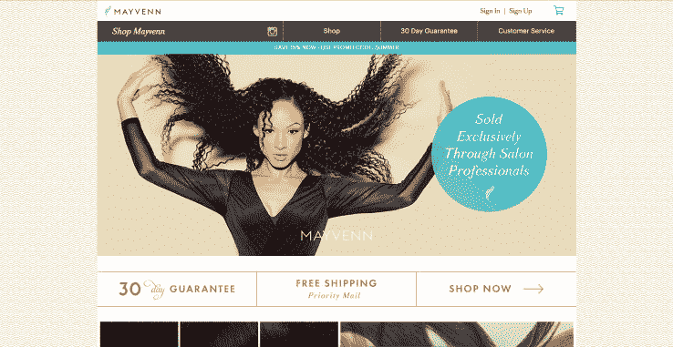
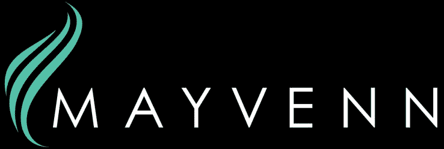

# 接发初创公司 Mayvenn 从 A16Z TechCrunch 获得 1000 万美元的 A 轮融资

> 原文：<https://web.archive.org/web/https://techcrunch.com/2015/06/19/hair-extensions-startup-mayvenn-raises-10-million-series-a-from-a16z/>

旧金山东湾一家名为 [Mayvenn](https://web.archive.org/web/20221007192037/https://welcome.mayvenn.com/) 的新接发公司正在改变购买更长头发的传统实体销售模式——给发型师提供他们自己的在线发廊。

大多数接发是从亚洲和印度次大陆进口到美国的，然后卖给街角的小美容店，那里的售货员可能不太了解接发。然后顾客购买头发并交给发型师。

问题是发型师不仅对质量没有控制，而且没有办法从购买的头发中赚取佣金。

Mayvenn 的模型为每个发型师提供营销材料和网络商店，以较低的成本出售被承诺为可靠的头发质量，并有机会从购买的每根头发中赚取佣金。

扩展的价格从数百美元到数千美元不等，但 Mayvenn 的联合创始人 Diishan Imira 可以保持低成本和高质量，因为他与亚洲的供应商有一些基本的关系。Imira 不仅能说一口流利的普通话，而且已经在这个地区从事国际贸易工作十多年了。

他认为这种模式对迎合最大的接发消费者——非裔美国女性的理发师特别有效。

> 这只是一个更好的系统，迪伊桑是发现它的人。本·霍洛维茨，a16z

但是伊米拉并不是第一个想到在网上出售头发的人。

[Vixxen](https://web.archive.org/web/20221007192037/http://www.vixxenn.com/)

是一个基于网络的创业公司，设计师可以建立一个交钥匙网站，并在转售的扩展 15%。这可能是 Mayvenn 在这一领域最激烈的竞争。

Mayvenn 还提供 15%的佣金，并包括一个个人网站，发型师可以指导客户购买头发。

Mayvenn 在短短一年半的时间里迅速发展到 30，000 名造型师，年收入已经达到八位数。这些数字令人印象深刻，足以引起 a16z 的本·霍洛维茨的注意。

“这就像是，如果你遇到任何销售安利或雅芳或康宝莱或任何这些东西的人，他们大多数人都会说‘我投了一大笔钱，我真不该这么做。我失去了所有的钱。但是对于 Mayvenn 的人来说，他们不投入资金，只是把钱取出来。这只是一个更好的系统，迪伊桑是发现它的人。"

安德森·霍罗威茨(Andreessen Horowitz)领导了 Mayvenn 最近的 1000 万美元 A 轮融资，霍罗威茨是 a16z 合伙公司的创始人之一，他计划作为“观察员”进入这家初创公司的董事会。

500 Startups、三一创投、核心创新资本、跨文化 Ventures、Impact America、苹果的吉米 Iovine、网球明星小威廉姆斯、翻译 CEO 史蒂夫·斯托特和安朱拉·阿查里亚-巴斯也把钱扔进了这轮。

在这次融资之前，Mayvenn 在种子轮融资中筹集了 300 万美元，使这家初创公司的融资总额达到 1300 万美元。据一位消息人士称，此次融资使 Mayvenn 的估值接近 6200 万美元。然而， [Pitchbook](https://web.archive.org/web/20221007192037/http://pitchbook.com/) 分析师告诉我们，融资后估值接近 3900 万美元，Mayvenn 最初寻求 2000 万美元，但最终接受了 1000 万美元。如果它筹集到 2000 万美元，这家初创公司的估值将接近 6200 万美元。

这可能是一项明智的投资。这种模式让发型师能够从他们的产品中赚钱，接发仍然是非裔美国女性的流行选择——喜剧演员克里斯·洛克 2009 年的纪录片《好头发》就是这个[、价值 6 . 84 亿美元](https://web.archive.org/web/20221007192037/http://www.bloomberg.com/bw/articles/2013-06-20/startups-target-go-after-the-multiracial-hair-care-market)的黑人发型行业的见证。

伊米拉认为，他的创业公司在非裔美国人以外也有潜力。霍洛维茨也同意。a16z 的合作伙伴看到了犹太人社区和非裔美国人社区的潜力。

“公司里的人认为这是为黑人设计的产品，但我说不，不，不，你完全搞错了。不是黑公司。这是一家犹太公司。“Mayvenn 这个名字是关键，当然，这是意第绪语中可信专家的意思，”Horowitz 告诉我。

伊米拉和霍洛维茨都有道理。好莱坞和郊区有很多来自不同种族的女性，现在愿意在当地的沙龙里支付数千英镑来加厚和加长她们的头发。我和几个在湾区和犹他州从事接发工作的理发师谈过，他们可以肯定有很多来自各个种族的女性愿意伪造更长的头发。

“在黑人社区之外，接发是较新的事物，但它的发展速度令人难以置信，”伊米拉说。“它变得无处不在。”

但伊米拉的主要精力放在了造型师身上。“这是美容师的业务，这样他们就可以在不购买或持有任何库存的情况下进行零售。对美容师来说，这是一项服务业务清单，”他说。

伊米拉计划用新的现金来扩大业务规模，这样他就可以“每年的收入从 8 位数迅速跃升至 10 位数。”

