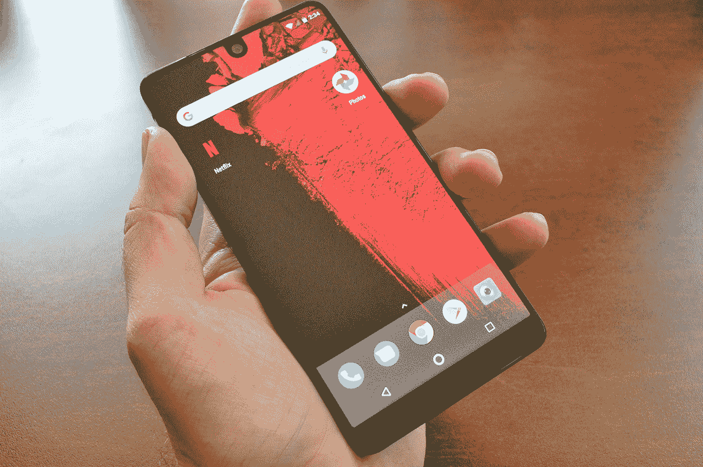
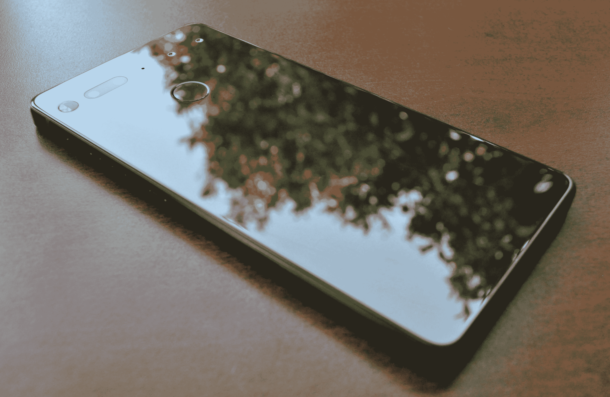
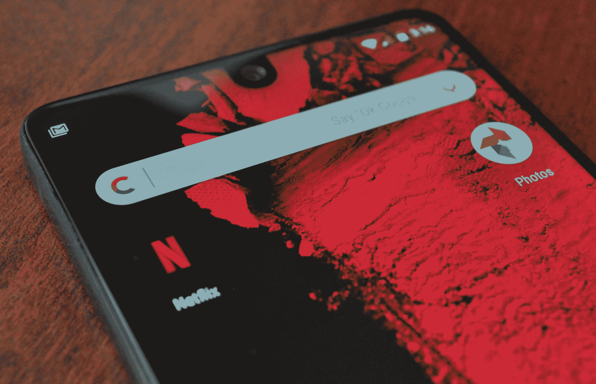
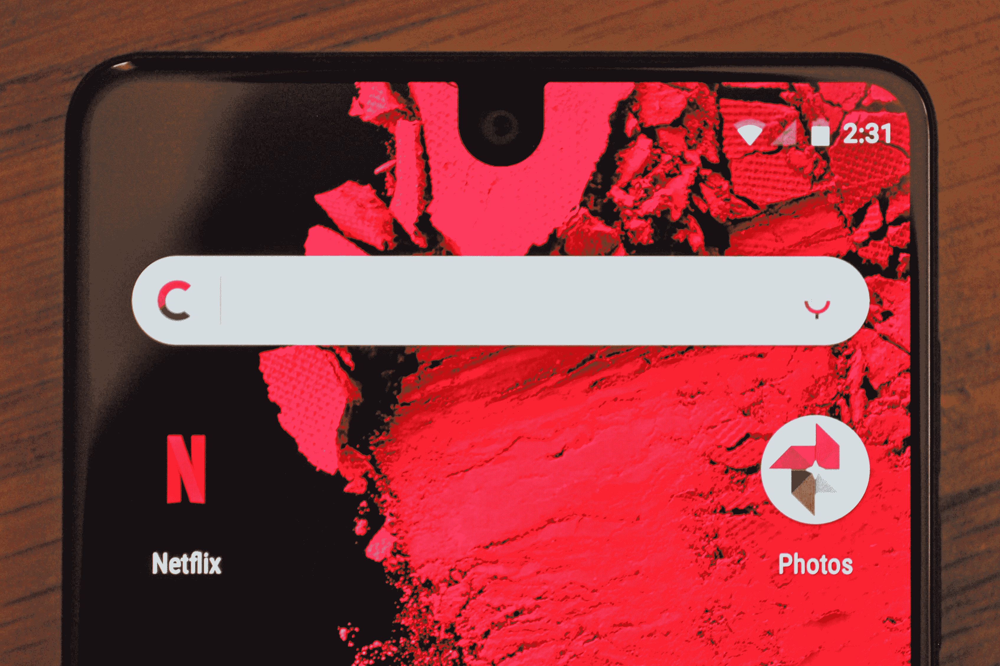
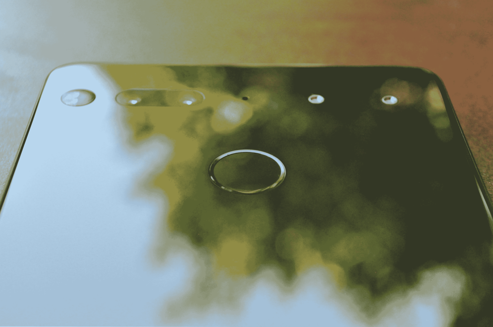

# 手握安迪·鲁宾的必备手机

> 原文：<https://web.archive.org/web/https://techcrunch.com/2017/08/18/hands-on-with-andy-rubins-essential-phone/>

这是一个非常吸引人的推介:安迪·鲁宾，Android 的创始人之一(他在谷歌领导这个项目已经八年了！)成立了一家新公司……他正在开发一款安卓手机。众所周知的“必备手机”。

几天来，我一直带着一部必不可少的手机。以下是我目前的想法。

*(我认为这是一次“实践”,而不是一次“回顾”,因为我们和其他几家商店在这一点上已经拥有这款手机两天多一点了。智能手机对我们的日常生活至关重要，而且还是一家全新公司的产品，因此我们有足够的时间来了解它的皮毛。我们将在未来几周进行更深入的评估，一旦我们觉得自己对这件事了如指掌——但随着这款设备刚刚上市，我觉得有必要分享一些早期印象。)*

在一个有一百万部不同安卓手机的世界里，是什么让这款手机脱颖而出呢？前面提到的与 Android 联合创始人的关系可能会吸引一些顽固分子……但是其他人呢？这个手机的*东西*是什么？

**它有几个:**

*   一个由钛和陶瓷制成的机身，结合在一起可能是我见过的最闪亮的(不管是好是坏——稍后会有更多介绍)智能手机。这真是一部漂亮的手机。
*   超薄边框的醒目显示屏；它几乎一直延伸到设备的顶部，为前置摄像头预留了一个小切口，底部有一个更标准的边框。
*   设备背面的一对数据/电源引脚允许您扣上可选的磁性附件，以扩展手机的功能。

如果你走向放在桌子上的一部重要电话，你可能注意到的第一件事实际上可能是缺少了你应该注意的东西。

没有品牌，不管是 Essential 的标志还是运营商的标志。没有摄像头磕碰。除了双摄像头、闪光灯和指纹识别器之外，它是一个庞大的、闪闪发光的平板电脑。

哦，它是多么闪亮。我一直带在身边的型号是该公司称之为“黑色月亮”的颜色——这种颜色将首先运送给买家。想象一个带有豪华轿车色彩的镜面；完全抛光，新鲜的盒子，这是非常令人震惊的。

唉，那样的光芒伴随着一个固有的缺陷:这个东西采集指纹，这是它的*工作*。如果指纹把你逼得走投无路，你可能要等到哑光颜色出现，或者习惯每五秒钟就把它擦一次。

但是比指纹更永久的痕迹呢？我一直带着这部手机，其他各种各样的东西都塞在同一个口袋里。钥匙。硬币。其他手机。两天后，老实说，有点出乎我的意料，手机的显示屏和背面都完美无瑕。我们将在未来几周内看看这种情况是否会持续。

它的手感很好，它的钛机身非常坚固。它的重量约为 180 克，比 iPhone 7(138 克)或 Pixel(143 克)/Pixel XL(168 克)都要重一点，但也不会让我感到困扰。

到目前为止，电池寿命似乎很长。两天是一个短暂的样本，但我发现自己在多个场合对设备上剩余的电池量感到惊喜。这是个好兆头。

而且，因为我就是不能不提:这款手机没有 3.5mm 插孔。我不喜欢那样。在 iPhone 上不喜欢，在传闻中的 Pixel 2 上不喜欢，在这里也不喜欢。我家里有半打蓝牙耳机，我仍然哀悼 3.5 毫米的死亡。它带有一个适配器，但我已经反适配器近十年了。

现在，关于那个屏幕。那个疯狂的边框灯屏幕，还有那个正对着屏幕中央的前置摄像头。

当这个东西的第一张照片流出时，我想我会发现相机的剪切比我在实践中更分散注意力。我已经不再注意它了。Android 主要使用屏幕最上方的通知栏，并不怎么使用中间的部分——所以我很少想到应该放在哪里。

当应用程序——比如说网飞——全屏显示时，相机旁边的区域会变暗，有效地将显示器的大小缩小到更标准的顶部边框的样子。虽然这比让一个摄像头插入你的视频四分之一英寸要好，但让你的屏幕突然失去你已经习惯于看到照亮的一大块还是有点不和谐。

没有那个切口会不会更好？当然可以！但是随着显示器边框的缩小和自拍的空前高涨，前置摄像头将永远需要一个家。再加上下一代 iPhone [可能会采用类似的方式](https://web.archive.org/web/20230316161342/https://techcrunch.com/2017/07/31/homepod-firmware-reveals-iphone-8-design-and-facial-recognition/)，我希望这些小的前置摄像头半岛会成为相当标准的配置。

我们将保存更深入的相机比较材料进行全面审查，但基本手机的后置摄像头似乎很强——特别是在户外。在室内和光线不足的情况下，我的结果更加复杂。

为了瘦身和摆脱相机的冲击，他们实际上是把拍照任务分散到两个相机上:一个是彩色的，一个是单色的。单色传感器比彩色传感器能够捕捉更多的细节，因此它们从每个传感器中获取图像，并通过一点后处理魔法将它们合并在一起。双摄像头还允许人像模式(阅读:当你的前景对象在焦点上时，背景非常模糊)；该公司向我们展示了它的预览版，但它还没有完全准备好供审查单位使用。

可以说，基本手机最吸引人的地方是背面的两个小针脚。

理论上，这些引脚可以让基本的手机做各种有趣的事情。它们在手机和可选的磁性配件之间传输电力和数据，您可以购买这些配件。这些配件应该与该公司未来发布的其他设备兼容，包括亚马逊 Echo/谷歌 Home 的竞争对手 Essential Home。

我说“理论上”是因为…嗯，他们没有尽最大努力说明那些有趣的事情可能是什么。他们宣布了一个 360 相机，一个坞站和…到目前为止就这些。他们承诺“每隔几个月”就会推出新的配件，但没有透露具体会是什么。

这与摩托罗拉去年对 Moto Z 做出的承诺以及最近对 Moto Z2 做出的承诺类似。即使是现在，Moto 的平台也缺乏任何真正惊天动地，真正证明概念的必备配件。

Essential 会不会有什么终极配件藏在袖子里？也许吧。但是，在他们展示之前，任何人购买这些引脚的手机都是在购买无形的承诺*的东西*。“想象一下可能性！”是一个容易陷入的陷阱——但是，如果这些图钉是你的主要吸引力，我会等到至少有一两个配件真正满足你的需求。

唉，还没有配件——包括 360 相机——准备好接受评论，所以在这方面我没什么可说的。我*有没有*去看看 360 相机的原型模型，它已经感觉很容易磁吸到位，一旦它在那里就很坚固——但除此之外，在我们真正深入这里之前，我们仍然在等待生产单位。

该设备实际上运行的是纯 Android 系统(Nougat，7.1.1)，只是做了一些调整，以解决摄像头剪切等问题。在这个过程中，我看到了一两个小故障——在我的 SIM 卡激活之前需要几次重置，通知栏似乎崩溃了两次，相机应用程序有时感觉有点不稳定……但诸如此类的事情都是全新团队的全新手机交易的一部分，我已经看到他们发布了补丁。在软件方面，这个团队似乎进展很快。

到目前为止，对于安迪·鲁宾的宏伟愿景来说，基本手机感觉像是一个坚实的基础，是一个统一的生态系统，有一个附加配件目录；承诺两年更新和每月安全补丁的 Android 手机之一。无论对你来说意味着什么，现在购买它就是在赌这个愿景。我很喜欢它——但是，如果你已经对你口袋里的东西很满意了，这里还没有任何东西会尖叫“你的手机是垃圾！扔了，给我买吧！”