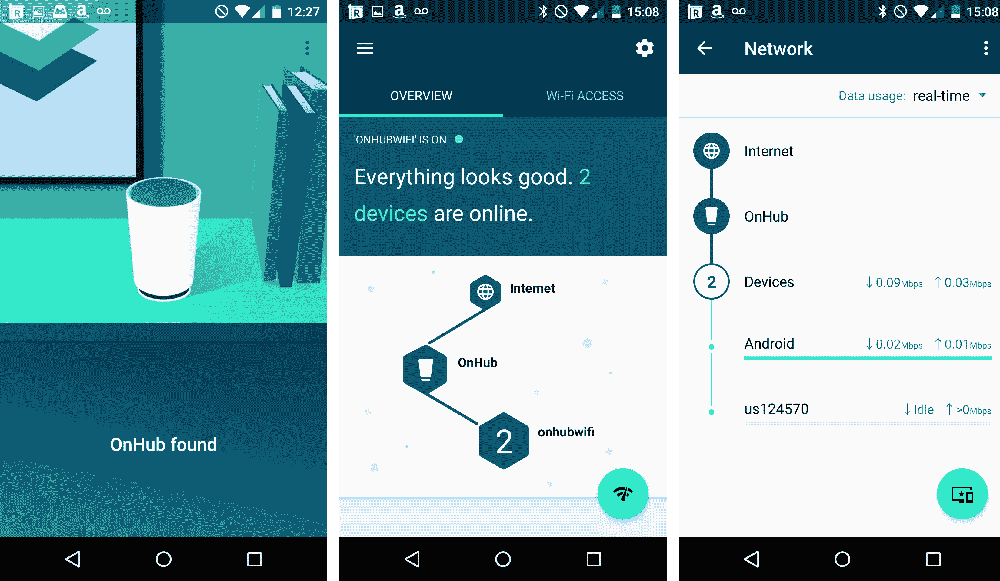
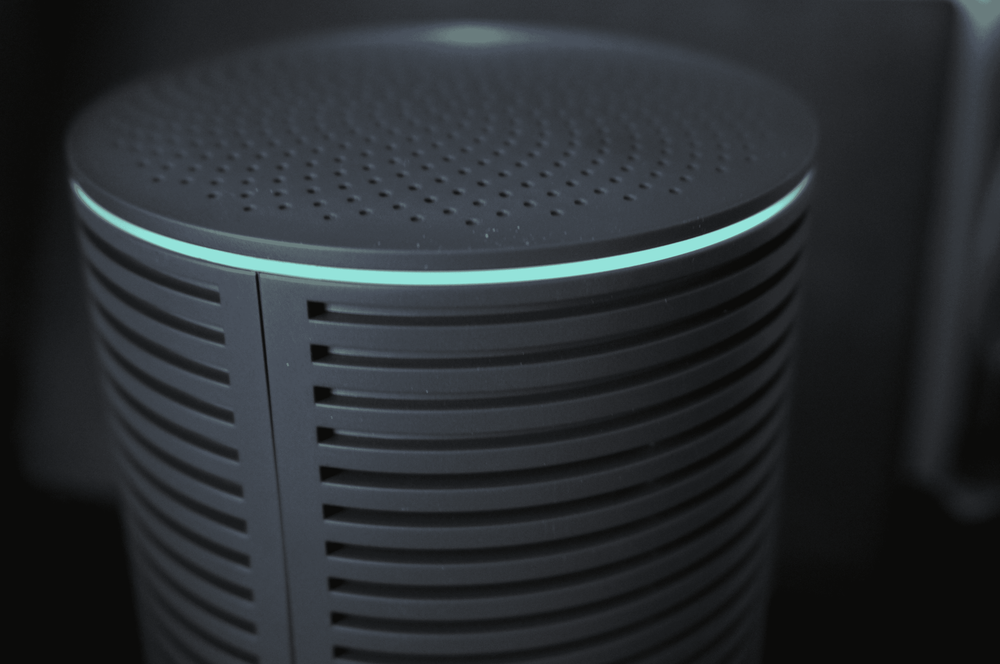
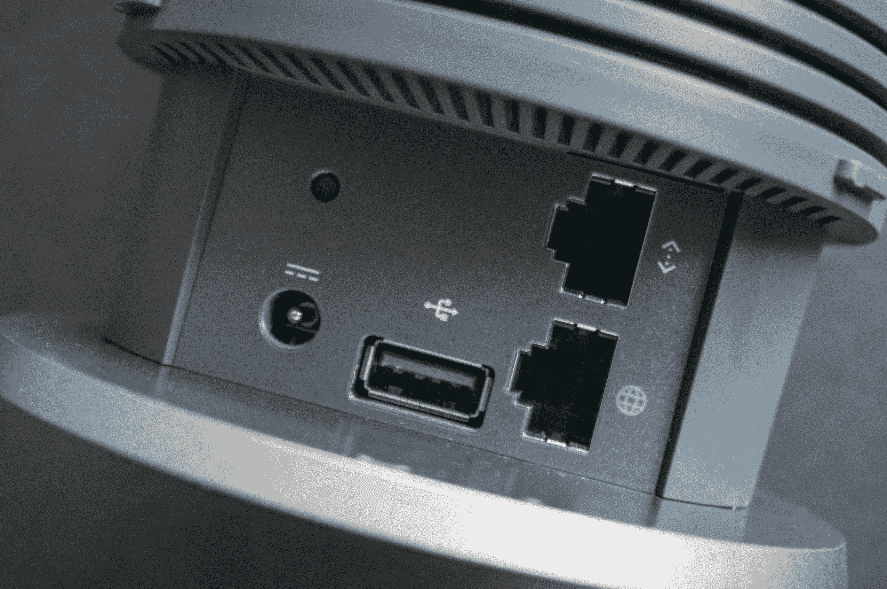

# 谷歌 OnHub 路由器 TechCrunch 实践

> 原文：<https://web.archive.org/web/https://techcrunch.com/2015/09/05/hands-on-with-googles-onhub-router/>

在一个完美的世界里，你永远不必考虑你的路由器。它会坐在某个角落里，确保你最喜欢的 YouTube 视频找到你的笔记本电脑。

但在现实中，当你的连接开始掉线时，你经常不得不重置你的路由器，如果你不得不实际改变任何设置，那你就惨了。尽管它们无处不在，但大多数路由器的用户界面仍然令人沮丧。输入谷歌。凭借[200 美元的 OnHub 路由器](https://web.archive.org/web/20221204063826/https://on.google.com/hub/)，谷歌希望解决现代路由器的所有问题——在很大程度上，它做到了。

在我的公寓里使用路由器几天后，我不得不承认，我不想回到我的旧设置，使用我的旧威瑞森提供的 Actiontec 路由器。OnHub 的 Wi-Fi 覆盖和用户体验比我试过的任何其他路由器都要好。

那么是什么让 OnHub 与众不同呢？谷歌与 TP-Link 合作，基本上建立了一个参考模型，它认为现代路由器应该是什么样的，并将其放入一个漂亮的圆柱形包中，这意味着清楚地表明它不只是另一个无聊的网络设备盒。它由本质上是一台小型计算机驱动，它使用所有的智能(和比典型路由器更多的天线)来确保您的数据在最适合您的任何通道上流动。

因为 OnHub 专注于为你找到最佳的 Wi-Fi 连接，它可能会给你一个比标准路由器好得多的连接，尤其是如果你住在一个有很多活跃 Wi-Fi 网络的地区。

> 如果你想要的只是一个可以工作的 Wi-Fi 网络，OnHub 可以给你提供更多。

我的 Macbook Air 目前可以接收大约 25 个网络，随着这个数字的上升，我的网络问题也在增加——尤其是在晚上，每个人都在使用平板电脑、笔记本电脑和苹果电视。例如，这意味着网飞视频经常会缓冲或完全停止。

当我切换到 OnHub 时，整体网络吞吐量上升了，视频播放速度加快了，从那以后我再也没有遇到过缓冲问题。当然，你的里程数可能会有所不同，但至少对我来说，OnHub 为我家的 Wi-Fi 连接创造了奇迹。

不过 OnHub 不仅仅是硬件。要设置和管理路由器，你需要在手机(Android 或 iOS)上安装一个应用程序，在手机和路由器握手(通过音频)后，你选择网络的名称和密码，就可以开始了。

OnHub 有一个 LED 环，有点让人想起失败的 Nexus Q 项目，给你一个关于其状态的视觉提示。不过，那是静态灯。OnHub 上没有闪烁的灯。

使用移动应用程序，您可以与其他人共享您的 Wi-Fi 密码，为某些设备(例如，当您开始游戏会话时，可能是您的 Xbox)提供优先网络访问权限，跟踪您的带宽使用情况，以及管理所有其他基本的路由器功能。

与标准路由器相比，这些选项有些有限，但这正是 OnHub 的要点。您仍然可以访问基本的 DNS 和 WAN 设置，以及端口转发和通用即插即用设置，但仅此而已。

没有人喜欢管理一个家庭 Wi-Fi 网络，但是 OnHub 让它变得非常简单。在这个过程中，你失去了一点灵活性，但是绝大多数用户都不在乎。如果你想要的只是一个可以工作的 Wi-Fi 网络，OnHub 可以给你提供更多。

> 如果你家里有 Wi-Fi 问题，那么 OnHub 值得一试。

不过，你确实放弃了 OnHub 的一些配置选项。该路由器只有一个以太网端口。在很大程度上，这是一个完全以 Wi-Fi 为中心的设备。如果你只有一个单独的桌面，这没什么大不了的(尽管你的桌面可能不在你的客厅里)。但如果你家里有几个非 Wi-Fi 设备，OnHub 很可能不适合你。谷歌正在与其他合作伙伴一起建造类似的路由器，所以也许下一个将有更多的物理端口。

OnHub 对未来毫无歉意。例如，在这方面，它与谷歌最早的 Chromebooks 没有太大区别。这是关于无线连接，而不是物理连接。或许它也有点像特洛伊木马，因为有很多迹象表明 OnHub 不仅仅是一个 Wi-Fi 路由器。

OnHub 将很快支持 Weave，比如谷歌新的物联网协议。一旦激活，OnHub 路由器将变得不仅仅是一个伟大的路由器——它将成为谷歌智能家居计划的中心枢纽。这只有在路由器可以覆盖整个房子的情况下才能工作，所以谷歌不仅改善了路由器的网络覆盖范围，还使它足够吸引人，可以放在你客厅的架子上(这不是你的网线通常可以到达的地方，但这是一个不同的问题)。

“Google On”的未来到底会是什么样子还有待观察。甚至不清楚“Google On”到底代表什么。今天，问题是是否值得购买这款 200 美元的路由器——因为目前，OnHub 就是这么回事。

如果你在家里遇到了 Wi-Fi 问题，因为电波太拥挤或者你当前的路由器不能覆盖你的整个家，那么 OnHub 值得一试。如果你没有，而且你已经有了一个稳定的联系，那么就没有真正的理由去改变，你可能最好等待。拿我来说，我是不会回到我的旧路由器的。