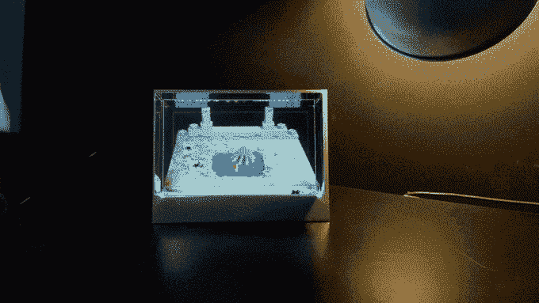
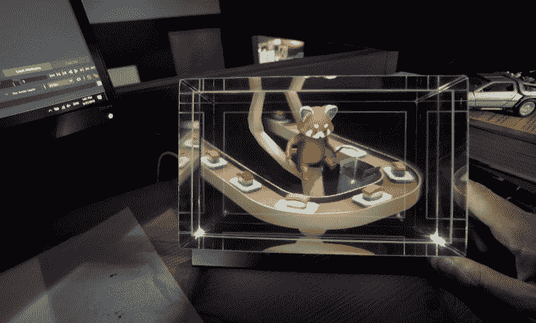

# 亲身体验外观奇特迷人的玻璃体积显示器 

> 原文：<https://web.archive.org/web/https://techcrunch.com/2018/08/22/hands-on-with-the-bizarrely-fascinating-looking-glass-volumetric-display/>

# 动手操作奇特迷人的玻璃体积显示器

3D 有什么好？在一个很可能是平面的界面中，深度给了你任何有价值的东西吗？“沉浸”作为一种衡量标准真的值那么多钱吗？

尽管大量初创公司和大公司已经投资了以 3D 为中心的硬件和软件，但毫无疑问，人们对它是否有必要存在一些抵触情绪。当我玩 [Looking Glass Factory](https://web.archive.org/web/20221025222221/https://lookingglassfactory.com/) 的最新项目时，我解决了其中一些问题，这是一款桌面立体显示器，他们认为这是公司目标的核心，他们刚刚将其命名为 Looking Glass。

我在这方面的经历让我有点困惑，不知道这项技术最终会走向何方，但他妈的，它真的很酷吗？

透过窥镜

这家初创公司正在进行[众筹活动](https://web.archive.org/web/20221025222221/https://www.kickstarter.com/projects/lookingglass/the-looking-glass-a-holographic-display-for-3d-cre)，以评估人们对这样一款产品的兴趣，他们已经筹集了大约 77.5 万美元，超过 1200 名支持者。我有机会试用了他们推出的两个版本，一个是 450 美元的 8.9 英寸版本，另一个是 2500 美元的 15.6 英寸版本。

该显示器显示一个物体的 45 个视图，每个视图以每秒 60 帧的速度传送图像，你可以从多个角度观看。其工作原理是，显示器基本上发出一个扇形视角，可以由多人从多个视角观察。无论你最初听到的是如何工作的技术细节，第一次看到这样的立体显示器都会有一定程度的不相信。这就像…往一个像素鱼缸里看。

Looking Glass Factory 自 2015 年成立以来，已经发运了相当多的产品，这些产品广泛适用于全息图世界，这一产品出现在它有机会成为设计师和创意类型的玩具的时候。该公司认为，该产品为这些人提供了一个机会，不用戴上耳机，就可以轻松地看到他们正在做什么，并向其他人展示，而不用到处扔耳机。

该显示器是最近 3D 数字资产平台和商店建设的迷人组合。现在，在 iPhone X 这样的设备上有复杂的相机阵列，构建 3D 扫描比以往任何时候都更容易，类似的大型科技公司正在寻求通过可以轻松访问的 3D 数字资产库来购买 AR/VR 开发流程。

我对这种体积显示类型的用例实际上扩展了多远感到有点困惑，但对于正在构建自己的模型并希望以更加身临其境的方式看到它们的 3D 创作者来说，这确实看起来是一个非常有趣的工具。这是在为他们解决一个根本问题吗？我不会这么说，但这是一项非常有趣的技术，我不怀疑他们能够将一些设备转移到通常渴望这种类型东西的早期采用者群体中。这些 Kickstarter 暴发户中的大多数都在兜售白日梦，但 Looking Glass Factory 已经在这方面工作了一段时间，不管你是否真的需要它，他们已经得到了它。