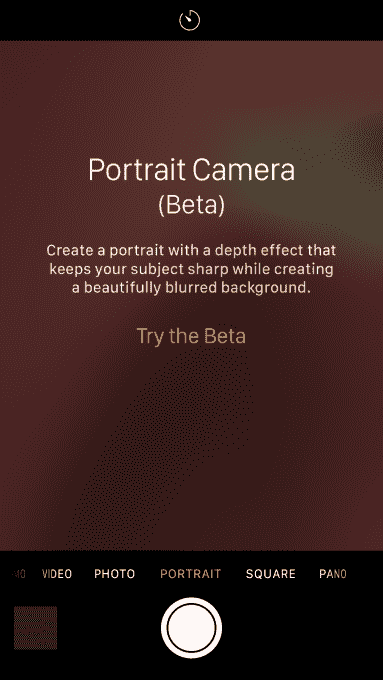
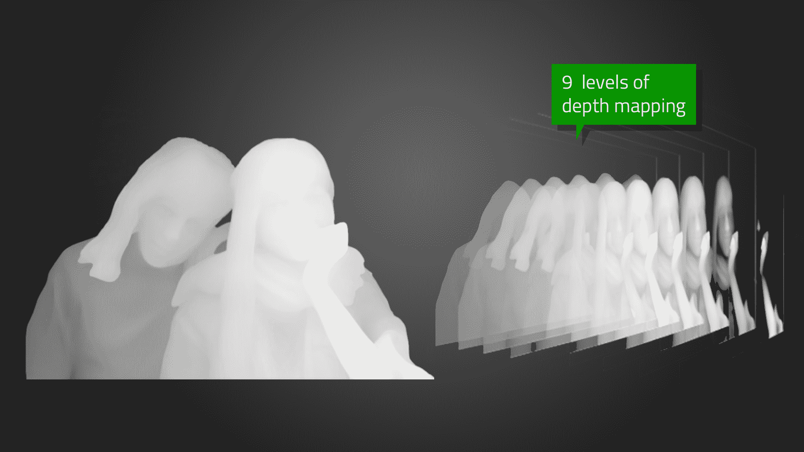
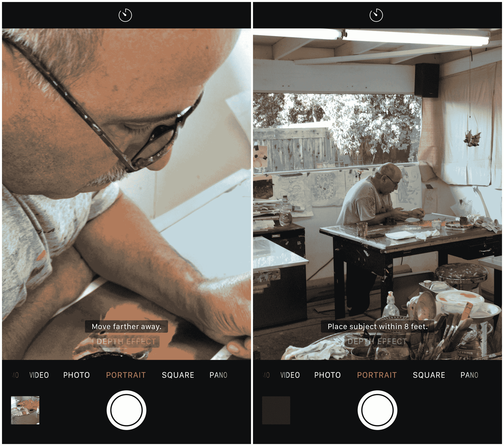
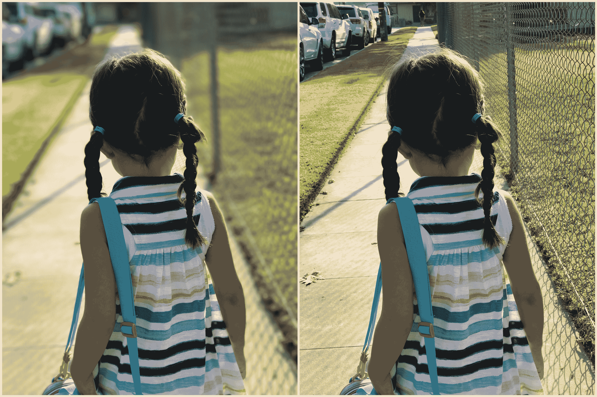
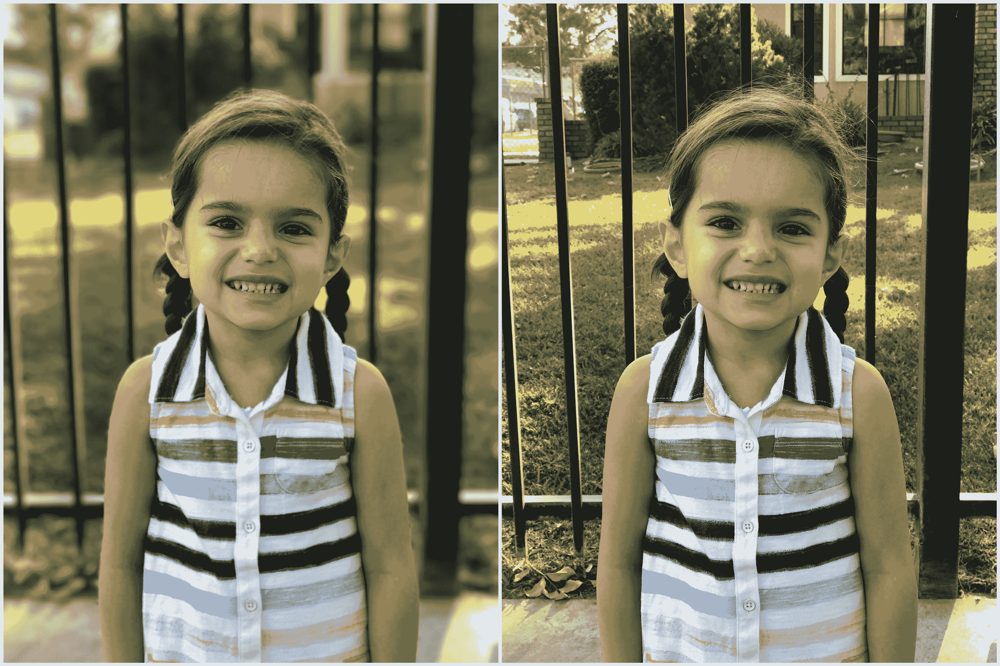
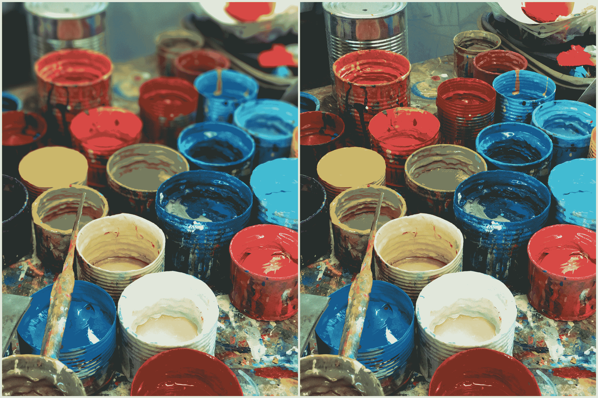
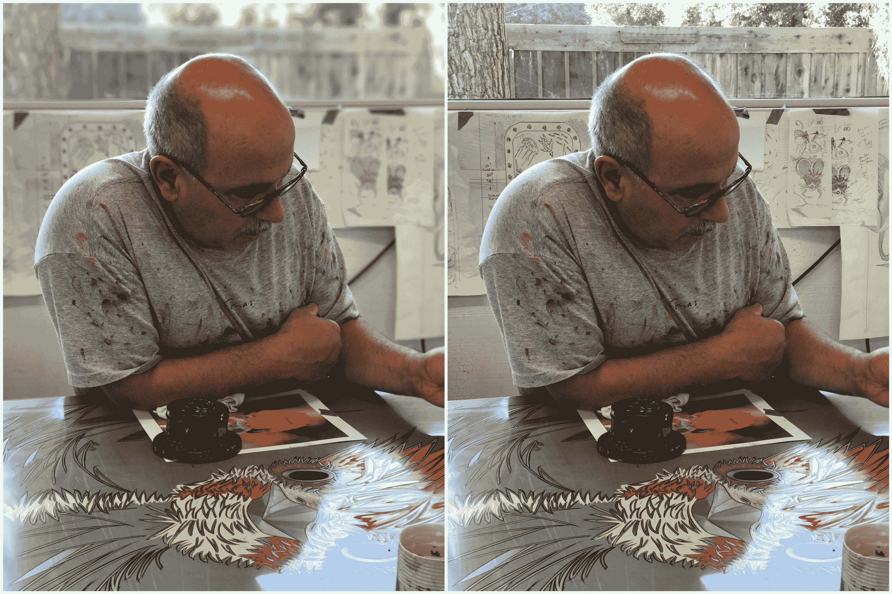

# 动手使用 iPhone 7 Plus 的疯狂新肖像模式

> 原文：<https://web.archive.org/web/https://techcrunch.com/2016/09/21/hands-on-with-the-iphone-7-plus-crazy-new-portrait-mode/>

iPhone 7 发布时最受关注的功能之一是新的肖像模式。

这是一个软件功能，它使用 iPhone 7 Plus 的两个镜头来创建在具有长焦镜头的相机上使用人像设置拍摄的图像的外观和感觉。

简单来说:将前景(人)与背景(其他垃圾)分开的令人愉悦的模糊。在这篇文章中，我会变得有点不靠谱，因为我觉得一旦这个特性广泛流行，就会非常缺乏背景——而且有一些人对此感兴趣。

如果你曾经在公园里拍过照，或者看过结婚照，并且想知道为什么它们看起来比你手机里的照片好得多，那么答案其实有三个部分:

1.  使用了相对较宽的光圈，这导致(除了其他效果之外)“焦点区域”或图片中清晰的部分非常窄。这意味着面部聚焦，背景不聚焦。
2.  它很可能是用长焦镜头拍摄的，但并不总是如此。这增强了主体和背景之间的“分离”,因为镜头中的远摄元素会导致远摄压缩，使明显的焦点区域变薄，并将面部调整到适当的比例。这就是为什么在合适的肖像中鼻子看起来大小合适，而用广角镜头看起来太大了。
3.  但最重要的是，摄影师花时间学习如何使用她的设备，恰当地定位主题，并运用她的艺术判断来提供一个合适的构图。

苹果还不能为你做最后一件事。那是你的工作。但它可以解决前两个问题，这就是它在肖像模式下所做的。在我们深入了解它的工作原理之前，让我们先来分析一下它是如何工作的。

## 它是如何工作的？

我将回头参考我的 [iPhone 评论](https://web.archive.org/web/20230309044517/https://techcrunch.com/2016/09/13/review-apple-tees-up-the-future-with-iphone-7/)来为苹果如何让肖像模式工作设置场景:
这个功能使用的深度映射是设备上有两个摄像头的副产品。它使用苹果收购的 LiNx 公司的技术来创建数据，图像处理器可以使用这些数据来制作其周围的 3D 地形图。

这还不包括苹果在 2013 年购买的 Primesense 芯片的全部功能(我们还没有看到这种东西完全实现)，但它即将到来。

目前，我们正在从这两个摄像头获得一系列其他好处，包括“融合”，苹果公司从广角和长焦镜头获取图像数据，并将它们混合在一起以获得最佳图像的方法。

我们还将推出肖像模式，该模式将在今天的开发者测试版和本周晚些时候的公开测试版中推出。

首次启动时会突出显示测试版通知的肖像模式位于相机应用程序中标准照片模式的右侧。在纵向模式下，没有*变焦、*数码或其他。相反，人像模式专门使用 56 毫米镜头拍摄图像，广角镜头收集深度数据，使其能够生成 9 层地图。

如果你想感受一下这是如何工作的，把手举到脸前，闭上一只眼睛。然后打开一个，关闭另一个。你看到你如何能看到你手的“周围”了吗？这就是苹果相机系统的工作原理。广角和长焦在图像上“看到”稍微不同的角度，允许它将图像分离和“切片”成离相机镜头 9 个不同距离的层。

一旦它有了这九个切片，它就可以挑选哪些层是清晰的，哪些层应用了高斯模糊 T2 模糊效果。**更新**:关于额外的询问，苹果公司向我澄清说，这实际上不是高斯效应，而是一个自定义的光盘模糊。这是一个比高斯模糊更清晰的圆形模糊。所以，如果你是少数渴望知道这里应用了什么样的模糊的人之一，现在你知道了。

预览模糊效果来自苹果的核心图像 API。

一旦长焦镜头检测到主体，使用自动对焦和我们马上会谈到的其他东西，iPhone 7 内部的图像处理器就会对远离主体的层应用越来越多的模糊。

因此，举例来说，如果相机分析场景并锁定 8 英尺外的对象，它会将图像切片，并在其他层上应用渐进渐变比例的模糊效果。离你的拍摄对象很近的东西可能是清晰的——包括在对焦区域的可变宽度部分。一旦它们变得更远，它们就会变得有点模糊，然后越来越模糊——直到远处前景或远处背景中的事物模糊到“最大”水平。

同样，该效果从前景*和背景*中分离出来。你可以在一个场景的“中间”拍摄一个对象，它会识别并相应地分开。

这些距离没有精确的比例，因为它们是基于一条曲线，而这条曲线取决于你与主体的距离、主体占据画面的多少以及它有多“深”。

在我的测试中，平均来说，一旦物体或风景距离拍摄对象 6 英尺或更远，你就处于最模糊状态。在里面，你会看到或多或少的模糊应用到这些切片。这一切都无缝地发生了，你可以在你的屏幕上看到一个*实时*效果预览，它以低于 30FPS 的固定帧速率运行。我的猜测是 24fps 左右，但足以给你一个准确的预览。

拍摄时几乎没有延迟，大约 600-650 毫秒。如果你看到一个完整的 HDR 拍摄过程需要多长时间，那么你会比那个时间快，比普通拍摄慢。

为了锁定你的肖像主体，并尽可能清晰地将其从背景中分离出来，苹果正在使用面部检测来帮助它快速找到主体，并告诉 ISP 什么应该清晰，什么不应该清晰。

在屏幕上，你会看到一个连续的指导提示，告诉你是否有足够的光线，以及你是否离深度效果太近或太远。人像模式需要大量的 T2 光线才能工作，在光线不足或对比度低的情况下效果不佳。它还要求你不能靠近长焦镜头的最小焦距 19 英寸。

该模式将标准图像和肖像图像发送到您的相机胶卷，带有深度效果标记。结果显示，这些图像是标准的 JPEG 图像，如果你仔细观察，它们看起来就像是从长焦镜头上拍摄下来的。在 iPhone 上，它们被贴上了“深度效果”的标签。除此之外，它们与你在 iPhone 7 上拍摄的其他图像是一样的。

## 那么，为什么是长焦？

首先，这个 56 毫米的等效镜头在苹果的营销中被称为长焦，但在摄影术语中它更接近于“普通”镜头。苹果公司称它为长焦专用*，与旁边的标准 28 毫米广角镜头*形成对比。所以，不要争论了，但在这种情况下，这是我们能使用的最远的镜头。

苹果使用这种长焦镜头是因为广角更好地捕捉深度数据，视野更广，没有 56 毫米的长焦压缩效果。长焦镜头是产生效果的基础，广角采集附加数据。如果你用长焦(其最小对焦距离为 19 英寸)拍摄一张靠近背景较远的对象的照片，即使没有人像模式，你也会看到这种自然模糊。所以你已经有了一个更好的光学平台。

## 结果如何？****

如果你跳过这里来看看它是如何工作的，我不怪你。简而言之:在许多情况下，令人难以置信地、奇迹般地好。另一些则相当粗暴。苹果表示，这仍处于测试阶段，事实也的确如此。它对树叶、链环栅栏和图案以及运动有困难。但它也能很好地处理我从未想过的事情，比如精细的儿童毛发和狗毛，拍摄背对着人的照片和根本不是人的物体。

它的主要问题是什么？细线、电线、链环、玻璃、树叶。任何与你拍摄对象的边缘融合在一起的东西都会让它变得混乱。越靠近目标越难分辨。动作也是不行的。如果对象动了一下，好的。如果它移动得太多，你会得到重影，就像你在 HDR 模式下做的那样——因为这涉及到合成。

让我们来看一些例子，我将剖析什么是有效的，什么是无效的，以及该模式如何在每个图像中应用效果。在每种情况下，我将包括标准和深度效果图像进行比较。

这是一个典型的肖像——一个与背景很好分离的直射镜头。处理的非常好。这也是“肖像类型”拍摄的主要情况，模糊效果使分散注意力和乏味的背景变得令人愉快。

注意树是如何比背景*更少*模糊，但是比主体*更*模糊。这就是深度效果渐变在起作用。不仅仅是*模糊*或*清晰—* 还有一个尺度在起作用，让它看起来更自然。

我把这个放在这里，是为了展示系统中仍然存在的小问题。注意婴儿手臂上的小三角形空隙——它不会分离。进一步的软件调整应该有助于纠正像这样破坏系统的事情。测试阶段的数据无疑会有所帮助。

背部拍摄，显示工作时没有人脸检测的深度效果。很难说身体检测是否真的在这里启动，但不管怎样，这意味着这种模式比苹果在这一点上愿意透露的要灵活得多。链条处理得好，加分。细毛，在这里看到的，不是那么糟糕，虽然它可以更好。

这也是一幅非常直截了当的肖像，但是你可以看到栅栏的背景——像这样的条和线可以给深度效果贴合。它很好地处理了这种情况，但特别是在手臂周围，你可以看到它在试图分开时会有点下垂。草也是一个问题。

这张照片准确地展示了当你远离镜头时，模糊效果是如何平滑增强的。

是的。T2 对非人类的物体有效。尽管苹果在人脸上使用图像识别，并强调这是一种*肖像*模式，但它确实对草莓和手之类的东西有效。只要有坚实的对比(注意这里的背景有多暗，手有多亮)，你就应该是清白的。注意:在苹果的相机应用程序中，没有检测物体或比较图像数据库来检测或减少噪音。暂时如此。

它对狗也有效。但只能是可爱的。关于这一点，你得核实一下——这是个奇闻。请注意，这两只小狗被“分组”在一起，彼此靠得很近。肖像处理背后的大脑足够聪明，可以将它们都包含在聚焦区域，模糊背景，但不模糊“主体”。对人类来说也是如此，通过面部识别将他们分组，即使他们稍微靠前或靠后。尽管有一个阈值，在一定的约束条件下，这个人会跳下到下一层，变得模糊。

这里是另一个物体，但从焦点来看，这种效果仍然令人愉快。这看似简单，但看似简单，实际上却令人印象深刻。这让我对未来的这种模式感到兴奋，我们可以随意应用深度或镜头效果，就像我们使用“真正的”镜头一样。

这个也一样。对象。看不见人类。仍然有效。

另一个经典用例。身体和脸部在画面中的 3/4 镜头(如果不是全部)。这种类型的镜头是你从这种模式中获得最大冲击力和最大乐趣的地方。

最后，这里有一个例子，它根本不应该工作，但却工作了。在这里，主体和背景之间几乎没有分离，但是它分离得很干净，模糊得令人愉快。ISP 做得非常好。这清楚地表明，切片之间的“距离”是一个*滑动*比例，而不是固定的——它们随着镜头的比例而增长和收缩。

最后，这显然是一个实验模式。到处都有小故障和失误。但总的来说，它直截了当地发挥了作用——展示了苹果全副武装、运转良好的摄像头和芯片团队的力量。很明显，苹果的相机团队真的将 iPhone 7 中的硅推到了极限。当它工作时，效果是惊人的，持续使用使设备触摸起来更温暖，特别是在苹果 A10 处理器所在的顶部。

一旦模式完全发布，我希望看到苹果将注意力转向让摄影师更直接地访问和控制我们拍摄的内容以及背景的模糊程度。尽管是小步前进——但这可能在一年或更长时间内都不会发生。鉴于到目前为止它是如此之好，我真的很有兴趣看看它会变得多好。