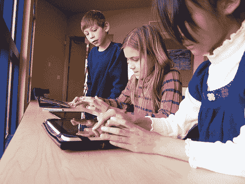

# 动手操作“YouTube Kids”，这是谷歌新推出的儿童友好的 YouTube 应用程序

> 原文：<https://web.archive.org/web/https://techcrunch.com/2015/02/23/hands-on-with-youtube-kids-googles-newly-launched-child-friendly-youtube-app/>

上周晚些时候，[有消息透露](https://web.archive.org/web/20230317063518/https://techcrunch.com/2015/02/19/youtube-kids/)YouTube 准备为移动设备发布一个新的、适合儿童的 YouTube 服务版本。今天，让世界各地的家庭高兴的是，这款应用程序已经上市，拥有简化的设计、精选的儿童安全内容、家长控制等等。谷歌表示，该应用程序将在 Android 和 iOS 设备上对家庭开放，这与之前关于 YouTube Kids 将首先使用 Android 的报道相反。

对这样一款应用的需求已经有一段时间了——事实上，父母们希望为他们的孩子提供更安全的视频服务，这甚至导致了许多初创公司加入进来，填补了这一空白，因为 YouTube 自己正在放弃这个机会。在 TechCrunch，我们过去曾报道过几个面向儿童的 YouTube 替代品，例如，包括像[happy](https://web.archive.org/web/20230317063518/https://techcrunch.com/2013/11/18/totlol-delivers-a-kid-safe-alternative-to-youtube-on-web-mobile/)、 [Jitterbug.tv](https://web.archive.org/web/20230317063518/http://www.jitterbug.tv/) 、 [PlayKids TV](https://web.archive.org/web/20230317063518/https://techcrunch.com/2013/06/25/playkids-tv/) 、 [Cakey](https://web.archive.org/web/20230317063518/https://techcrunch.com/2014/11/21/hot-or-not-founder-returns-with-cakey-a-youtube-app-for-kids/) 和 [Totlol](https://web.archive.org/web/20230317063518/https://techcrunch.com/2013/11/18/totlol-delivers-a-kid-safe-alternative-to-youtube-on-web-mobile/) (现在[已不存在](https://web.archive.org/web/20230317063518/https://techcrunch.com/2009/06/05/totlol-developer-forced-to-shut-down-kids-video-service/))这样的应用。

在其他地方，iTunes 和谷歌 Play 商店充满了来自其他开发者的应用，他们在 YouTube 上推出了自己的儿童安全视频应用，如[儿童安全电视](https://web.archive.org/web/20230317063518/https://itunes.apple.com/us/app/kid-safe-tube-tv-safe-videos/id531168856?mt=8)、[YouTube 儿童视频播放器](https://web.archive.org/web/20230317063518/https://play.google.com/store/apps/details?id=com.appsrental.kidsvideoplayer&hl=en)、 [YouTube 儿童视频](https://web.archive.org/web/20230317063518/https://itunes.apple.com/us/app/youtube-videos-for-kids/id395463337?mt=8)、YouTube 播放列表等。然而，这些应用中有许多质量很差，或者设计糟糕。现在 YouTube Kids 已经正式推出，他们很可能会失去过去几年建立起来的大部分观众。

令人惊讶的是，YouTube 花了这么长时间来解决这个问题——有这么多孩子使用平板电脑和父母的智能手机来浏览视频，但[YouTube 之前提供的家长控制很难使用](https://web.archive.org/web/20230317063518/http://www.tuaw.com/2013/05/23/parenting-tip-how-to-control-what-your-child-watches-on-youtube/),以至于大多数父母甚至都懒得使用——如果他们知道这种选项甚至存在的话，但许多人并不知道。问题是迫切需要一个专用的应用程序，而这正是 YouTube 今天所提供的。

## 设计和内容

据 YouTube Kids 的集团产品经理 Shimrit Ben-Yair 说，新的应用程序在过去一年中一直在开发中，并遵循了 YouTube 上家庭娱乐领域 200%的年增长率。

虽然该公司拒绝透露推出时该应用程序中有多少视频，但 Ben-Yair 会说 YouTube Kids 上有“数千”个频道。

这些频道包括知名儿童娱乐品牌的内容，例如梦工厂电视、[吉姆·汉森电视](https://web.archive.org/web/20230317063518/https://www.youtube.com/user/JimHensonFamilyTV)、[母鹅俱乐部](https://web.archive.org/web/20230317063518/https://www.youtube.com/user/MotherGooseClub)、[会说话的汤姆和朋友](https://web.archive.org/web/20230317063518/https://www.youtube.com/user/TalkingFriends)、[国家地理儿童](https://web.archive.org/web/20230317063518/https://www.youtube.com/channel/UCXVCgDuD_QCkI7gTKU7-tpg)、[阅读彩虹](https://web.archive.org/web/20230317063518/https://www.youtube.com/watch?v=lDuOVpeQ-BM)和[托马斯坦克引擎](https://web.archive.org/web/20230317063518/https://www.youtube.com/watch?v=TBPcrh2R_AQ&feature=youtu.be)，以及其他来自 YouTubers 的节目，如[视频兄弟](https://web.archive.org/web/20230317063518/https://www.youtube.com/user/scishow)和 [Stampylonghead【等等](https://web.archive.org/web/20230317063518/https://www.youtube.com/user/stampylonghead)

Ben-Yair 解释说，应用程序中的内容首先通过算法进行过滤，以符合儿童友好性。然后，YouTube 向监管迈出了第二步，利用一个团队对视频进行人工取样以进行质量控制。她说，这一两步过程意味着内容最初出现在 YouTube 上和在应用程序中可用之间可能会有轻微的延迟。但是新的内容一直在增加，就像 YouTube 本身一样。

对于最终用户来说，在启动新应用程序后，你首先会注意到的是，YouTube Kids 的设计与普通的 YouTube 应用程序完全不同。[谷歌称](https://web.archive.org/web/20230317063518/http://googleblog.blogspot.com/2015/02/youtube-kids.html)该应用包括一个“更亮更大的界面”，旨在更好地为“小拇指和矮胖手指”工作也就是说，该应用程序有大按钮，孩子们可以点击这些按钮来访问应用程序中的专用部分，包括“节目”、“音乐”、“学习”和“探索”，分别由播放按钮、收音机、灯泡和望远镜的图标来指示。

年幼的孩子可能不会将这些图标视为进入各种类别的门户，但这就是为什么该应用程序也有一个主屏幕，只需滑动即可浏览——即使是最小的孩子似乎也能很快掌握这一点。

【YouTube https://www.youtube.com/watch?v=OUmMAAPX6E8]

同时，当播放任何给定的视频时，您可以点击视频本身，以便查看下面指向其他相关视频建议的缩略图。

这是 YouTube 的主要应用程序经常让孩子们失望的地方，导致他们观看的视频不像他们目前正在观看的视频那样对儿童安全。但是在 YouTube Kids 应用中，这些建议已经被预先过滤了。

## 搜索

一个红色的放大镜图标还可以让孩子们在 YouTube 的儿童内容中搜索感兴趣的特定项目，而不是深入到各个类别中。该功能将返回比类别部分更多的结果，将孩子们引向更“安全”的内容，如教程、操作指南或其他教育内容。这很有用，因为以前孩子们经常会在 YouTube 上寻找一些*应该*适合儿童观看的东西，比如 Elmo 视频，结果却意外发现*非常*不合适的视频与搜索词匹配——比如 [Elmo](https://web.archive.org/web/20230317063518/https://www.youtube.com/watch?v=G_Yc7NY0ZCE) [咒骂](https://web.archive.org/web/20230317063518/https://www.youtube.com/watch?v=miBQ9jDeujk)。

有了新的应用程序，孩子们意外遇到这类视频的可能性就消除了，尽管父母可以选择采取额外的预防措施。家长控制选项允许他们完全关闭搜索选项，从而限制儿童浏览预先选择的视频。

## 家长控制

除了禁用搜索功能，YouTube 儿童家长控制设置还借鉴了竞争对手[亚马逊](https://web.archive.org/web/20230317063518/http://www.amazon.com/gp/help/customer/display.html?nodeId=201240110)的“Kindle FreeTime”服务，引入了计时器选项。这项功能允许父母通过配置一个定时器来限制孩子的屏幕时间，当他们的屏幕时间结束时提醒孩子。

然而，这种特性只在一定程度上有用。如果你把平板电脑交给你的孩子娱乐，然后他们达到了 YouTube 视频的上限，这并不意味着他们一定会放下平板电脑。如果他们在设备上安装了任何其他游戏，YouTube 的“会话开始”提醒只会让他们在设备上继续新的活动。

不过，这个功能的好处是，你可以限制孩子更被动地观看视频，而支持(希望)你已经在他们的平板电脑上安装的更具教育意义的游戏和/或电子书。

另一个只能来自真实世界中参与 YouTube 儿童应用程序创建的父母的设置是关闭视频声音设置的能力。在这里，父母可以选择关闭许多儿童视频中的背景音乐和声音效果，让孩子继续观看，而没有令人头痛的噪音。

## 缺少什么:个性化、定制内容

虽然 YouTube Kids 应用程序对于有小孩的父母来说绝对是很好的第一步，但它目前在几个方面存在不足。首先，没有办法根据孩子的年龄来缩小内容范围。

这意味着该应用程序中有针对非常年幼的幼儿的内容，如 BabyFirst TV，它与吸引较大年龄(可能是小学年龄)儿童的内容并列，如关于“简单但很酷的科学实验”的视频。这可能会有一点问题，因为在孩子的早期，例如，一个三岁的孩子和一个五岁的孩子之间的兴趣差异是巨大的。虽然这不像一个孩子偶然发现成人内容那么糟糕，但这仍然不是理想的用户体验。

但是 Ben-Yair 说今天发布的只是 YouTube 孩子的第一步。

“我们今天的经历是一次注销的经历，”她指出。这意味着该应用程序目前没有定制功能，但“我们肯定会探索这一点，”她补充道。该应用的未来版本可能允许父母不仅根据孩子的年龄，而且根据他们的兴趣更好地定制内容。虽然这样做，谷歌将不得不围绕孩子拥有谷歌账户意味着什么的法律准则和法规。

同样值得注意的是:应用程序中的家长控制现在可以被大一点的孩子使用。该应用程序要求父母输入与这些数字相对应的数字，并拼成单词。(例如*“要访问，请输入数字二、零、一、五。”这意味着这款应用只对那些有年幼孩子的父母有用，他们还不是读者。一个聪明的大一点的孩子很快就能知道如何访问这个部分，关闭定时器，重新打开搜索，等等。*

但 YouTube 表示，该应用主要针对处于“早期识字”年龄范围的儿童。就目前而言，迎合年龄较大的孩子似乎是次要目标。

## 更多儿童产品即将上市

YouTube Kids 是谷歌正在进行的几项举措之一，旨在[开发更多针对家庭的产品和服务](https://web.archive.org/web/20230317063518/http://arstechnica.com/gadgets/2014/12/google-to-launch-kid-friendly-versions-of-chrome-youtube-others-in-2015/)。该公司已经[了一个在线家庭安全中心](https://web.archive.org/web/20230317063518/https://www.google.com/safetycenter/families/start/)，该中心教父母如何配置网络过滤器和限制访问移动应用程序和游戏；去年年底，该公司披露了其内部努力，由有自己孩子的谷歌员工带头，该公司将带来其他产品的儿童友好版本，包括搜索和 Chrome，以及 YouTube。

## 现已上市

谷歌表示，YouTube Kids 现在可以在美国 iTunes 应用商店(儿童区)和 Google Play 上使用。该应用程序未来也将在 Kurio 和 nabi kids 的平板电脑上提供。该公司拒绝提供在其他平台或地区发布的时间表。