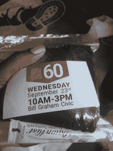

# 对抗无家可归者的创业公司 HandUp 为科技行业树立了榜样

> 原文：<https://web.archive.org/web/http://techcrunch.com/2015/09/13/handup-homeless-outreach/>

继[为无家可归者推出捐赠礼品卡](https://web.archive.org/web/20230326090753/https://techcrunch.com/2015/08/27/handup-2/#.1tipee:QCov)之后， [HandUp](https://web.archive.org/web/20230326090753/https://handup.org/) 于上周五在三藩市举办了社区拓展日活动，继续唤起人们对无家可归者的关注，并为人们提供一种参与无家可归者社区的方式。

HandUp 与[项目“无家可归者联系”](https://web.archive.org/web/20230326090753/http://www.projecthomelessconnect.org/)合作，举办了一次无家可归者拓展日活动，由旧金山市政府官员、Dropbox 和 Zendesk 的员工以及其他人参加。活动以在大厅的集会开始，大厅是旧金山市中心的餐馆中心。

旧金山住房机会、伙伴关系和参与部主任比万·达菲(见上图)在集会上说:“我有幸见到罗斯·布鲁姆，从最开始就了解了 HandUp 的使命，我如此相信它，因为我认为它是如此令人愉快，以至于当你忘记我们街道上人们的人性时，坏事就发生了。”。“当你认为一名警察通过将某人从一个街区转移到另一个街区来解决无家可归问题时，他处于更有利的地位。”

一套卫生用品

正式开球后，我们被分成四组，平均五人一组，每组由一名社区倡导者带领，带我们去旧金山市区，在那里我们可以为无家可归的人服务。然后，我们走上街头，带着卫生用品包，包括洗发水、除臭剂、肥皂、牙刷和牙膏、袜子，还有一份即将在比尔·格雷厄姆礼堂举行的活动的传单，人们可以在那里获得医疗、牙科和视力保健以及就业援助等资源。

我的领队是德尔·西摩，田德隆徒步旅行的负责人。他告诉我，他在田德隆区住了 30 年，没有住房。现在他已经重新站起来，他致力于回馈社会。我团队中的其他人包括 HandUp 创始人罗斯·布鲁姆(Rose Broome)和几名 Zendesk 员工。

布鲁姆告诉我:“这是我第一次分发卫生用品包。“我在街上走过，但我不习惯。我不习惯以这种方式看待贫穷。这里街上的人生病了，受伤了。这里的很多人见到我们都很开心。很多人真的很亲切。我觉得我们能做的一件小事就能有所帮助。一路上遇到一位 HandUp 成员，他看到了我的衬衫，并看到 HandUp 如何帮助他获得买药的钱，这令人兴奋。”

我有幸目睹了布鲁姆和 HandUp 成员德怀特之间的那一刻。当他看到 Rose 的 HandUp t 恤时，他的眼睛完全亮了起来，并对他能够通过 HandUp 获得的东西表达了很多感谢。使用 HandUp 的在线众筹平台，德怀特能够从支持者那里筹集到 150 美元，然后，更好的是，谷歌匹配了捐款。这 300 美元足够德怀特支付他急需的药物。

每个参与的志愿者都得到了两张价值 25 美元的亲手制作的礼品卡。HandUp 大约两周前推出的礼品卡使无家可归者能够在 Project Homeless Connect 兑换食物或其他商品。

布鲁姆说，自从推出礼品卡以来，无家可归者联系项目已经达到了最大容量，人们涌入办公室兑换礼品卡。为了让人们更容易兑换，并减轻 PHC 的负担，布鲁姆说，她目前正在寻找旧金山其他愿意充当 HandUp 礼品卡兑换点的地方。

任何有兴趣通过赠送礼品卡帮助无家可归者的人都可以在这里[订购。迄今为止，HandUp 已经从 Jason Calacanis、Marc Benioff、Eric Ries 和 SV Angel 等投资者那里筹集了 85 万美元的资金。](https://web.archive.org/web/20230326090753/https://handup.org/giftcards)