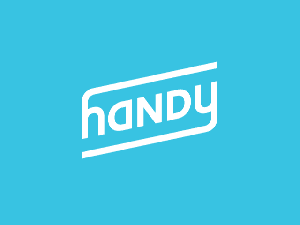

# 随着清洁经济的整合，Handy 每周的订单达到 100 万美元 

> 原文：<https://web.archive.org/web/https://techcrunch.com/2014/10/14/handy-hits-1-million-a-week-in-bookings-as-cleaning-economy-consolidates/>

在线和移动清洁和家庭维修预订服务市场正在起飞，Handy 将宣布一些大数据。

推出两年后，Handy 每周的预订量已经超过了 100 万美元。首席运营官 Umang Dua 表示:“我们的运营成本从大约 300 万美元增加到了 5200 万美元。

对于汉拉汉和杜瓦来说，新的按需服务经济为消费者和服务专业人士提供了一个更好的模式。有了该公司的新移动应用程序，汉拉汉说:“我们的清洁工说它就像你口袋里的 ATM 机。”

对于 Handy 上的大多数清洁专业人员来说，时薪在每小时 15 美元到 22 美元之间，平均每小时 18 美元左右。“它让你有能力选择自己的时间，并给你一个健康的小时工资，”汉拉汉说。

营收数据出炉之际， [Handy](https://web.archive.org/web/20230130100923/https://techcrunch.com/2014/09/16/handybook-rebrands-as-handy/) 和 [Homejoy](https://web.archive.org/web/20230130100923/https://techcrunch.com/2014/09/04/homejoy-iphone-app/) 最近几个月都采取措施，分别通过新品牌和移动设备新应用重新定义自己的业务。

越来越多的消费者开始接受通过手机预订服务的想法，在国家和县一级强制进行背景调查，随后是入职流程，方便的服务专业人员经过彻底审查。

“我们认为这个便捷的平台将成为你家庭的遥控器。Hanrahan 说:“我们希望能够以一种即时预订的方式推出所有这些服务类别。

Handy 和 Homejoy 都认为自己提供的服务不仅仅是家庭清洁，但至少对 Handy 来说，该公司不断膨胀的收入仍主要来自房屋清洁。据汉拉汉说，事实上，公司大约 85%的收入来自清洁，剩下的 15%在“杂工服务和少量管道服务”之间分配。

Handy 目前在美国的 25 个城市、加拿大的两个城市以及伦敦提供服务。“我们已经收到了超过 20 万份潜在清洁工和杂工的申请，有超过 5000 名活跃的专业人士在一个月内至少完成一项工作。

