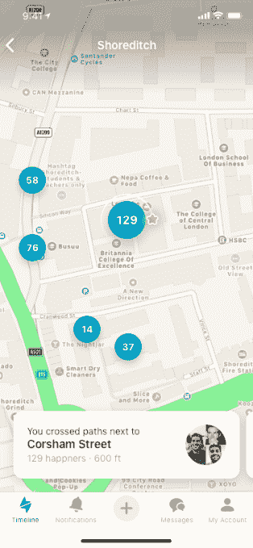
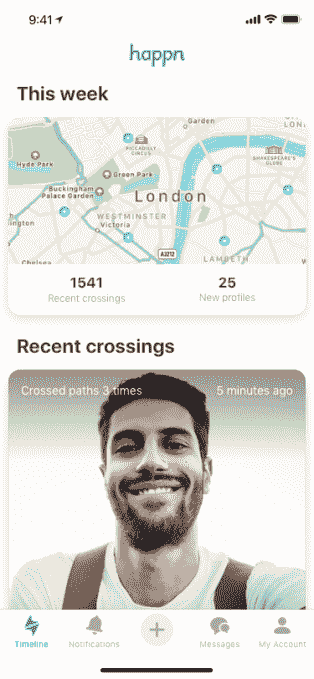

# Happn 通过一个错过联系的互动地图来取代 Tinder Places 

> 原文：<https://web.archive.org/web/https://techcrunch.com/2018/06/21/happn-takes-on-tinder-places-with-an-interactive-map-of-missed-connections/>

约会应用 [Happn](https://web.archive.org/web/20230217185339/http://www.happn.com/) ，其“错过的联系”类型的约会体验将在现实生活中相遇的人联系起来，正在对 Tinder 进行反击。似乎受到 Happn 基于位置的功能的启发，Tinder 最近开始试点一种名为[的 Tinder Places](https://web.archive.org/web/20230217185339/https://techcrunch.com/2018/05/23/tinder-places-tracks-your-location-to-help-you-find-matches/) 的功能，该功能可以跟踪你的位置，将你与那些访问你相同常去的人匹配起来，如最喜欢的酒吧、书店、健身房、餐馆等。

当然，Tinder 进军基于位置的约会应该让 Happn 感到担忧，Happn 围绕着为可能在现实生活中相遇的人牵线搭桥的想法构建了整个约会应用，但却错过了这样做。

现在，Happn 正在用自己的新功能挑战 Tinder Places。它首次推出了一个互动地图，用户可以在这里发现他们在过去七天里遇到的人。

Happn 创始人、法国企业家迪迪埃·拉帕波特(Didier Rappaport)驳斥了 Tinder 的威胁。

“我们根本不认为这是一个威胁，而是一件好事，”他告诉 TechCrunch。“从一开始，寻找与你有过交集的人就一直存在于 Happn 的 DNA 中……Tinder 希望在其产品中包含相同的功能，我们感到非常荣幸。然而，我们永远不会在我们的产品中使用刷卡，”他说。

Rappaport 认为刷卡是错误的，因为它会让你把对方当成一种产品，而这不是 Happn 的哲学。

“我们希望(给我们的用户一个机会)与一个人互动或不互动，让他们花时间来决定，如果他们突然改变主意，希望有第二次机会，能够回到他们的时间线，”他指出。

要使用 Happn 的地图，你可以点击你去过的一个特定地点，然后会出现那些也去过那里的潜在匹配者，或者在那个地点 250 米范围内的匹配者。该地图将使用 Happn 已经用来创建其时间轴的相同地理位置数据，但只是以另一种形式显示它。

对于那些不习惯一直用约会应用分享自己位置的人(嗯，大家？)，Happn 还提供了一种“隐形”模式，让人们在一天中的特定时段隐藏自己的位置——例如，当他们在工作时。

虽然 Happn 的新功能对普通用户来说是一个很好的升级，但 Tinder 基于位置的功能——我们很抱歉地报告——设计得更优雅。

如今，当你想使用 Happn 的隐形模式时，你必须打开它，或者你必须付费订阅才能在特定时间自动出现。这意味着在日常使用中需要付出更多的努力。

与此同时，Tinder Places 允许你阻止你经常去的地方——比如说，健身房——被记录为你想去比赛的地方。它还会自动删除不合适的地方，包括你的家庭和工作地址，并在添加新地址时提醒你，这样你就可以根据自己的选择迅速采取行动将其删除。Tinder Places 也是免费的。(只是目前没有在全球范围内推出)。

然而，Happn 确实提供了一种向特定用户隐藏你的个人信息和其他细节的方法，并且永远不会实时显示你的当前位置，也像 Tinder 一样。

Happn 于 2014 年推出，目前在全球 50 个主要城市和 40 个国家拥有近 5000 万用户。它声称每月有 650 万用户，但与 Tinder 估计的 5000 万活跃用户相比，这个数字要小得多。

随着 Tinder 母公司 Match Group [抢夺铰链](https://web.archive.org/web/20230217185339/https://techcrunch.com/2018/06/21/hinge-sells-51-percent-of-shares-to-match-group/)、[起诉 Bumble](https://web.archive.org/web/20230217185339/https://techcrunch.com/2018/03/16/tinder-owner-match-is-suing-bumble-over-patents/) 、[有效地复制了使用“错过的联系”的想法，](https://web.archive.org/web/20230217185339/https://techcrunch.com/2018/05/23/tinder-places-tracks-your-location-to-help-you-find-matches/)人们不得不怀疑竞争对手的约会应用程序，尤其是那些 Happn 规模的应用程序，还剩下多少生命。

该应用可在 App Store、Play Store 和 Windows Store 上免费下载。