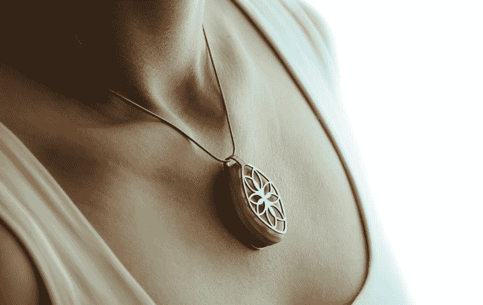
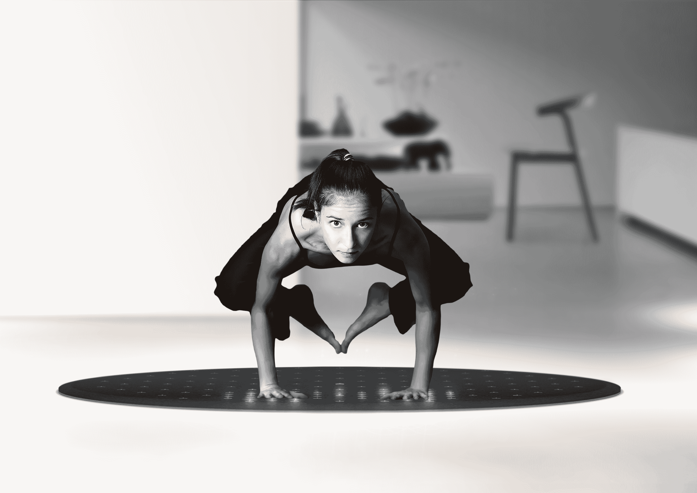
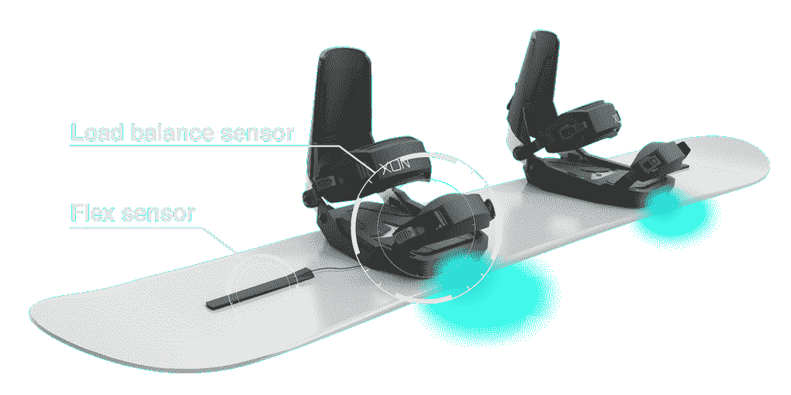
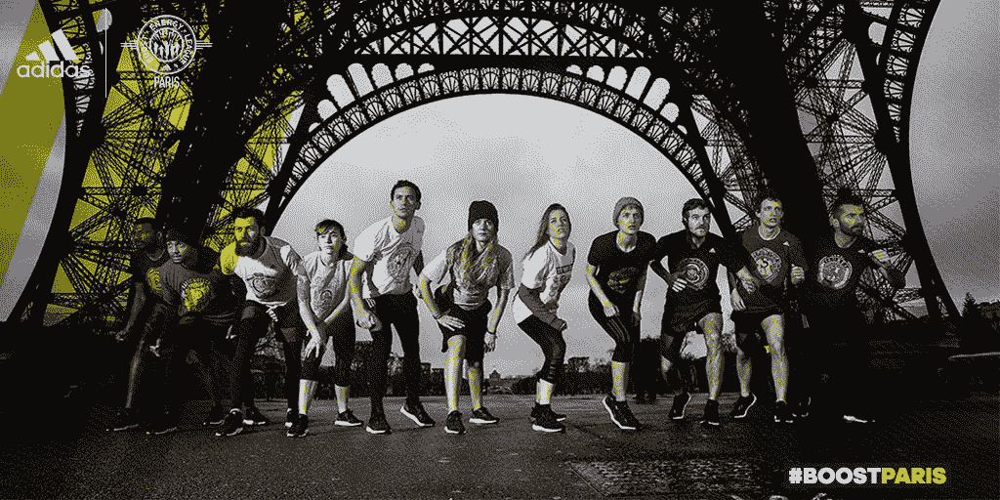

# 互联运动装备更硬、更快、更强

> 原文：<https://web.archive.org/web/https://techcrunch.com/2016/02/21/harder-faster-stronger-connected-sports-gear/>

米莉仆撰稿人

如果尼尔·阿姆斯特朗(Neil Armstrong)在踏上月球时佩戴了 Fitbit 腕带，世界会有所不同吗？如果水门事件期间尼克松配备了心脏传感器会怎样？

## 所有人的量化自我

关于高水平运动员的体育与创新系列 n 1 描述了技术如何成为监控运动表现的必要因素。技术也正在成为常规体育锻炼的一部分:业余爱好者现在可以使用复杂的高科技设备来衡量个人的运动表现。

正如 Benjamin Carlier(来自法国体育创业加速器 Le Tremplin)所指出的，“如今，在 4 小时 30 分钟内跑完马拉松的非专业人士对成绩监控和分析的要求几乎与用 3 小时跑完相同距离的运动员相同。”(阅读关于[特伦普林的法文全文。)](https://web.archive.org/web/20230327160219/http://www.letremplin.paris/le-sport-de-demain-vu-par-benjamin-carlier/)

有了智能手机，人们可以大量使用加速度计和陀螺仪等测量和监控工具。每个人都有能力跟踪自己的身体活动:频率、强度和进度。所涉及的技术不一定是最近才出现的(计步器和 GPS 已经出现好几年了)，但它们现在(几乎)在每个人的口袋或手提包里。

## 固定或移动设备

“你无法管理你无法衡量的东西。”这个众所周知的管理规则也适用于体育运动，并解释了“量化自我”技术的成功。越来越多的人愿意记录、监测和分享营养、睡眠、身体活动、健康等个人数据。

这一趋势开启了一个全新的互联物体世界: [Babolat 的](https://web.archive.org/web/20230327160219/http://en.babolatplay.com/)球拍、 [Adidas 的](https://web.archive.org/web/20230327160219/http://www.adidas.fr/micoach)智能球、由 [Withings](https://web.archive.org/web/20230327160219/http://www.withings.com/us/en/store?resetcart) 开发的物体集合、俳句的追踪器(前[自行车助手](https://web.archive.org/web/20230327160219/http://www.futur-en-seine.paris/en/projet/bike-assistant-branding-produit-en-cours/)和 [Bellabeat 的](https://web.archive.org/web/20230327160219/http://www.futur-en-seine.paris/en/projet/bellabeat-2/)Leaf……每项运动都有其专用的数字装置。

贝拉巴特叶

这些技术旨在成为我们日常生活的一部分，并定义一种生活方式。与徒步旅行者的传统计步器不同，传统计步器的主要要求是精确，这种新一代物品的基本要求是能够适应我们的日常生活。

> 一步一步，技术正在我们的皮肤下找到自己的方式。

Fitbit 腕带就是一个很好的例子:它显然是为了鼓励日常体育活动而设计的，而不仅仅是为了监控它。它轻便、灵活、耐摔、舒适；它只需要每隔几天充电一次，并具有与智能手机自动同步的功能。

Fitbit 追踪器提供了高度个性化的——可能还很有趣的——体验:根据他们的统计数据，用户将收到量身定制的建议、鼓励、目标和个人挑战。

太阴万亿分之一

同样，Lunar 在 2014 年开发了一款名为 [Tera](https://web.archive.org/web/20230327160219/http://tera.lunar-europe.com/) 的互联瑜伽垫。它旨在成为用户日常生活的一部分，而不仅仅是促进产品的偶尔使用。它为多种活动(瑜伽、普拉提等)提供了广泛的功能。):体重控制，肌肉训练等。，但是，更重要的是，Tera 号称是设计师单品。“Tera 几乎就像一张非常时尚的地毯，”Lunar 的联合创始人罗曼·格布哈德([连线](https://web.archive.org/web/20230327160219/http://www.wired.com/2014/06/this-intelligent-wool-rug-doubles-as-a-yoga-instructor/))说。“它应该融入你的正常生活。”

## 硬件对软件？

这种设备最近才出现在法国的电子商店(FNAC、布朗热甚至卡斯托拉马)和移动电话网络(Orange、SFR、Bouygues)中，但它们在法国消费设备支出中所占的份额越来越大:2013 年为 1%，预计 2016 年为 3%(xer fi–2014)。该领域的营业额预计每年增长 50 %: 2013 年€为 1 . 5 亿英镑，2016 年€为 5 亿英镑(xer fi–2014)。到 2020 年，这个数字将达到 750 亿€(摩根士丹利，2013 年，CNIL 引用)。

Cerevo 的 Xon

然而，基于连接对象的业务模型并不是唯一的选择。这一领域的重要参与者正在远离硬件，而更愿意专注于软件和数据。

这种策略的一个例子是 Rossignol 的[滑雪追踪应用](https://web.archive.org/web/20230327160219/http://skipursuit.rossignol.com/)。Rossignol 没有像 [Cerevo 的 Xon Snow](https://web.archive.org/web/20230327160219/https://xon.cerevo.com/en/) 那样为滑雪板和滑雪板开发智能绑定，而是转向免费应用。仅依靠客户智能手机中的内置传感器，Rossignol 的应用程序可以跟踪最大速度、平均速度、距离和持续时间，以及积极和消极的海拔变化。在谷歌地球上，可视化和恢复可以在“时间轴”模式或 3D 模式下进行，该应用程序提供了一种社交体验，因为可以在脸书上共享乘坐体验。

另一个例子是耐克，该公司在 2014 年停止销售连接腕带，以专注于其 Nike+应用程序。同样，Jawbone——活动跟踪和连接腕带的领导者——现在主要定位为软件和数据生产公司。

## 助推器:游戏，社会经验和收益

虽然锻炼可以通过追踪器来提示，但追踪器的使用方式——频率和持续时间——取决于几个因素。这里有几个应用于跑步的例子:

*   游戏化:僵尸，快跑！让它的百万用户沉浸在一个僵尸横行的世界里，在那里奔跑是唯一的生存机会(加速，任务等等。).

阿迪达斯推动战斗跑巴黎

*   社交分享:为了对抗 Nike+，阿迪达斯推出了 Boost Battle Run，在巴黎挑战 1 万名跑步者。最近，联合国儿童基金会发起了第一次相连的[世界跑步](https://web.archive.org/web/20230327160219/https://teamunicefworldrun.org/?utm_source=google&utm_medium=cpc&utm_term=world%20run%20unicef&utm_campaign=World-Run&gclid=CjwKEAiA9uaxBRDYr4_hrtC3tW8SJAD6UU8GEroyuX0R2XqRf9891MDAsr1e86oCapcYWc08ARGvZhoCWhXw_wcB)，来自同一个团队的参与者没有一起跑步，但他们的努力是相加的。
*   收获:跑步英雄根据每个参与者的跑步活动，提供在合作商店和品牌中赚取折扣券的机会。

## 有价值的数据

这些应用对于那些想方设法接近难以触及的目标并销售新产品的公司来说，是一个千载难逢的机会。但是还有更多；当他们收集数百万关于客户日常生活中身体活动的数据时，公司追求不同的目标:

*   微调他们的产品:由于他们比以往任何时候都更准确地衡量消费者的行为，公司希望调整他们的产品以满足潜在客户的精确需求。
*   出售数据:在美国，UnitedHealth Group、Humana、Cigna 和 Highmark 等主要保险公司自 2014 年以来一直根据 Fitbit 的数据为投保人提供折扣。这在法国仍然是禁忌，根据 1978 年的“信息与自由”法，这是非法的。然而， [Axa](https://web.archive.org/web/20230327160219/https://www.axa.fr/mutuelle-sante/partenariat-withings/jeu-pulse.html) 已经为它最好的徒步旅行者提供“健康检查”。

只看活动跟踪器，数据使用有巨大的潜力。当考虑到即将出现的所有其他类型的追踪器时，后果可能远远不止这些。有了“可穿戴计算”，我的眼镜能看到我眼睛能看到的东西，我的手表能跟踪我的心跳和体温……为什么我的脑电波不行呢？在去年的 Futur en Seine 上，展示了两款脑电图耳机( [Melomind](https://web.archive.org/web/20230327160219/http://www.futur-en-seine.paris/en/projet/melomind-2/) 和 [Neuronaute](https://web.archive.org/web/20230327160219/http://www.futur-en-seine.paris/en/projet/bioserenity/) )。两者都被设计为消费类产品…这种设备产生的数据将如何使用？

虽然一些项目(见 [PlaceRaider](https://web.archive.org/web/20230327160219/http://www.technologyreview.com/view/429394/placeraider-the-military-smartphone-malware-designed-to-steal-your-life/) )担心数据安全和黑客攻击，但跟踪正在进行中，不会停止。根据哥本哈根大学心理学教授安德斯·科尔丁-约根森的说法，“在 2022 年之前，你和我将会像今天更新我们的脸书状态一样频繁地更新我们的个人生理数据”([Cahier Innovation et Perspective](https://web.archive.org/web/20230327160219/http://www.cnil.fr/fileadmin/documents/La_CNIL/publications/DEIP/CNIL_CAHIERS_IP2_WEB.pdf)，CNIL)。

一步一步，技术正在我们的皮肤下找到自己的方式。我们已经为量化自我的未来做好准备了吗？